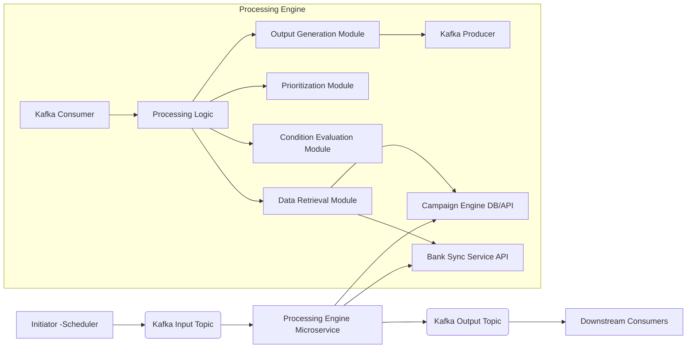

# Collection Campaign Configuration System Design

## Introduction

This document outlines the design for the collection campaign configuration system. The purpose of this system is to provide a flexible and powerful way to define rules and criteria for selecting customers and their contact information for various collection campaigns. This system will drive the automated outreach process, ensuring the right customers are targeted with the appropriate communication methods based on their specific circumstances.

## Data Model

The campaign configuration system utilizes several database tables to store campaign definitions, conditions, and rules. These tables are defined in the [`src/services/campaign-engine/database/migrations/create_campaign_tables.sql`](src/services/campaign-engine/database/migrations/create_campaign_tables.sql) migration file. Additionally, custom field values are stored in the bank-sync-service database.

-   **[`campaign_engine.campaign_groups`](src/services/campaign-engine/database/migrations/create_campaign_tables.sql:2):** This table organizes campaigns into logical groups.
    -   `id`: Unique identifier for the campaign group.
    -   `name`: Name of the campaign group (must be unique).
    -   `created_at`: Timestamp of creation.
    -   `updated_at`: Timestamp of last update.

-   **[`campaign_engine.campaigns`](src/services/campaign-engine/database/migrations/create_campaign_tables.sql:15):** This table represents individual collection campaigns. Each campaign belongs to a campaign group and has a name and a priority within that group. The campaign priority determines the order in which campaigns within the same group are evaluated for a customer.The priority is crucial for the campaign selection logic, ensuring that a customer is considered for campaigns with the higher-priority first. A customer can only be assigned to a campaign within one group (and not appear on lower priority if they are already assigned to a higher priority campaign within the same group)
    -   `id`: Unique identifier for the campaign.
    -   `campaign_group_id`: Foreign key referencing the `campaign_groups` table, linking the campaign to its group.
    -   `name`: Name of the campaign (must be unique within the group).
    -   `priority`: Priority of the campaign within its group (lower number indicates higher priority, must be unique within the group).
    -   `created_at`: Timestamp of creation.
    -   `updated_at`: Timestamp of last update.

-   **[`campaign_engine.base_conditions`](src/services/campaign-engine/database/migrations/create_campaign_tables.sql:33):** This table stores the base conditions that a customer must meet to be eligible for a specific campaign. These conditions can be based on various data sources like loans, customers, or custom fields.
    -   `id`: Unique identifier for the base condition.
    -   `campaign_id`: Foreign key referencing the `campaigns` table, linking the condition to a campaign.
    -   `field_name`: The name of the field to evaluate (e.g., 'loan_status', 'customer_segment').
    -   `operator`: The comparison operator (e.g., '=', '>', '<', 'LIKE').
    -   `field_value`: The value to compare against.
    -   `data_source`: Specifies where the `field_name` can be found (e.g., 'bank_sync_service.loans', 'bank_sync_service.customers', 'custom_fields').
    -   `created_at`: Timestamp of creation.
    -   `updated_at`: Timestamp of last update.

-   **[`campaign_engine.contact_selection_rules`](src/services/campaign-engine/database/migrations/create_campaign_tables.sql:51):** This table defines rules for selecting specific contact information (like phone numbers) for a customer who qualifies for a campaign. Each rule has a priority within the campaign.
    -   `id`: Unique identifier for the contact selection rule.
    -   `campaign_id`: Foreign key referencing the `campaigns` table, linking the rule to a campaign.
    -   `rule_priority`: Priority of the rule within the campaign (lower number indicates higher priority, must be unique within the campaign).
    -   `created_at`: Timestamp of creation.
    -   `updated_at`: Timestamp of last update.

-   **[`campaign_engine.contact_rule_conditions`](src/services/campaign-engine/database/migrations/create_campaign_tables.sql:67):** This table stores the conditions that must be met for a specific contact selection rule to be applied. These conditions are similar to base conditions but are evaluated per contact rule.
    -   `id`: Unique identifier for the contact rule condition.
    -   `contact_selection_rule_id`: Foreign key referencing the `contact_selection_rules` table, linking the condition to a contact rule.
    -   `field_name`: The name of the field to evaluate.
    -   `operator`: The comparison operator.
    -   `field_value`: The value to compare against.
    -   `data_source`: Specifies where the `field_name` can be found (e.g., 'bank_sync_service.loans', 'custom_fields').
    -   `created_at`: Timestamp of creation.
    -   `updated_at`: Timestamp of last update.

-   **[`campaign_engine.contact_rule_outputs`](src/services/campaign-engine/database/migrations/create_campaign_tables.sql:85):** This table specifies which type of contact information should be included if a contact selection rule's conditions are met.
    -   `id`: Unique identifier for the contact rule output.
    -   `contact_selection_rule_id`: Foreign key referencing the `contact_selection_rules` table, linking the output to a contact rule.
    -   `related_party_type`: Specifies the type of party whose contact info should be included (e.g., 'customer', 'reference_customer_parent', 'reference_customer_all').
    -   `contact_type`: Specifies the type of contact information (e.g., 'mobile', 'home', 'work', 'all').
    -   `created_at`: Timestamp of creation.
    -   `updated_at`: Timestamp of last update.

-   **[`campaign_engine.custom_fields`](src/services/campaign-engine/database/migrations/create_campaign_tables.sql:101):** This table stores metadata for custom fields that can be used in both base and contact rule conditions. These custom fields are calculated externally and uploaded to the system for direct use in rule evaluation.
    -   `id`: Unique identifier for the custom field.
    -   `field_name`: The name of the custom field (must be unique).
    -   `data_type`: The data type of the custom field ('string', 'number', 'date', 'boolean').
    -   `description`: Optional description of what this custom field represents.
    -   `created_at`: Timestamp of creation.
    -   `updated_at`: Timestamp of last update.

-   **`bank_sync_service.loan_custom_fields`:** This table stores the actual values of custom fields for each loan using a JSONB structure. These values are calculated externally and uploaded to the system for use in campaign evaluation.
    -   `account_number`: Loan account number (Primary key, Foreign key to `bank_sync_service.loans`).
    -   `fields`: JSONB column containing all custom field values as key-value pairs (e.g., `{"risk_score": 85, "collection_priority": "high", "payment_likelihood": 0.75, "propensity_to_pay": 0.82}`).
    -   `source_system`: Identifies the external system that calculated these values (default: 'EXTERNAL').
    -   `uploaded_at`: Timestamp when the values were last uploaded.
    -   `uploaded_by`: Identifier of the user/system that uploaded the values.
    -   `created_at`: Timestamp of creation.
    -   `updated_at`: Timestamp of last update.
    -   **Note**: PostgreSQL JSONB indexes can be created on specific fields within the JSON for optimal query performance.

The relationships between the tables are as follows:
-   `campaigns` has a many-to-one relationship with `campaign_groups` (via `campaign_group_id`).
-   `base_conditions` has a many-to-one relationship with `campaigns` (via `campaign_id`).
-   `contact_selection_rules` has a many-to-one relationship with `campaigns` (via `campaign_id`).
-   `contact_rule_conditions` has a many-to-one relationship with `contact_selection_rules` (via `contact_selection_rule_id`).
-   `contact_rule_outputs` has a many-to-one relationship with `contact_selection_rules` (via `contact_selection_rule_id`).
-   `loan_custom_fields` has a one-to-one relationship with `loans` in bank-sync-service (via `account_number`).

## Campaign Configuration

Users will configure the collection campaigns through an interface that interacts with the defined data model. The configuration process will involve:

1.  **Defining Campaign Groups:** Users will create campaign groups, assigning a unique name and a priority to each.
2.  **Creating Campaigns:** Within each group, users will create individual campaigns, providing a name and a priority unique within that group.
3.  **Setting Base Conditions:** For each campaign, users will define the base conditions that customers must satisfy to be considered for the campaign. This involves selecting a data source, field name, operator, and value. Custom fields defined in the `custom_fields` table can be used here.
4.  **Defining Contact Selection Rules:** For each campaign, users will define rules for selecting contact information. Each rule will have a priority.
5.  **Setting Contact Rule Conditions:** For each contact selection rule, users will define the conditions that must be met for the rule to apply. These conditions also use data sources, field names, operators, and values, including custom fields.
6.  **Specifying Contact Rule Outputs:** For each contact selection rule, users will specify which type of contact information (`related_party_type` and `contact_type`) should be included if the rule's conditions are met.
7.  **Defining Custom Fields:** Users can register custom fields by providing a name, data type, and description. The actual values for these fields are calculated externally and uploaded to the system.

The interface should guide users through these steps, ensuring data integrity and adherence to the defined schema.

## Campaign Selection Logic

The campaign selection logic determines which campaign(s) a customer is eligible for and which contact information should be used. The process will follow these steps:

1.  **Customer and Loan Data Retrieval:** For a given set of customers, retrieve all relevant data from various sources (e.g., bank sync service for customer details, loans, and loan-level custom field values that have been uploaded to the system).
2.  **Campaign Group Prioritization:** Iterate through campaign groups (can be processed in parallel)
3.  **Campaign Evaluation within Group:** For the current campaign group, iterate through the campaigns within that group in order of their priority (lowest number first).
4.  **Base Condition Evaluation:** For the current campaign, evaluate all associated base conditions for the customer. If all base conditions are met, the customer is eligible for this campaign.
5.  **Customer Assignment and Group Exclusion:** If a customer is eligible for a campaign, assign the customer to this campaign. Once a customer is assigned to a campaign within a group, they are excluded from consideration for any other campaigns within the same group
6.  **Contact Selection Rule Evaluation:** If a customer is assigned to a campaign, evaluate the contact selection rules for that campaign in order of their priority.
7.  **Contact Rule Condition Evaluation:** For each contact selection rule, evaluate its associated conditions.
8.  **Contact Information Inclusion:** If a contact selection rule's conditions are met, include the contact information specified by the `contact_rule_outputs` associated with that rule.
9.  **Output Generation:** Generate the final output, which includes the assigned campaign for each customer and the selected contact information.

This prioritized approach ensures that each customer is assigned to the most relevant campaign based on the defined group and campaign priorities, and that the appropriate contact details are selected based on the contact selection rules.

## Processing Engine Design (High-Performance)

### 1. Introduction

This document details the design of the high-performance processing engine responsible for evaluating customers against defined collection campaigns, applying prioritization logic, selecting appropriate contact information, and generating an output list for subsequent actions. The engine must process between 500,000 and 1,000,000 customers within a 30-minute window.

### 2. Architecture

The processing engine will be implemented as a standalone Node.js microservice. It will interact with the `bank-sync-service` to retrieve customer and loan data and with the `campaign-engine` (or its database directly, depending on the final data access strategy) for campaign configuration. Kafka will be used as the primary messaging bus for receiving customer processing requests and emitting results.

### 3. Data Retrieval Strategy

Efficient data retrieval is critical for performance.

*   **Campaign Configuration:** The engine will fetch campaign group, campaign, base condition, contact selection rule, contact rule condition, contact rule output, and custom field metadata from the `campaign-engine` database. To minimize repeated database calls, this configuration data should be fetched once at the start of a processing run or periodically refreshed and cached in memory within the processing engine microservice. Given the expected volume and the static nature of campaign configurations during a run, an in-memory cache is highly recommended.
*   **Customer and Loan Data:** Retrieving data for 500k-1M customers efficiently from the `bank-sync-service` is a major challenge.
    *   **Batching API Calls:** The `bank-sync-service` should expose an API endpoint that allows fetching data for multiple customers (and their associated loans, phones, etc.) in a single request, using a list of customer IDs. The processing engine will retrieve customer IDs in batches from the Kafka input topic and then make batched requests to the `bank-sync-service`. The batch size should be tuned for optimal performance, considering network latency and the `bank-sync-service`'s capacity.
    *   **Data Structure:** The data returned by the `bank-sync-service` should be structured to allow easy access to customer, loan, and contact information for condition evaluation.
    *   **Minimizing Data Transfer:** Only necessary fields for condition evaluation and output generation should be retrieved.

### 4. Processing Model

A parallel batch processing model is best suited for the required volume and time limit.

*   **Batch Processing:** The engine will consume customer IDs from a Kafka input topic in batches. Each batch will be processed together.
*   **Parallel Processing (Node.js):** To leverage multi-core processors, Node.js worker threads can be used. The main thread can handle Kafka consumption and batching, while worker threads process individual customer batches in parallel. The number of worker threads should be configurable and tuned based on the available CPU cores and the nature of the processing (CPU-bound vs. I/O-bound).
*   **Scalability:** The microservice can be scaled horizontally by running multiple instances. Kafka's consumer group mechanism will distribute the customer batches among the instances.

### 5. Condition Evaluation

Efficiently evaluating conditions against customer data is key.

*   **Representing Conditions:** Campaign conditions and rules, once fetched, should be represented in a data structure optimized for quick lookup and evaluation. This could involve parsing the database definitions into executable functions or a structured object model.
*   **Evaluation Logic:** A dedicated module will handle condition evaluation. It will take a customer's data and a condition object (field name, operator, value, data source) and return a boolean result.
    *   **Data Source Mapping:** The evaluator needs to understand `data_source` to retrieve the correct value from the customer's data object (e.g., `bank_sync_service.loans`, `custom_fields`).
    *   **Operator Implementation:** Implement efficient logic for various operators (=, >, <, LIKE, etc.) based on the `data_type` of the field.
    *   **Handling Complex Conditions:** If complex conditions (e.g., combining multiple base conditions with AND/OR) are introduced, the condition data model and evaluation logic will need to be extended to support logical operators and potentially a condition tree structure.
*   **Custom Fields:** Custom field values are pre-calculated externally at the loan level and uploaded to the system. The processing engine retrieves these values from the `loan_custom_fields` table along with other loan data. This approach:
    *   Eliminates the need for complex source mapping logic within the engine
    *   Improves performance as no calculation is needed during campaign processing
    *   Allows for flexible external calculation methods without impacting the campaign engine
    *   Supports loan-specific custom attributes (risk scores, payment propensity, etc.)
    *   Uses PostgreSQL's efficient JSONB storage and indexing capabilities

### 6. Prioritization Logic Implementation

The prioritization logic ensures customers are assigned to the single highest-priority campaign they qualify for within a group.

*   **Campaign Iteration:** Within each group, it will iterate through campaigns sorted by their priority (lowest number first).
*   **Early Exit:** As soon as a customer satisfies all base conditions for a campaign, they are assigned to that campaign. The engine must then immediately stop evaluating this customer against any other campaigns within the current group. This early exit is crucial for performance.
*   **Tracking Assigned Customers:** A mechanism (e.g., a Set or Map in memory for the current batch) is needed to keep track of customers who have already been assigned to a campaign to ensure they are not processed again for lower-priority campaigns within the same group.

### 7. Output Generation

The output will be a list of customers assigned to campaigns, including selected contact information.

*   **Structure:** The output for each processed customer should include:
    *   Customer Identifier
    *   Assigned Campaign Identifier
    *   List of selected contact information (e.g., phone numbers), each including the contact type and the contact value.
*   **Contact Selection Rule Evaluation:** For customers assigned to a campaign, the engine will evaluate the contact selection rules in priority order. For each rule whose conditions are met, the specified contact information (`related_party_type`, `contact_type`) will be extracted from the customer's data and added to the output list for that customer.
*   **Output Destination:** The generated output list for each batch of customers will be published to a Kafka output topic.

### 8. Error Handling and Monitoring

*   **Error Handling:**
    *   Implement robust error handling for data retrieval failures (network issues, service unavailability), condition evaluation errors (invalid data types), and unexpected issues.
    *   Use mechanisms like retries for transient errors during data retrieval.
    *   Failed customer processing events can be sent to a Kafka dead-letter queue for later analysis and reprocessing.
*   **Monitoring:**
    *   Integrate with a monitoring system (like Prometheus and Grafana, which are present in the environment details) to track key metrics:
        *   Processing rate (customers per second/minute)
        *   Total processing time for a run
        *   Number of customers processed
        *   Number of customers assigned to campaigns
        *   Error rate
        *   Latency of calls to external services (`bank-sync-service`)
    *   Implement logging to capture detailed information about processing, errors, and campaign assignments for auditing and debugging.