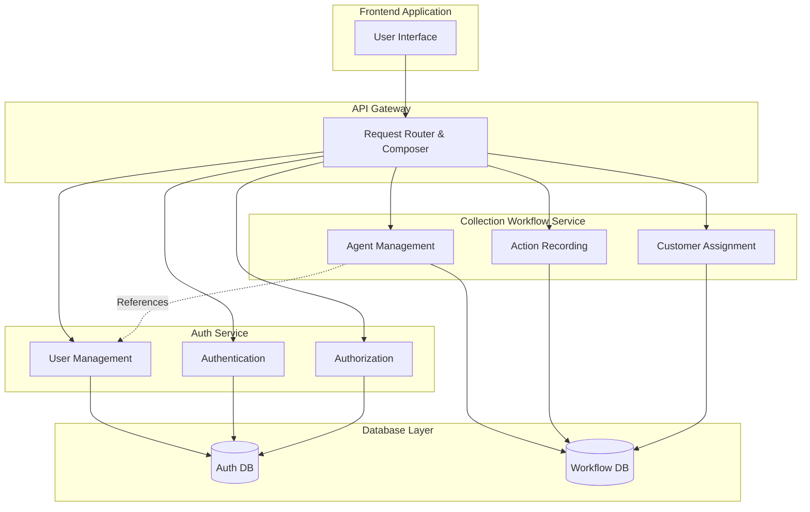
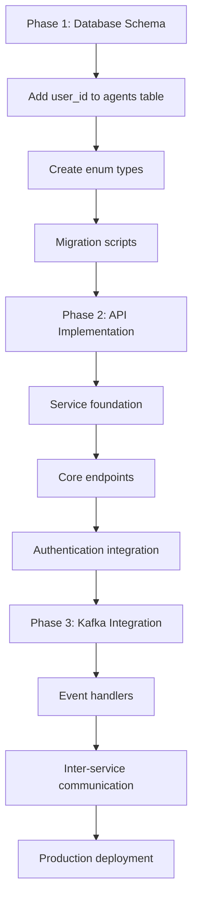
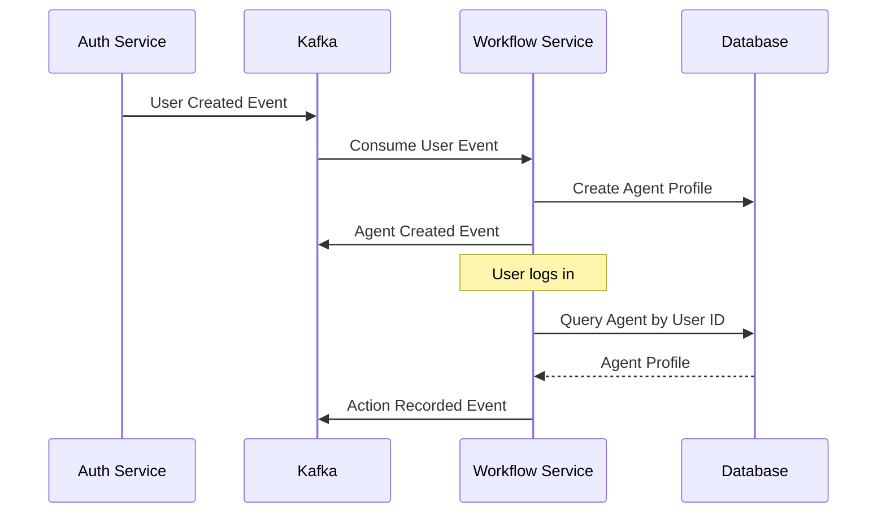

# Collection Workflow Service Implementation Plan

## Executive Summary

This document provides a comprehensive implementation plan for the Collection Workflow Service and User-Agent Linking Workflow in the CollectionCRM system. The implementation follows a phased approach prioritizing database schema modifications, core API development, and event-driven integration.

## Current System Assessment

### Existing Infrastructure
- **Database**: PostgreSQL with schema-based separation (`auth_service`, `bank_sync_service`, `workflow_service`)
- **Services**: Auth-service and Bank-sync-service implemented in TypeScript/Node.js
- **Architecture**: Microservices with API Gateway, Docker containerization
- **Event System**: Kafka infrastructure configured but not fully utilized
- **Caching**: Redis for session management and rate limiting

### Current Workflow Service Schema Analysis
The existing `workflow_service` schema includes:
- `agents` table - **Missing user_id foreign key**
- `action_records` table with partitioning by date
- `customer_agents` table for assignments (SCD Type 2)
- `customer_cases` and `customer_case_actions` tables
- Materialized views for performance reporting

### Gaps Identified
1. **User-Agent Linking**: No foreign key relationship between `workflow_service.agents` and `auth_service.users`
2. **Service Implementation**: Workflow service code doesn't exist yet
3. **Kafka Integration**: Event handling not implemented
4. **API Endpoints**: Collection workflow API contract not implemented

## Implementation Phases

### Phase 1: Database Schema Modifications and User-Agent Linking (Weeks 1-2)

#### 1.1 Database Schema Updates

**Required Changes to `workflow_service.agents` table:**

```sql
-- Add user_id column with foreign key constraint
ALTER TABLE workflow_service.agents 
ADD COLUMN user_id UUID REFERENCES auth_service.users(id);

-- Create index for performance
CREATE INDEX idx_agents_user_id ON workflow_service.agents(user_id);

-- Add unique constraint to ensure one agent per user
ALTER TABLE workflow_service.agents 
ADD CONSTRAINT uk_agents_user_id UNIQUE (user_id);
```

**Additional Enum Types Needed:**
```sql
-- Action types and results
CREATE TYPE action_type AS ENUM ('CALL', 'VISIT', 'EMAIL', 'SMS', 'LETTER');
CREATE TYPE action_subtype AS ENUM ('REMINDER_CALL', 'FOLLOW_UP_CALL', 'FIELD_VISIT', 'COURTESY_CALL');
CREATE TYPE action_result AS ENUM ('PROMISE_TO_PAY', 'PAYMENT_MADE', 'NO_CONTACT', 'REFUSED_TO_PAY', 'DISPUTE');

-- Customer status types
CREATE TYPE customer_status AS ENUM ('ACTIVE', 'INACTIVE', 'COOPERATIVE', 'UNCOOPERATIVE');
CREATE TYPE collateral_status AS ENUM ('SECURED', 'UNSECURED', 'PARTIAL');
CREATE TYPE processing_state_status AS ENUM ('IN_PROCESS', 'COMPLETED', 'PENDING', 'ESCALATED');
CREATE TYPE lending_violation_status AS ENUM ('NONE', 'MINOR', 'MAJOR', 'CRITICAL');
CREATE TYPE recovery_ability_status AS ENUM ('HIGH', 'MEDIUM', 'LOW', 'NONE');
```

#### 1.2 User-Agent Linking Implementation

**Database Migration Strategy:**
1. Add `user_id` column as nullable initially
2. Create migration script to link existing agents to users
3. Make `user_id` NOT NULL after data migration
4. Add constraints and indexes

**New API Endpoints for User-Agent Management:**
```typescript
// New endpoints to add to collection workflow API
GET  /api/v1/collection/agents/by-user/{userId}     // Get agent by user ID
POST /api/v1/collection/agents/link-user            // Link existing agent to user
GET  /api/v1/collection/users/{userId}/agent        // Get user's agent profile
```

### Phase 2: Core API Endpoints Implementation (Weeks 3-6)

#### 2.1 Service Architecture

**Directory Structure:**
```
src/services/workflow-service/
├── src/
│   ├── app.ts                    # Express app configuration
│   ├── index.ts                  # Service entry point
│   ├── config/
│   │   ├── data-source.ts        # TypeORM configuration
│   │   ├── env.config.ts         # Environment configuration
│   │   └── swagger.ts            # API documentation
│   ├── controllers/
│   │   ├── agent.controller.ts   # Agent management endpoints
│   │   ├── action.controller.ts  # Action recording endpoints
│   │   ├── assignment.controller.ts # Customer assignment endpoints
│   │   └── case.controller.ts    # Case management endpoints
│   ├── entities/
│   │   ├── agent.entity.ts       # Agent entity
│   │   ├── action-record.entity.ts # Action record entity
│   │   ├── customer-agent.entity.ts # Assignment entity
│   │   └── customer-case.entity.ts # Case entities
│   ├── repositories/
│   │   ├── agent.repository.ts   # Agent data access
│   │   ├── action.repository.ts  # Action data access
│   │   └── assignment.repository.ts # Assignment data access
│   ├── services/
│   │   ├── agent.service.ts      # Agent business logic
│   │   ├── action.service.ts     # Action business logic
│   │   └── assignment.service.ts # Assignment business logic
│   ├── middleware/
│   │   ├── auth.middleware.ts    # JWT validation
│   │   ├── validation.middleware.ts # Request validation
│   │   └── error-handler.middleware.ts # Error handling
│   ├── routes/
│   │   ├── agent.routes.ts       # Agent routes
│   │   ├── action.routes.ts      # Action routes
│   │   └── assignment.routes.ts  # Assignment routes
│   └── utils/
│       ├── logger.ts             # Logging utility
│       └── response.ts           # Standard response format
├── tests/                        # Unit and integration tests
├── package.json
└── tsconfig.json
```

#### 2.2 Core Implementation Patterns

**Following Bank-Sync-Service Patterns:**
- TypeORM for database operations
- Express.js with middleware stack
- JWT authentication via auth middleware
- Standard error handling middleware
- Validation middleware using express-validator
- Structured logging with Pino

**Key API Endpoints to Implement:**

1. **Agent Management** (Priority: High)
   - `GET /agents` - List agents with filtering
   - `POST /agents` - Create new agent
   - `PUT /agents/{id}` - Update agent
   - `GET /agents/{id}/performance` - Agent performance metrics

2. **Action Management** (Priority: High)
   - `POST /actions` - Record collection action
   - `GET /actions/customer/{cif}` - Customer actions
   - `GET /actions/loan/{accountNumber}` - Loan actions
   - `PUT /actions/{id}/result` - Update action result

3. **Assignment Management** (Priority: Medium)
   - `GET /assignments/agent/{agentId}` - Agent assignments
   - `POST /assignments` - Create assignment
   - `PUT /assignments/{id}` - Update assignment
   - `GET /assignments/history/{cif}` - Assignment history

4. **Case Management** (Priority: Low)
   - `GET /cases/customer/{cif}` - Customer case history
   - `POST /cases` - Record case action
   - `GET /cases/status/{cif}` - Customer case status

### Phase 3: Kafka Integration and Event Handling (Weeks 7-8)

#### 3.1 Event-Driven Architecture

**Kafka Topics Design:**
```typescript
// Topic naming convention: service.entity.action
const KAFKA_TOPICS = {
  // Auth service events
  USER_CREATED: 'auth-service.user.created',
  USER_UPDATED: 'auth-service.user.updated',
  USER_DEACTIVATED: 'auth-service.user.deactivated',
  
  // Workflow service events
  AGENT_CREATED: 'workflow-service.agent.created',
  AGENT_UPDATED: 'workflow-service.agent.updated',
  ACTION_RECORDED: 'workflow-service.action.recorded',
  CUSTOMER_ASSIGNED: 'workflow-service.assignment.created',
  
  // Bank sync events
  CUSTOMER_UPDATED: 'bank-sync-service.customer.updated',
  LOAN_UPDATED: 'bank-sync-service.loan.updated',
  
  // Payment events
  PAYMENT_RECEIVED: 'payment-service.payment.received'
};
```

#### 3.2 Event Handlers Implementation

**User-Agent Linking Events:**
```typescript
// Handle user lifecycle events from auth-service
interface UserEventHandler {
  handleUserCreated(event: UserCreatedEvent): Promise<void>;
  handleUserUpdated(event: UserUpdatedEvent): Promise<void>;
  handleUserDeactivated(event: UserDeactivatedEvent): Promise<void>;
}

// Event payload structures
interface UserCreatedEvent {
  userId: string;
  username: string;
  email: string;
  role: string;
  timestamp: Date;
}
```

**Integration Points:**
1. **Auth Service → Workflow Service**: User lifecycle events
2. **Workflow Service → Other Services**: Action notifications
3. **Bank Sync Service → Workflow Service**: Customer/loan updates
4. **Payment Service → Workflow Service**: Payment notifications

#### 3.3 Kafka Configuration

**Producer Configuration:**
```typescript
// Kafka producer for publishing events
const kafkaConfig = {
  clientId: 'workflow-service',
  brokers: [process.env.KAFKA_BROKERS || 'kafka:9092'],
  retry: {
    initialRetryTime: 100,
    retries: 8
  }
};
```

**Consumer Groups:**
- `workflow-service-user-events` - Handle auth service events
- `workflow-service-bank-events` - Handle bank sync events
- `workflow-service-payment-events` - Handle payment events

## Technical Implementation Details

### Authentication & Authorization Integration

**JWT Token Validation:**
```typescript
// Middleware to extract user context and link to agent
interface AuthenticatedRequest extends Request {
  user: {
    id: string;
    username: string;
    role: string;
    agentId?: string; // Populated by middleware
  };
}

// Agent context middleware
const agentContextMiddleware = async (req: AuthenticatedRequest, res: Response, next: NextFunction) => {
  if (req.user) {
    const agent = await agentService.getAgentByUserId(req.user.id);
    req.user.agentId = agent?.id;
  }
  next();
};
```

### Database Connection & ORM Configuration

**TypeORM Configuration:**
```typescript
// Following bank-sync-service patterns
export const AppDataSource = new DataSource({
  type: 'postgres',
  host: env.DB_HOST,
  port: env.DB_PORT,
  username: env.DB_USERNAME,
  password: env.DB_PASSWORD,
  database: env.DB_DATABASE,
  schema: 'workflow_service',
  entities: [Agent, ActionRecord, CustomerAgent, CustomerCase],
  migrations: ['src/migrations/*.ts'],
  synchronize: false, // Use migrations in production
  logging: env.isDevelopment()
});
```

### Performance Considerations

**Database Optimization:**
1. **Partitioning**: `action_records` already partitioned by date
2. **Indexing**: Strategic indexes on frequently queried columns
3. **Materialized Views**: `agent_performance` and `customer_collection_status` for reporting
4. **Connection Pooling**: Configure appropriate pool sizes

**Caching Strategy:**
```typescript
// Redis caching for frequently accessed data
interface CacheService {
  getAgentPerformance(agentId: string, period: string): Promise<PerformanceMetrics>;
  cacheAgentPerformance(agentId: string, period: string, data: PerformanceMetrics): Promise<void>;
  invalidateAgentCache(agentId: string): Promise<void>;
}
```

## Implementation Sequence and Dependencies

### Phase 1 Dependencies (Weeks 1-2)
1. **Database Schema Updates**
   - Modify `workflow_service.agents` table
   - Add new enum types
   - Create migration scripts
   - Update materialized views

2. **User-Agent Linking**
   - Implement linking logic
   - Create migration for existing data
   - Add validation constraints

### Phase 2 Dependencies (Weeks 3-6)
1. **Service Foundation**
   - Project setup following bank-sync-service patterns
   - TypeORM entities and repositories
   - Basic middleware and error handling

2. **Core API Implementation**
   - Agent management endpoints
   - Action recording endpoints
   - Assignment management endpoints
   - Case management endpoints

3. **Authentication Integration**
   - JWT validation middleware
   - User-agent context resolution
   - Role-based authorization

### Phase 3 Dependencies (Weeks 7-8)
1. **Kafka Integration**
   - Producer/consumer setup
   - Event handlers implementation
   - Topic management

2. **Inter-Service Communication**
   - Event publishing for workflow actions
   - Event consumption from auth/bank services
   - Error handling and retry logic

## Risk Assessment and Mitigation Strategies

### High-Risk Areas

1. **Database Migration Complexity**
   - **Risk**: Data integrity issues during user-agent linking
   - **Mitigation**: 
     - Comprehensive backup strategy
     - Staged migration with rollback plan
     - Extensive testing on production-like data

2. **Cross-Service Dependencies**
   - **Risk**: Service coupling and cascading failures
   - **Mitigation**:
     - Circuit breaker patterns
     - Graceful degradation
     - Comprehensive monitoring

3. **Performance Impact**
   - **Risk**: Database performance degradation with new foreign keys
   - **Mitigation**:
     - Performance testing with realistic data volumes
     - Index optimization
     - Query performance monitoring

### Medium-Risk Areas

1. **Kafka Event Ordering**
   - **Risk**: Out-of-order event processing
   - **Mitigation**: Proper partitioning strategy and idempotent handlers

2. **Authentication Integration**
   - **Risk**: Security vulnerabilities in JWT handling
   - **Mitigation**: Follow established patterns from auth-service

## Success Metrics and Validation

### Technical Metrics
- API response times < 200ms for 95th percentile
- Database query performance maintained
- Zero data integrity issues during migration
- 99.9% uptime for workflow service

### Functional Metrics
- All API endpoints implemented per contract
- User-agent linking working correctly
- Event-driven updates functioning
- Performance reporting accurate

## Deployment Strategy

### Docker Configuration
```yaml
# Addition to docker-compose.yml
workflow-service:
  build:
    context: ../../
    dockerfile: docker/base-images/workflow-service.Dockerfile
  ports:
    - "3003:3003"
  environment:
    - NODE_ENV=development
    - DB_HOST=postgres
    - DB_PORT=5432
    - DB_USERNAME=postgres
    - DB_PASSWORD=${POSTGRES_ADMIN_PASSWORD:-admin_password}
    - DB_DATABASE=collectioncrm
    - PORT=3003
    - API_PREFIX=/api/v1/collection
    - KAFKA_BROKERS=kafka:9092
    - REDIS_HOST=redis
    - REDIS_PORT=6379
    - AUTH_SERVICE_URL=http://auth-service:3000
  depends_on:
    - postgres
    - kafka
    - redis
    - auth-service
```

### Environment Configuration
- Development: Local Docker setup with hot reload
- Staging: Production-like environment for testing
- Production: Kubernetes deployment with auto-scaling

## Mermaid Diagrams

### User-Agent Linking Architecture


### Implementation Flow


### Event-Driven Architecture


This comprehensive implementation plan provides a structured roadmap for developing the Collection Workflow Service with proper user-agent linking, following established patterns while introducing necessary event-driven capabilities.