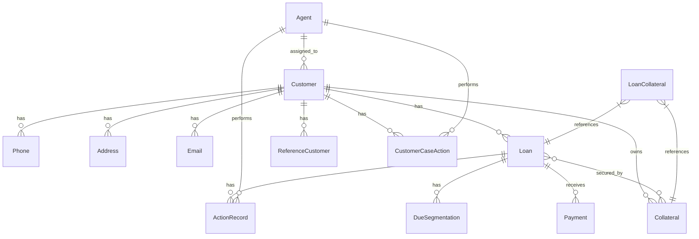

# Data Model

This document outlines the data model for the Collection CRM system, including entity relationships, attributes, and access patterns.

## Entity Relationship Diagram



## Entity Definitions

### 0. SynchronizedEntity

Base interface for all entities that are synchronized from external systems:

```typescript
interface SynchronizedEntity {
  id: string;                 // Unique identifier 
  naturalKey: string;         // Stable business identifier (never changes)
  sourceSystem: SourceSystemType; // Origin system
  createdBy: string;          // User/system that created
  updatedBy: string;          // User/system that last updated
  createdAt: Date;            // Creation timestamp
  updatedAt: Date;            // Last update timestamp
  isEditable: boolean;        // Whether record can be modified
  lastSyncedAt: Date;         // Last synchronization timestamp
}
```

### 1. Customer

Represents individuals or organizations with loans.

```typescript
interface Customer extends SynchronizedEntity {
  // naturalKey represents the CIF number
  cif: string;                // VPBANK CIF  (unique)
  type: 'INDIVIDUAL' | 'ORGANIZATION'; // Customer type 
  
  // For individuals
  name?: string;              // Name 
  dateOfBirth?: Date;         // Date of birth 
  nationalId?: string;        // National ID number 
  gender?: string;            // Gender
  
  // For organizations
  companyName?: string;       // Company name 
  registrationNumber?: string; // Registration number 
  taxId?: string;             // Tax ID 
  
  segment: string;            // Customer segment 
  status: 'ACTIVE' | 'INACTIVE'; // Status 
  
  // Relationships (accessed via repository methods)
  getPhoneNumbers(): Phone[];
  getAddresses(): Address[];
  getEmails(): Email[];
  getLoans(): Loan[];
  getCollaterals(): Collateral[];
  getCustomerCaseActions(): CustomerCaseAction[]; 
}
```

### 2. Phone

Represents phone numbers associated with customers. cif+type is unique pair keys

```typescript
interface Phone extends SynchronizedEntity {
  // naturalKey represents the CIF number
  cif: string;        // Reference to customer's naturalKey (stable) 
  type: PhoneType;            // Phone type 
  number: string;             // Phone number 
  isPrimary: boolean;         // Whether this is the primary phone 
  isVerified: boolean;        // Whether this phone is verified 
  verificationDate?: Date;    // When the phone was verified 
}
```

### 3. Address

Represents physical addresses associated with customers. cif+type is unique pair keys

```typescript
interface Address extends SynchronizedEntity {
  // naturalKey represents the CIF number
  cif: string;        // Reference to customer's naturalKey (stable)
  type: AddressType;          // Address type 
  addressLine1: string;       // Address line 1 
  addressLine2?: string;      // Address line 2 
  city: string;               // City 
  state: string;              // State/Province 
  district: string;           // District 
  country: string;            // Country 
  isPrimary: boolean;         // Whether this is the primary address 
  isVerified: boolean;        // Whether this address is verified 
  verificationDate?: Date;    // When the address was verified 
}
```

### 4. Email

Represents email addresses associated with customers. cif+address is unique pair keys

```typescript
interface Email extends SynchronizedEntity {
  // naturalKey represents the CIF number
  cif: string;        // Reference to customer's naturalKey (stable)
  address: string;            // Email address 
  isPrimary: boolean;         // Whether this is the primary email 
  isVerified: boolean;        // Whether this email is verified 
  verificationDate?: Date;    // When the email was verified 
}
```

### 5. Loan

Represents a loan issued to a customer. accountNumber is unique key

```typescript
interface Loan extends SynchronizedEntity {
  // naturalKey represents the accountNumber
  accountNumber: string;      // Loan account number 
  cif: string;                // Reference to customer's naturalKey (stable)
  productType: LoanProductType; // Loan product type 
  originalAmount: number;     // Original loan amount 
  currency: string;           // Currency code 
  disbursementDate: Date;     // Disbursement date 
  maturityDate: Date;         // Maturity date 
  interestRate: number;       // Interest rate 
  term: number;               // Loan term in months 
  paymentFrequency: string;   // Payment frequency 
  limit: number;              // Limit of OD & Cards
  
  outstanding: number;     // Current outstanding balance 
  remainingAmount: number;  // Remaining amount = Outstanding - dueAmount this period 
  dueAmount: number;          // Current due amount 
  minPay: number;             // For cards product
  nextPaymentDate: Date;      // Next payment date 
  dpd: number;                // Days overdue 
  delinquencyStatus: string;  // Delinquency status 
  
  // tracking loan status
  status: 'OPEN' | 'CLOSED'   // Loan status 
  closeDate?: Date;           // Loan close date 
  resolutionCode?: string;    // Resolution code 
  resolutionNotes?: string;   // Resolution notes 
  
  // Relationships (accessed via repository methods)
  getDueSegmentation(): DueSegmentation[];
  getActions(): ActionRecord[];
  getPayments(): Payment[];
}
```

### 6. Collateral

Represents assets used as collateral for loans. collateralNumber is unique key

```typescript
interface Collateral extends SynchronizedEntity {
  // naturalKey represents the collateralNumber
  collateralNumber: string;   // VPBANK collateral number
  cif: string;        // Reference to customer's naturalKey (stable)
  
  type: string;               // Collateral type 
  description: string;        // Description 
  value: number;              // Assessed value 
  valuationDate: Date;        // Valuation date 
  
  // For vehicles
  make?: string;              // Vehicle make 
  model?: string;             // Vehicle model 
  year?: number;              // Vehicle year 
  vin?: string;               // Vehicle identification number 
  licensePlate?: string;      // License plate 
  
  // For real estate
  propertyType?: string;      // Property type 
  address?: string;           // Property address 
  size?: number;              // Property size 
  titleNumber?: string;       // Title number 
}
```

### 7. ActionRecord

Represents actions taken by collection agents.

```typescript
interface ActionRecord {
  id: string;                 // Unique identifier 
  cif: string;                // Reference to customer's naturalKey (stable)
  loanAccountNumber: string;  // Reference to loan's naturalKey (stable)
  
  type: ActionType;           // Action type 
  subtype: ActionSubType;     // Action subtype 
  actionResult: ActionResultType; // Action result 
  actionDate: Date;           // When the action occurred 
  notes: string;              // Action notes 
  
  // For calls
  callTraceId?: number;      // Call traceid in Callcenters
  
  // For visits
  visitLocation?: {           // Visit location 
    latitude: number;
    longitude: number;
    address?: string;
  };
  
  // Metadata
  createdAt: Date;            // Creation timestamp 
  updatedAt: Date;            // Last update timestamp 
  createdBy: string;          // User who created this action 
  updatedBy: string;          // User who last updated this action 
}
```

### 8. Agent

Represents collection agents and their teams.

```typescript
interface Agent {
  id: string;                 // Unique identifier 
  employeeId: string;         // Employee ID 
  name: string;               // Agent name 
  email: string;              // Work email 
  phone: string;              // Work phone 
  
  type: 'AGENT' | 'SUPERVISOR' | 'ADMIN'; // Agent type 
  team: Team;                 // Team assignment 
  isActive: boolean;          // Whether agent is active 
  
  // Relationships
  getCustomers(): Customer[];   // Assigned Customer (1:N), based on CustomerAgent[]
  getActions(): ActionRecord[];    // Performed actions (1:N)
  
  // Metadata
  createdAt: Date;            // Creation timestamp 
  updatedAt: Date;            // Last update timestamp 
}
```

### 9. Payment

Represents payments made toward a loan.

```typescript
interface Payment extends SynchronizedEntity {
  // naturalKey represents the referenceNumber
  referenceNumber: string;    // Reference number 
  loanAccountNumber: string;  // Reference to loan's naturalKey (stable)
  cif: string;           // Reference to customer's naturalKey (stable)
  
  amount: number;             // Payment amount 
  currency: string;           // Currency code 
  paymentDate: Date;          // Payment date 
  paymentMethod: string;      // Payment method 
  
  status: 'PENDING' | 'COMPLETED' | 'FAILED' | 'REVERSED'; // Payment status 
  statusReason?: string;      // Status reason 
}
```

### 10. DueSegmentation

Represents due segmentation amount for different duedates for a loan. loanAccountNumber + dueDate is unique pair key

```typescript
interface DueSegmentation extends SynchronizedEntity {
  // naturalKey represents the loanAccountNumber
  loanAccountNumber: string;  // Reference to loan's naturalKey (stable)
  dueDate: Date;              // Duedate need to pay
  // Allocation
  principalAmount: number;    // Amount allocated to principal 
  interestAmount: number;     // Amount allocated to interest 
  feesAmount: number;         // Amount allocated to fees 
  penaltyAmount: number;      // Amount allocated to penalties 
}
```

### 11. LoanCollateral

Represents the many-to-many relationship between loans and collaterals. loanAccountNumber + collateralNumber is unique pair key

```typescript
interface LoanCollateral {
  loanAccountNumber: string;   // Reference to loan's naturalKey (stable)
  collateralNumber: string;      // Reference to collateral's naturalKey (stable)
  
  // Metadata
  createdAt: Date;            // Creation timestamp 
  updatedAt: Date;            // Last update timestamp 
  sourceSystem: string;       // Source system identifier 
}
```

### 12. CustomerAgent

Represents list of customer assigning to agents. scd type 2 table

```typescript
interface CustomerAgent {
  id: string;          // Internal database ID
  cif: string;         // Reference to customer 
  
  assignedCallAgentId?: string;  // Assigned call agent ID 
  assignedFieldAgentId?: string; // Assigned field agent ID 
  
  // Metadata
  startDate: Date;            // scd type 2
  endDate: Date;            // scd type 2
  isCurrent: boolean;       // scd type 2
}
```

### 13. CustomerCaseAction

Represents actions and status inputs from agents at the customer level.

```typescript
interface CustomerCaseAction {
  id: string;                 // Unique identifier 
  cif: string;     // Reference to customer's natural key 
  
  actionDate: Date;           // When the action occurred 
  notes: string;              // Action notes 
  
  // Status inputs
  customerStatus: CustomerStatusType;        // Customer status 
  collateralStatus: CollateralStatusType;    // Collateral status 
  processingStateStatus: ProcessingStateStatusType; // Processing state status 
  lendingViolationStatus: LendingViolationStatusType; // Lending violation status 
  recoveryAbilityStatus: RecoveryAbilityStatusType; // Recovery ability status 
  
  // Metadata
  createdAt: Date;            // Creation timestamp 
  updatedAt: Date;            // Last update timestamp 
  createdBy: string;          // User who created this action 
  updatedBy: string;          // User who last updated this action 
}
```

### 14. ReferenceCustomer

Represents related contacts to a customer (such as guarantors, spouses, or other related parties).

```typescript
interface ReferenceCustomer extends SynchronizedEntity {
  // naturalKey represents the refCif
  refCif: string;         // Stable business identifier (CIF number)
  primaryCif: string;        // Reference to primary customer's naturalKey (stable)
  relationshipType: ReferenceRelationshipType;   // Relationship to primary customer 
  
  cif: string;                // VPBANK CIF 
  type: 'INDIVIDUAL' | 'ORGANIZATION'; // Customer type 
  
  // For individuals
  name?: string;              // Name 
  dateOfBirth?: Date;         // Date of birth 
  nationalId?: string;        // National ID number 
  gender?: string;            // Gender 
  
  // For organizations
  companyName?: string;       // Company name 
  registrationNumber?: string; // Registration number 
  taxId?: string;             // Tax ID 
  
  // Relationships (accessed via repository methods)
  getPhoneNumbers(): Phone[];
  getAddresses(): Address[];
  getEmails(): Email[];
}
```

## Access Patterns

### 1. Customer Management

- Retrieve customer by ID
- Search customers by name, national ID, or company registration
- List customers by segment or risk category
- Update customer contact information
- View customer's loans and collection history
- Manage reference customers

### 2. Loan Management

- Retrieve loan by ID or account number
- List loans by customer
- List loans by delinquency status
- View loan payment history
- View loan collateral information
- Manage loan-collateral associations

### 3. Collection Workflow

- Assign customers to agents
- Record collection actions and outcomes
- Create and update customer case actions
- Track customer-level collection status
- Track agent performance metrics
- Generate collection reports

### 4. Payment Tracking

- Record and track payments
- View payment history by loan or customer
- Generate payment reports
- Reconcile payments with collection actions

## Data Access Control

| Entity              | Collection Agent | Team Lead | Administrator |
|---------------------|------------------|-----------|--------------|
| Customer            | Read             | Read      | Read/Write   |
| Phone               | Read/Write       | Read/Write| Read/Write   |
| Address             | Read/Write       | Read/Write| Read/Write   |
| Email               | Read/Write       | Read/Write| Read/Write   |
| Loan                | Read             | Read      | Read/Write   |
| Collateral          | Read             | Read      | Read/Write   |
| ActionRecord        | Read/Write       | Read/Write| Read/Write   |
| Agent               | Read             | Read/Write| Read/Write   |
| Payment             | Read             | Read      | Read/Write   |
| LoanCollateral      | Read             | Read      | Read/Write   |
| CustomerAgent       | Read             | Read/Write| Read/Write   |
| CustomerCaseAction  | Read/Write       | Read/Write| Read/Write   |
| ReferenceCustomer   | Read/Write       | Read/Write| Read/Write   |

## Data Synchronization

### Natural Key Approach

The system uses natural business keys to maintain relationship integrity during synchronization:

1. **Natural Key Definition**:
   - Each synchronized entity has a `naturalKey` field that remains stable across synchronization cycles
   - Natural keys are derived from business identifiers in source systems:
     - Customer: CIF number
     - Loan: Account number
     - Collateral: Collateral number
     - Phone/Address/Email: Composite key of entity type + source ID + customer CIF

2. **Relationship Management**:
   - Relationships between entities use naturalKey references instead of database IDs
   - This ensures relationships remain intact even when database IDs change during synchronization

3. **Synchronization Process**:
   - Entities are synchronized using upsert operations based on naturalKey matching
   - This approach is more efficient than truncate-and-insert and preserves relationship integrity

### Entity Synchronization Details

1. **Customer Data**:
   - Synchronized daily from core bank systems
   - Natural key: CIF number
   - Read-only in Collection CRM when sourced from core bank systems
   - Contact information can be updated in CRM but not synced back

2. **Loan Data**:
   - Synchronized daily from core bank systems
   - Natural key: Account number
   - Read-only in Collection CRM 
   - Payment information updated in real-time

3. **Collateral Data**:
   - Synchronized daily from core bank systems
   - Natural key: Collateral number
   - Read-only in Collection CRM 

4. **Payment Data**:
   - Real-time updates from payment processing system
   - Natural key: Reference number
   - Read-only in Collection CRM

5. **Action Records**:
   - Created and managed within Collection CRM
   - References loan and customer using loan naturalKey and customer naturalKey
   - Fully editable by authorized users

6. **CustomerAgent Data**:
   - Created and managed within Collection CRM
   - Mapping assigned Customers to Agents using customer naturalKey and Agent id
   - Represents the many-to-many relationship between Customers and Agents
   - SCD type 2 

7. **CustomerCaseAction Data**:
   - Created and managed within Collection CRM
   - References customer using customer naturalKey
   - Fully editable by authorized users

8. **ReferenceCustomer Data**:
   - Synchronized daily from T24 or created within Collection CRM
   - Natural key: CIF number
   - Basic information read-only when synchronized from T24
   - Contact information can be updated in CRM but not synced back

9. **LoanCollateral Data**:
   - Created and managed within Collection CRM
   - References loans and collaterals using their naturalKeys
   - Represents the many-to-many relationship between loans and collaterals


## Data Source Tracking

To implement the requirement that data imported from external sources (T24, W4, OTHER) should be read-only while allowing agents to add new data and edit their own entries, the system will implement the following approach:

1. **Source Tracking**:
   - Applied only to entities that can be imported from external systems: Customer, ReferenceCustomer, Phone, Address, Email, Loan, Collateral, Payment
   - Each tracked entity extends the SynchronizedEntity interface
   - Values for `sourceSystem` are defined in the SourceSystemType enum
   - The `isEditable` flag determines if a record can be modified

2. **Edit Permissions Logic**:
   - Records with `sourceSystem` values of "T24", "W4", or "OTHER" will be read-only for core fields
   - Records with `sourceSystem` value of "CRM" will be editable by the user who created them (`createdBy` matches current user) or by users with appropriate permissions
   - Supplementary information can be added to external records without modifying the core data

3. **Implementation Approach**:
   ```typescript
   interface SynchronizedEntity {
     id: string;                 // Internal database ID (can change during sync)
     naturalKey: string;         // Stable business identifier (never changes)
     sourceSystem: SourceSystemType; // Origin system
     lastSyncedAt: Date;         // Last synchronization timestamp
     createdBy: string;          // User/system that created
     updatedBy: string;          // User/system that last updated
     createdAt: Date;            // Creation timestamp
     updatedAt: Date;            // Last update timestamp
     isEditable: boolean;        // Whether record can be modified
   }
   ```

4. **Extending Records**:
   - For records from external systems that need additional information, the system will use extension tables rather than modifying the original records
   - Example: CustomerExtension table to store additional information about customers without modifying the original Customer record

5. **UI Presentation**:
   - Read-only fields from external systems will be visually distinguished in the UI
   - Editable fields created within the CRM will be clearly indicated
   - The source of each record will be displayed to users

## Data Dictionaries

This section defines standardized value sets for various field types used throughout the system.

### SourceSystemType Dictionary

Defines the source systems from which data can originate.

```typescript
enum SourceSystemType {
 T24 = 'T24',           // Core banking system
 W4 = 'W4',             // Workflow system
 OTHER = 'OTHER',       // Other external systems
 CRM = 'CRM'            // Collection CRM (internal)
}
```

### PhoneType Dictionary

Defines the types of phone numbers associated with customers.

```typescript
enum PhoneType {
 MOBILE = 'MOBILE',       // Mobile/cell phone
 HOME = 'HOME',           // Home landline
 WORK = 'WORK',           // Work/office phone
 EMERGENCY = 'EMERGENCY', // Emergency contact
 FAX = 'FAX',             // Fax number
 OTHER = 'OTHER'          // Other phone types
}
```

### AddressType Dictionary

Defines the types of addresses associated with customers.

```typescript
enum AddressType {
 HOME = 'HOME',             // Residential address
 WORK = 'WORK',             // Work/office address
 BILLING = 'BILLING',       // Billing address
 MAILING = 'MAILING',       // Mailing address
 PROPERTY = 'PROPERTY',     // Property address (for collateral)
 TEMPORARY = 'TEMPORARY',   // Temporary address
 OTHER = 'OTHER'            // Other address types
}
```

### LoanProductType Dictionary

Defines the types of loan products offered.

```typescript
enum LoanProductType {
 // Secured loans
 MORTGAGE = 'MORTGAGE',                 // Home mortgage loan
 AUTO = 'AUTO',                         // Auto/vehicle loan
 SECURED_PERSONAL = 'SECURED_PERSONAL', // Secured personal loan
 
 // Unsecured loans
 PERSONAL = 'PERSONAL',                 // Unsecured personal loan
 EDUCATION = 'EDUCATION',               // Education/student loan
 BUSINESS = 'BUSINESS',                 // Business loan
 
 // Credit facilities
 CREDIT_CARD = 'CREDIT_CARD',           // Credit card
 OVERDRAFT = 'OVERDRAFT',               // Overdraft facility
 LINE_OF_CREDIT = 'LINE_OF_CREDIT',     // Line of credit
 
 // Other
 REFINANCE = 'REFINANCE',               // Refinance loan
 CONSOLIDATION = 'CONSOLIDATION',       // Debt consolidation loan
 OTHER = 'OTHER'                        // Other loan types
}
```

### ActionType Dictionary

Defines the types of actions performed by collection agents.

```typescript
enum ActionType {
 // Communication actions
 CALL = 'CALL',                     // Phone call to customer
 SMS = 'SMS',                       // SMS message to customer
 EMAIL = 'EMAIL',                   // Email to customer
 LETTER = 'LETTER',                 // Physical letter to customer
 
 // In-person actions
 VISIT = 'VISIT',                   // In-person visit
 MEETING = 'MEETING',               // Scheduled meeting
 
 // Case management actions
 CASE_REVIEW = 'CASE_REVIEW',       // Review of case details
 CASE_ESCALATION = 'CASE_ESCALATION', // Escalation to higher authority
 CASE_TRANSFER = 'CASE_TRANSFER',   // Transfer to another agent/team
 
 // Payment actions
 PAYMENT_ARRANGEMENT = 'PAYMENT_ARRANGEMENT', // Setting up payment plan
 PAYMENT_REMINDER = 'PAYMENT_REMINDER',       // Reminder about payment
 PAYMENT_CONFIRMATION = 'PAYMENT_CONFIRMATION', // Confirming received payment
 
 // Legal actions
 LEGAL_NOTICE = 'LEGAL_NOTICE',     // Legal notice issuance
 LEGAL_FILING = 'LEGAL_FILING',     // Legal case filing
 
 // Other
 NOTE = 'NOTE',                     // General note/comment
 OTHER = 'OTHER'                    // Other action types
}
```

### ActionSubType Dictionary

Defines subtypes for the main action types.

```typescript
enum ActionSubType {
 // Call subtypes
 CALL_OUTBOUND = 'CALL_OUTBOUND',       // Outbound call initiated by agent
 CALL_INBOUND = 'CALL_INBOUND',         // Inbound call from customer
 CALL_FOLLOWUP = 'CALL_FOLLOWUP',       // Follow-up call
 
 // SMS subtypes
 SMS_REMINDER = 'SMS_REMINDER',         // Payment reminder SMS
 SMS_CONFIRMATION = 'SMS_CONFIRMATION', // Confirmation SMS
 SMS_INFORMATION = 'SMS_INFORMATION',   // Informational SMS
 
 // Email subtypes
 EMAIL_REMINDER = 'EMAIL_REMINDER',     // Payment reminder email
 EMAIL_STATEMENT = 'EMAIL_STATEMENT',   // Statement email
 EMAIL_LEGAL = 'EMAIL_LEGAL',           // Legal notice email
 
 // Visit subtypes
 VISIT_SCHEDULED = 'VISIT_SCHEDULED',   // Scheduled visit
 VISIT_UNSCHEDULED = 'VISIT_UNSCHEDULED', // Unscheduled visit
 
 // Payment arrangement subtypes
 ARRANGEMENT_NEW = 'ARRANGEMENT_NEW',   // New payment arrangement
 ARRANGEMENT_REVISED = 'ARRANGEMENT_REVISED', // Revised payment arrangement
 
 // Legal subtypes
 LEGAL_WARNING = 'LEGAL_WARNING',       // Legal warning
 LEGAL_DEMAND = 'LEGAL_DEMAND',         // Demand letter
 LEGAL_COURT = 'LEGAL_COURT',           // Court proceedings
 
 // Other
 OTHER = 'OTHER'                        // Other subtypes
}
```

### ActionResultType Dictionary

Defines the possible outcomes of collection actions.

```typescript
enum ActionResultType {
 // Contact results
 CONTACTED = 'CONTACTED',               // Successfully contacted customer
 NOT_CONTACTED = 'NOT_CONTACTED',       // Could not contact customer
 LEFT_MESSAGE = 'LEFT_MESSAGE',         // Left message/voicemail
 
 // Response results
 PROMISE_TO_PAY = 'PROMISE_TO_PAY',     // Customer promised to pay
 PAYMENT_MADE = 'PAYMENT_MADE',         // Payment was made
 DISPUTE = 'DISPUTE',                   // Customer disputed the debt
 HARDSHIP_CLAIM = 'HARDSHIP_CLAIM',     // Customer claimed financial hardship
 
 // Negative results
 REFUSED = 'REFUSED',                   // Customer refused to pay
 DISCONNECTED = 'DISCONNECTED',         // Phone disconnected/invalid
 WRONG_CONTACT = 'WRONG_CONTACT',       // Wrong contact information
 NO_RESPONSE = 'NO_RESPONSE',           // No response from customer
 
 // Visit results
 NOT_HOME = 'NOT_HOME',                 // Customer not at home
 ADDRESS_NOT_FOUND = 'ADDRESS_NOT_FOUND', // Address could not be found
 
 // Other
 PENDING = 'PENDING',                   // Action pending completion
 COMPLETED = 'COMPLETED',               // Action completed
 FAILED = 'FAILED',                     // Action failed
 OTHER = 'OTHER'                        // Other result types
}
```

### Team Dictionary

Defines the collection teams within the organization.

```typescript
enum Team {
 // Early-stage collection teams
 EARLY_STAGE_CALL = 'EARLY_STAGE_CALL',   // Early-stage call center team
 EARLY_STAGE_FIELD = 'EARLY_STAGE_FIELD', // Early-stage field team
 
 // Mid-stage collection teams
 MID_STAGE_CALL = 'MID_STAGE_CALL',       // Mid-stage call center team
 MID_STAGE_FIELD = 'MID_STAGE_FIELD',     // Mid-stage field team
 
 // Late-stage collection teams
 LATE_STAGE_CALL = 'LATE_STAGE_CALL',     // Late-stage call center team
 LATE_STAGE_FIELD = 'LATE_STAGE_FIELD',   // Late-stage field team
 
 // Specialized teams
 LEGAL = 'LEGAL',                         // Legal team
 RESTRUCTURING = 'RESTRUCTURING',         // Loan restructuring team
 SPECIAL_ASSETS = 'SPECIAL_ASSETS',       // Special assets team
 HIGH_VALUE = 'HIGH_VALUE',               // High-value accounts team
 
 // Management
 SUPERVISOR = 'SUPERVISOR',               // Supervisory team
 MANAGEMENT = 'MANAGEMENT',               // Management team
 
 // Other
 OTHER = 'OTHER'                          // Other teams
}
```

### ReferenceRelationshipType Dictionary

Defines the possible relationship types between customers and their references.

```typescript
enum ReferenceRelationshipType {
  GUARANTOR = 'GUARANTOR',           // Financial guarantor
  SPOUSE = 'SPOUSE',                 // Spouse/partner
  FAMILY_MEMBER = 'FAMILY_MEMBER',   // Other family member
  BUSINESS_PARTNER = 'BUSINESS_PARTNER', // Business partner
  EMPLOYER = 'EMPLOYER',             // Employer
  EMPLOYEE = 'EMPLOYEE',             // Employee
  FRIEND = 'FRIEND',                 // Personal friend
  COLLEAGUE = 'COLLEAGUE',           // Work colleague
  LEGAL_REPRESENTATIVE = 'LEGAL_REPRESENTATIVE', // Legal representative
  OTHER = 'OTHER'                    // Other relationship types
}
```

### CustomerStatusType Dictionary

Defines the possible status types for customers in collection.

```typescript
enum CustomerStatusType {
 COOPERATIVE = 'COOPERATIVE',           // Customer is cooperative
 PARTIALLY_COOPERATIVE = 'PARTIALLY_COOPERATIVE', // Customer is somewhat cooperative
 UNCOOPERATIVE = 'UNCOOPERATIVE',       // Customer is uncooperative
 UNREACHABLE = 'UNREACHABLE',           // Cannot reach customer
 DISPUTED = 'DISPUTED',                 // Customer disputes the debt
 BANKRUPT = 'BANKRUPT',                 // Customer has declared bankruptcy
 DECEASED = 'DECEASED',                 // Customer is deceased
 LEGAL_REPRESENTATION = 'LEGAL_REPRESENTATION', // Customer has legal representation
 UNKNOWN = 'UNKNOWN'                    // Status unknown
}
```

### CollateralStatusType Dictionary

Defines the status types for collateral assets.

```typescript
enum CollateralStatusType {
 SECURED = 'SECURED',                   // Collateral is secured
 PARTIALLY_SECURED = 'PARTIALLY_SECURED', // Collateral is partially secured
 AT_RISK = 'AT_RISK',                   // Collateral is at risk
 DAMAGED = 'DAMAGED',                   // Collateral is damaged
 MISSING = 'MISSING',                   // Collateral is missing
 SEIZED = 'SEIZED',                     // Collateral has been seized
 IN_LIQUIDATION = 'IN_LIQUIDATION',     // Collateral is being liquidated
 LIQUIDATED = 'LIQUIDATED',             // Collateral has been liquidated
 NOT_APPLICABLE = 'NOT_APPLICABLE',     // No collateral or not applicable
 UNKNOWN = 'UNKNOWN'                    // Status unknown
}
```

### ProcessingStateStatusType Dictionary

Defines the processing state of collection cases.

```typescript
enum ProcessingStateStatusType {
 NEW = 'NEW',                           // New case
 IN_PROGRESS = 'IN_PROGRESS',           // Case in progress
 PENDING_CUSTOMER = 'PENDING_CUSTOMER', // Waiting for customer action
 PENDING_APPROVAL = 'PENDING_APPROVAL', // Waiting for internal approval
 PENDING_LEGAL = 'PENDING_LEGAL',       // Waiting for legal action
 ON_HOLD = 'ON_HOLD',                   // Case temporarily on hold
 ESCALATED = 'ESCALATED',               // Case has been escalated
 RESOLVED = 'RESOLVED',                 // Case has been resolved
 CLOSED = 'CLOSED',                     // Case is closed
 REOPENED = 'REOPENED'                  // Previously closed case reopened
}
```

### LendingViolationStatusType Dictionary

Defines the status of lending violations.

```typescript
enum LendingViolationStatusType {
 NONE = 'NONE',                         // No violations
 PAYMENT_DELAY = 'PAYMENT_DELAY',       // Payment delay violation
 COVENANT_BREACH = 'COVENANT_BREACH',   // Covenant breach
 COLLATERAL_ISSUE = 'COLLATERAL_ISSUE', // Collateral-related violation
 FINANCIAL_REPORTING = 'FINANCIAL_REPORTING', // Financial reporting violation
 MULTIPLE = 'MULTIPLE',                 // Multiple violations
 SEVERE = 'SEVERE',                     // Severe violations
 UNDER_INVESTIGATION = 'UNDER_INVESTIGATION', // Violations under investigation
 RESOLVED = 'RESOLVED',                 // Violations resolved
 UNKNOWN = 'UNKNOWN'                    // Status unknown
}
```

### RecoveryAbilityStatusType Dictionary

Defines the assessment of recovery ability.

```typescript
enum RecoveryAbilityStatusType {
 HIGH = 'HIGH',                         // High recovery probability
 MEDIUM = 'MEDIUM',                     // Medium recovery probability
 LOW = 'LOW',                           // Low recovery probability
 VERY_LOW = 'VERY_LOW',                 // Very low recovery probability
 REQUIRES_RESTRUCTURING = 'REQUIRES_RESTRUCTURING', // Requires loan restructuring
 REQUIRES_LEGAL = 'REQUIRES_LEGAL',     // Requires legal action
 WRITE_OFF_RECOMMENDED = 'WRITE_OFF_RECOMMENDED', // Write-off recommended
 UNKNOWN = 'UNKNOWN'                    // Recovery ability unknown
}
