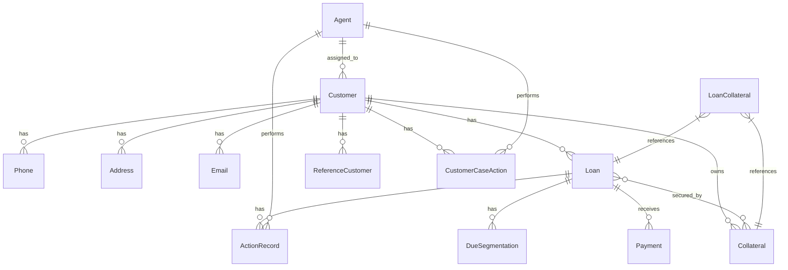

# CollectionCRM Database Schema Implementation

This document provides an overview of the CollectionCRM database schema implementation. The schema has been split into four separate files, one for each schema in the database:

1. [Auth Service Schema](./database-schema-auth-service.md) - Authentication and authorization related tables
2. [Bank Sync Service Schema](./database-schema-bank-sync-service.md) - Customer and loan-related tables synchronized from external systems
3. [Payment Service Schema](./database-schema-payment-service.md) - Payment-related tables
4. [Workflow Service Schema](./database-schema-workflow-service.md) - Collection workflow-related tables including agents, actions, and cases

## Implementation Notes

- The schema is designed for PostgreSQL 13 or higher to take advantage of features like declarative partitioning.
- Each schema corresponds to a microservice in the system architecture.
- The implementation includes comprehensive indexing and optimization strategies as described in the documentation.
- Partitioning is implemented for high-volume tables to improve query performance and facilitate data archiving.
- Materialized views are created for frequently accessed reports and dashboards.

## Database Diagram

## Implementation Steps

1. Run the schema creation scripts in the following order:
   - Common setup (extensions, schemas, types)
   - Auth Service Schema
   - Bank Sync Service Schema
   - Payment Service Schema
   - Workflow Service Schema

2. Verify the schema creation by checking the tables, indexes, and constraints.

3. Set up a process for creating new partitions as needed (e.g., quarterly partitions for high-volume tables).

4. Implement a refresh schedule for materialized views based on reporting requirements.