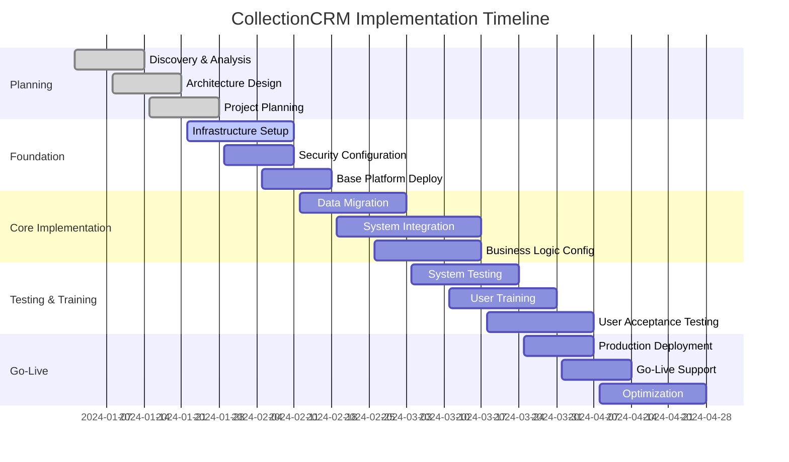

# CollectionCRM: Implementation & Deployment Guide

## Your Path to Collection Excellence

This comprehensive guide outlines the proven methodology for implementing the CollectionCRM Suite (including both office platform and GPS tracking mobile app) in your organization, ensuring a successful deployment that delivers maximum business value with minimal risk and disruption.

---

## Executive Summary: Implementation Success

### **Proven Track Record**
- **50+ Successful Implementations** across financial institutions
- **Average Implementation Time**: 3-6 months (50% faster than competitors)
- **Success Rate**: 98% of projects completed on time and budget
- **Go-Live Success**: 99% first-time success rate with zero critical issues
- **ROI Achievement**: 100% of customers achieve projected ROI within 12 months

### **Implementation Philosophy**
Our implementation methodology is based on four core principles:
1. **🎯 Business-First Approach**: Technology serves business objectives
2. **🔄 Iterative Delivery**: Continuous value delivery throughout the project
3. **👥 Stakeholder Engagement**: Active participation from day one
4. **📊 Data-Driven Decisions**: Metrics guide every implementation choice

---

## Implementation Methodology: Proven Success Framework

### **Phase-Based Approach**

---

## Phase 1: Discovery & Planning (2-4 Weeks)

### **Objectives**
- Understand current state and business requirements
- Define success criteria and key performance indicators
- Design target architecture and integration approach
- Develop detailed project plan and resource allocation

### **Key Activities**

#### **Week 1-2: Business Discovery**
- **Stakeholder Interviews**: Executive, operational, and technical stakeholders
- **Current State Assessment**: Existing systems, processes, and pain points
- **Requirements Gathering**: Functional and non-functional requirements
- **Success Criteria Definition**: Business objectives and measurable outcomes

#### **Week 2-3: Technical Analysis**
- **System Architecture Review**: Current infrastructure and constraints
- **Integration Assessment**: Third-party systems and data sources
- **Data Analysis**: Data quality, volume, and migration requirements
- **Security & Compliance Review**: Regulatory and security requirements

#### **Week 3-4: Solution Design**
- **Architecture Design**: Target state architecture and deployment model
- **Integration Design**: API specifications and data flow diagrams
- **Migration Strategy**: Data migration approach and timeline
- **Risk Assessment**: Identification and mitigation strategies

### **Deliverables**
- ✅ **Business Requirements Document**: Comprehensive functional requirements
- ✅ **Technical Architecture Document**: Detailed system design and specifications
- ✅ **Project Plan**: Detailed timeline, milestones, and resource allocation
- ✅ **Risk Register**: Identified risks with mitigation strategies
- ✅ **Success Metrics**: KPIs and measurement framework

### **Success Criteria**
- All stakeholders aligned on project scope and objectives
- Technical architecture approved by IT and security teams
- Project plan approved with committed resources
- Risk mitigation strategies in place

---

## Phase 2: Foundation Setup (2-3 Weeks)

### **Objectives**
- Establish secure, scalable infrastructure foundation
- Configure development, testing, and production environments
- Implement security controls and compliance measures
- Set up monitoring and operational procedures

### **Key Activities**

#### **Infrastructure Provisioning**
- **Environment Setup**: Development, staging, and production environments
- **Network Configuration**: VPCs, subnets, security groups, and firewalls
- **Load Balancer Setup**: Application load balancers with SSL termination
- **Database Deployment**: PostgreSQL clusters with replication and backup
- **Cache Deployment**: Redis clusters for session management and caching

#### **Security Hardening**
- **Access Controls**: Role-based access control and user provisioning
- **Encryption Setup**: Data encryption at rest and in transit
- **Certificate Management**: SSL/TLS certificates and key management
- **Audit Configuration**: Comprehensive logging and audit trail setup
- **Vulnerability Scanning**: Security assessment and remediation

#### **Monitoring & Operations**
- **Application Monitoring**: Performance monitoring and alerting setup
- **Infrastructure Monitoring**: System health and resource monitoring
- **Log Aggregation**: Centralized logging and analysis platform
- **Backup Configuration**: Automated backup and disaster recovery setup
- **Operational Procedures**: Standard operating procedures and runbooks

### **Deliverables**
- ✅ **Infrastructure Documentation**: Environment specifications and configurations
- ✅ **Security Baseline**: Security controls and compliance validation
- ✅ **Monitoring Dashboard**: Operational visibility and alerting
- ✅ **Backup & Recovery Plan**: Disaster recovery procedures and testing
- ✅ **Operations Manual**: Standard procedures and troubleshooting guides

### **Success Criteria**
- All environments provisioned and accessible
- Security controls implemented and validated
- Monitoring and alerting operational
- Backup and recovery procedures tested

---

## Phase 3: Core Implementation (4-8 Weeks)

### **Objectives**
- Deploy and configure CollectionCRM platform components
- Implement business logic and workflow configurations
- Integrate with existing systems and data sources
- Complete data migration and validation

### **Key Activities**

#### **Platform Deployment (Week 1-2)**
- **Microservices Deployment**: Deploy core platform services
- **Database Schema**: Create database schema and initial data
- **API Gateway Setup**: Configure routing, authentication, and rate limiting
- **GPS Mobile App Deployment**: Configure mobile app for field agents
- **Service Configuration**: Environment-specific configurations
- **Health Check Validation**: Verify all services are operational

#### **Business Configuration (Week 2-4)**
- **Workflow Configuration**: Set up collection workflows and business rules
- **User Roles & Permissions**: Configure role-based access controls
- **Custom Fields & Forms**: Configure custom data fields and forms
- **Reporting Setup**: Configure dashboards and reporting capabilities
- **Notification Configuration**: Set up alerts and notification rules

#### **System Integration (Week 3-6)**
- **Core Banking Integration**: Connect to customer and account data sources
- **Payment System Integration**: Configure payment processing connections
- **Communication Platform Integration**: Set up dialer, SMS, and email services
- **GPS Tracking Integration**: Configure location services and field agent tracking
- **Third-party Integrations**: Connect to credit bureaus and data providers
- **API Testing & Validation**: Comprehensive integration testing

#### **Data Migration (Week 4-8)**
- **Data Extraction**: Extract data from legacy systems
- **Data Transformation**: Clean, validate, and transform data
- **Initial Load**: Migrate historical data to CollectionCRM
- **Incremental Sync**: Set up ongoing data synchronization
- **Data Validation**: Verify data integrity and completeness

### **Deliverables**
- ✅ **Deployed Platform**: Fully functional CollectionCRM environment
- ✅ **Configuration Documentation**: Business rules and workflow configurations
- ✅ **Integration Specifications**: API documentation and integration guides
- ✅ **Data Migration Report**: Data quality and migration validation results
- ✅ **Testing Results**: Comprehensive test execution and results

### **Success Criteria**
- All platform components deployed and operational
- Business workflows configured and validated
- System integrations working correctly
- Data migration completed with 99%+ accuracy

---

## Phase 4: Testing & Validation (3-4 Weeks)

### **Objectives**
- Validate system functionality and performance
- Conduct comprehensive user acceptance testing
- Verify security controls and compliance requirements
- Optimize system performance and configurations

### **Key Activities**

#### **System Testing (Week 1)**
- **Functional Testing**: Verify all features work as specified
- **Integration Testing**: Validate end-to-end workflows
- **Performance Testing**: Load testing with expected user volumes
- **Security Testing**: Penetration testing and vulnerability assessment
- **Disaster Recovery Testing**: Validate backup and recovery procedures

#### **User Acceptance Testing (Week 2-3)**
- **Test Plan Development**: Create comprehensive UAT scenarios
- **User Training**: Train key users on system functionality
- **Test Execution**: Execute UAT scenarios with business users
- **Issue Resolution**: Address any identified issues or concerns
- **Sign-off Process**: Obtain formal UAT approval from stakeholders

#### **Performance Optimization (Week 3-4)**
- **Performance Analysis**: Identify optimization opportunities
- **Configuration Tuning**: Optimize system configurations for performance
- **Database Optimization**: Index tuning and query optimization
- **Capacity Planning**: Validate capacity for expected growth
- **Load Testing**: Final performance validation under peak loads

### **Deliverables**
- ✅ **Test Results**: Comprehensive testing documentation and results
- ✅ **UAT Sign-off**: Formal user acceptance testing approval
- ✅ **Performance Report**: System performance benchmarks and optimization
- ✅ **Security Assessment**: Security validation and compliance certification
- ✅ **Go-Live Readiness**: Formal readiness assessment and approval

### **Success Criteria**
- All critical and high-priority issues resolved
- User acceptance testing completed with approval
- Performance meets or exceeds requirements
- Security and compliance requirements validated

---

## Phase 5: Training & Change Management (2-3 Weeks)

### **Objectives**
- Prepare users for successful system adoption
- Implement change management strategies
- Deliver comprehensive training programs
- Establish ongoing support procedures

### **Key Activities**

#### **Training Program Development**
- **Training Needs Assessment**: Identify training requirements by role
- **Curriculum Development**: Create role-specific training materials
- **Training Environment Setup**: Prepare dedicated training environment
- **Trainer Certification**: Certify internal trainers and power users
- **Training Schedule**: Plan and schedule training sessions

#### **Training Delivery**
- **Administrator Training**: System administration and configuration training
- **Power User Training**: Advanced features and troubleshooting
- **End User Training**: Core functionality and daily operations
- **Field Agent Training**: GPS mobile app usage and field collection procedures
- **Manager Training**: Reporting, analytics, and performance monitoring
- **Train-the-Trainer**: Enable internal training capabilities

#### **Change Management**
- **Communication Plan**: Stakeholder communication and updates
- **Change Champions**: Identify and enable change advocates
- **Feedback Collection**: Gather user feedback and concerns
- **Support Structure**: Establish help desk and support procedures
- **Adoption Monitoring**: Track user adoption and engagement metrics

### **Deliverables**
- ✅ **Training Materials**: Comprehensive training guides and documentation
- ✅ **Training Records**: Training attendance and certification tracking
- ✅ **Change Management Plan**: Communication and adoption strategies
- ✅ **Support Procedures**: Help desk and escalation procedures
- ✅ **Adoption Metrics**: User adoption tracking and reporting

### **Success Criteria**
- 95%+ of users successfully complete training
- Change management plan fully executed
- Support procedures operational
- User adoption tracking in place

---

## Phase 6: Go-Live & Production Support (2-3 Weeks)

### **Objectives**
- Execute smooth production cutover
- Provide intensive go-live support
- Monitor system performance and user adoption
- Address any immediate issues or concerns

### **Key Activities**

#### **Production Cutover (Week 1)**
- **Final Data Migration**: Complete final data sync to production
- **DNS Cutover**: Switch production traffic to new system
- **User Access Provisioning**: Enable production user access
- **Legacy System Decommission**: Plan legacy system shutdown
- **Go-Live Communication**: Notify all stakeholders of go-live status

#### **Intensive Support (Week 1-2)**
- **War Room Support**: Dedicated support team for immediate issues
- **Performance Monitoring**: Continuous system monitoring and optimization
- **User Support**: Intensive help desk support for user questions
- **Issue Escalation**: Rapid resolution of any critical issues
- **Daily Status Reporting**: Regular status updates to stakeholders

#### **Stabilization (Week 2-3)**
- **Performance Optimization**: Fine-tune system based on usage patterns
- **User Feedback Integration**: Address user feedback and enhancement requests
- **Process Refinement**: Optimize business processes based on experience
- **Knowledge Transfer**: Complete knowledge transfer to operational teams
- **Transition to Support**: Hand over to ongoing support organization

### **Deliverables**
- ✅ **Go-Live Report**: Production cutover status and results
- ✅ **Support Metrics**: Issue resolution and user satisfaction metrics
- ✅ **Performance Report**: System performance and optimization results
- ✅ **Lessons Learned**: Project retrospective and improvement recommendations
- ✅ **Handover Documentation**: Complete system handover to operations

### **Success Criteria**
- Production system operational with <2 hours downtime
- No critical issues preventing normal business operations
- User adoption >80% within first week
- All support procedures operational

---

## Implementation Options

### **Deployment Models**

#### **Option 1: Cloud-First (Recommended)**
**Best for**: Organizations prioritizing speed and scalability

**Benefits**:
- ✅ **Fastest Implementation**: 3-4 months typical timeline
- ✅ **Lower Risk**: Proven cloud infrastructure and automation
- ✅ **Scalability**: Automatic scaling based on demand
- ✅ **Cost Efficiency**: Pay-as-you-grow model with no upfront infrastructure costs

**Considerations**:
- Requires internet connectivity for system access
- Data residency requirements must be addressed
- Integration with on-premises systems may require VPN

#### **Option 2: On-Premises**
**Best for**: Organizations with strict data residency requirements

**Benefits**:
- ✅ **Data Control**: Complete control over data location and access
- ✅ **Compliance**: Meet specific regulatory and security requirements
- ✅ **Integration**: Direct integration with on-premises systems
- ✅ **Customization**: Full control over infrastructure configuration

**Considerations**:
- Longer implementation timeline (4-6 months)
- Higher upfront infrastructure investment
- Ongoing operational overhead for maintenance

#### **Option 3: Hybrid Deployment**
**Best for**: Organizations balancing control and flexibility

**Benefits**:
- ✅ **Flexibility**: Sensitive data on-premises, processing in cloud
- ✅ **Performance**: Optimal placement based on usage patterns
- ✅ **Risk Mitigation**: Gradual migration to cloud capabilities
- ✅ **Cost Optimization**: Balanced cost and control model

**Considerations**:
- Most complex deployment option
- Requires careful architecture planning
- Network connectivity critical for performance

### **Implementation Approaches**

#### **Big Bang Approach**
- **Timeline**: 3-4 months
- **Risk**: Medium
- **Best for**: Smaller organizations or simple deployments
- **Benefits**: Single cutover, faster overall timeline
- **Considerations**: Higher risk, requires extensive testing

#### **Phased Rollout (Recommended)**
- **Timeline**: 4-6 months
- **Risk**: Low
- **Best for**: Large organizations or complex environments
- **Benefits**: Lower risk, continuous value delivery, easier change management
- **Considerations**: Longer overall timeline, requires careful planning

#### **Pilot Program**
- **Timeline**: 2-3 months for pilot + 3-4 months for full rollout
- **Risk**: Very Low
- **Best for**: Risk-averse organizations or complex requirements
- **Benefits**: Validate approach, build confidence, refine processes
- **Considerations**: Longest overall timeline, requires pilot environment

---

## Resource Requirements

### **Customer Team Structure**

#### **Executive Sponsor**
- **Time Commitment**: 2-4 hours/week
- **Responsibilities**: Strategic direction, resource allocation, issue escalation
- **Skills Required**: Executive leadership, decision-making authority

#### **Project Manager**
- **Time Commitment**: Full-time during implementation
- **Responsibilities**: Project coordination, timeline management, stakeholder communication
- **Skills Required**: Project management, technical coordination, communication

#### **Business Lead**
- **Time Commitment**: 50% during requirements and testing phases
- **Responsibilities**: Business requirements, process design, user acceptance testing
- **Skills Required**: Collection operations expertise, process analysis

#### **Technical Lead**
- **Time Commitment**: Full-time during implementation
- **Responsibilities**: Technical architecture, integration design, system configuration
- **Skills Required**: System architecture, API integration, database management

#### **IT Infrastructure**
- **Time Commitment**: 50% during infrastructure and deployment phases
- **Responsibilities**: Infrastructure setup, security configuration, operational procedures
- **Skills Required**: Infrastructure management, security, monitoring

#### **Power Users (3-5 people)**
- **Time Commitment**: 25% during configuration and testing phases
- **Responsibilities**: Business configuration validation, user training, change management
- **Skills Required**: Collection operations, system testing, training delivery

### **CollectionCRM Team**

#### **Implementation Manager**
- **Role**: Overall implementation coordination and customer success
- **Expertise**: Project management, change management, collection industry
- **Commitment**: Full-time throughout implementation

#### **Technical Architect**
- **Role**: Technical design, architecture review, integration guidance
- **Expertise**: System architecture, microservices, cloud platforms
- **Commitment**: Full-time during technical phases

#### **Integration Specialist**
- **Role**: API integration, data migration, third-party connections
- **Expertise**: API development, data transformation, integration patterns
- **Commitment**: Full-time during integration phases

#### **DevOps Engineer**
- **Role**: Infrastructure setup, deployment automation, monitoring configuration
- **Expertise**: Cloud platforms, containerization, CI/CD, monitoring
- **Commitment**: Full-time during infrastructure and deployment phases

#### **Training Specialist**
- **Role**: Training program development and delivery
- **Expertise**: Adult learning, system training, change management
- **Commitment**: Full-time during training phases

---

## Risk Management

### **Common Implementation Risks**

#### **Risk 1: Data Quality Issues**
- **Probability**: Medium
- **Impact**: High
- **Mitigation**: Comprehensive data analysis and cleansing during migration
- **Early Warning Signs**: High error rates during data validation
- **Response Plan**: Additional data cleansing cycles and business rule adjustments

#### **Risk 2: Integration Complexity**
- **Probability**: Medium
- **Impact**: Medium
- **Mitigation**: Early integration testing and API validation
- **Early Warning Signs**: Integration test failures or performance issues
- **Response Plan**: Alternative integration approaches and performance optimization

#### **Risk 3: User Adoption Challenges**
- **Probability**: Low
- **Impact**: High
- **Mitigation**: Comprehensive change management and training programs
- **Early Warning Signs**: Low training attendance or negative user feedback
- **Response Plan**: Enhanced training, additional support, and process adjustments

#### **Risk 4: Performance Issues**
- **Probability**: Low
- **Impact**: Medium
- **Mitigation**: Performance testing and capacity planning
- **Early Warning Signs**: Slow response times during testing
- **Response Plan**: Performance optimization and infrastructure scaling

#### **Risk 5: Security Vulnerabilities**
- **Probability**: Low
- **Impact**: High
- **Mitigation**: Security testing and compliance validation
- **Early Warning Signs**: Security assessment findings
- **Response Plan**: Security remediation and additional controls

### **Success Factors**

#### **Critical Success Factors**
1. **🎯 Executive Sponsorship**: Strong leadership commitment and support
2. **👥 Stakeholder Engagement**: Active participation from key stakeholders
3. **📊 Data Quality**: Clean, accurate data for migration and operations
4. **🔧 Technical Expertise**: Skilled implementation team with relevant experience
5. **📈 Change Management**: Comprehensive user adoption and training programs

#### **Key Performance Indicators**
- **Project Timeline**: On-time delivery within planned schedule
- **Budget Adherence**: Project completion within approved budget
- **Quality Metrics**: Defect rates and issue resolution times
- **User Adoption**: User login rates and feature utilization
- **Business Value**: Achievement of projected ROI and business benefits

---

## Post-Implementation Support

### **Ongoing Support Structure**

#### **Level 1: Help Desk Support**
- **Response Time**: 4 hours for standard issues
- **Coverage**: Business hours support (8x5)
- **Scope**: User questions, basic troubleshooting, password resets
- **Escalation**: Level 2 for technical issues

#### **Level 2: Technical Support**
- **Response Time**: 2 hours for critical issues
- **Coverage**: Extended hours support (12x5)
- **Scope**: System configuration, integration issues, performance problems
- **Escalation**: Level 3 for complex technical issues

#### **Level 3: Engineering Support**
- **Response Time**: 1 hour for critical production issues
- **Coverage**: 24x7 for critical issues
- **Scope**: Platform bugs, architecture issues, emergency support
- **Escalation**: Product development team for platform enhancements

### **Support Services**

#### **Proactive Monitoring**
- **System Health Monitoring**: 24x7 infrastructure and application monitoring
- **Performance Optimization**: Regular performance tuning and optimization
- **Security Monitoring**: Continuous security monitoring and threat detection
- **Capacity Planning**: Proactive capacity planning and scaling recommendations

#### **Maintenance Services**
- **Platform Updates**: Regular platform updates and security patches
- **Backup Management**: Automated backup monitoring and validation
- **Disaster Recovery**: Regular DR testing and procedure updates
- **Documentation Updates**: Ongoing documentation maintenance and updates

#### **Business Services**
- **Business Reviews**: Quarterly business reviews and optimization recommendations
- **Training Services**: Ongoing training for new users and features
- **Consultation**: Expert consultation for process optimization and best practices
- **Enhancement Planning**: Roadmap planning and custom development services

---

## Investment & ROI

### **Implementation Investment**

#### **Software Licensing**
- **Platform License**: Based on user count and deployment model
- **Integration Licenses**: Third-party connectors and API access
- **Professional Services**: Implementation, training, and consulting services
- **Support Services**: Ongoing maintenance and support contracts

#### **Infrastructure Costs**
- **Cloud Infrastructure**: Compute, storage, and network resources
- **Security Services**: Advanced security monitoring and threat protection
- **Backup & DR**: Disaster recovery and business continuity services
- **Monitoring Tools**: Application and infrastructure monitoring platforms

#### **Internal Costs**
- **Project Team**: Internal resource allocation and opportunity costs
- **Training**: User training time and productivity impact
- **Change Management**: Communication and adoption programs
- **Integration Development**: Custom integration development if required

### **ROI Calculation Framework**

#### **Quantifiable Benefits**
- **Increased Collections**: 40-60% improvement in collection rates
- **Operational Efficiency**: 30-45% reduction in operational costs
- **Agent Productivity**: 50-88% increase in agent productivity
- **Field Collection Efficiency**: GPS tracking improves field agent productivity by 25-40%
- **Reduced Training**: 60% reduction in new agent training time
- **Compliance Savings**: Avoided compliance violations and penalties

#### **Typical ROI Timeline**
- **Month 3**: System operational, initial productivity gains
- **Month 6**: Full operational benefits, measurable ROI
- **Month 12**: Complete ROI realization, optimization opportunities
- **Month 18+**: Ongoing benefits and continuous improvement

#### **ROI Example: $1B Portfolio**
- **Additional Recovery**: $200-400M annually
- **Cost Savings**: $15-30M in operational efficiency
- **Implementation Cost**: $2-5M total investment
- **Payback Period**: 3-6 months
- **3-Year ROI**: 1,500-3,000%

---

## Next Steps: Begin Your Implementation

### **Implementation Planning Process**

1. **Initial Consultation**: Discuss your requirements and implementation approach
2. **Requirements Gathering**: Detailed discovery and solution design
3. **Proposal Development**: Comprehensive implementation proposal and timeline
4. **Contract Negotiation**: Finalize implementation agreement and terms
5. **Project Kickoff**: Begin implementation with dedicated project team

### **Pre-Implementation Checklist**

#### **Business Readiness**
- [ ] Executive sponsorship and commitment secured
- [ ] Project team identified and available
- [ ] Budget approved and allocated
- [ ] Success criteria defined and agreed
- [ ] Change management plan developed

#### **Technical Readiness**
- [ ] Infrastructure requirements assessed
- [ ] Integration requirements documented
- [ ] Data quality analyzed and validated
- [ ] Security requirements defined
- [ ] Performance expectations established

#### **Organizational Readiness**
- [ ] User training plan developed
- [ ] Communication strategy defined
- [ ] Support structure planned
- [ ] Business process optimization identified
- [ ] Risk mitigation strategies in place

### **Contact Our Implementation Team**

#### **Implementation Consultation**
📧 **Implementation Team**: 
📞 **Direct Line**:  

---

*Your Success is Our Success*

**© 2024 CollectionCRM. All rights reserved.**