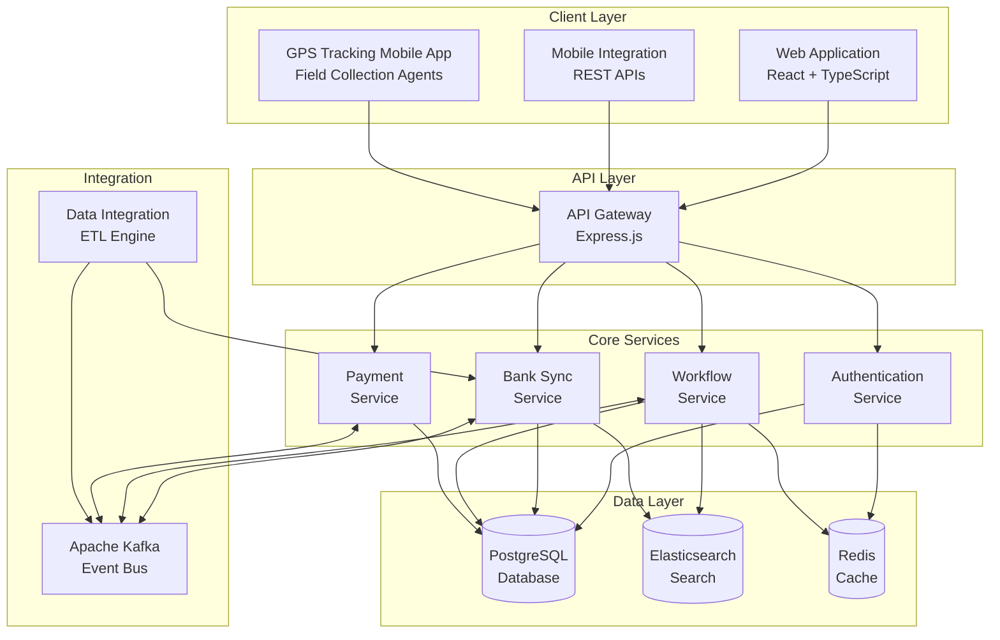

# CollectionCRM: Product Overview & Feature Showcase

## Complete Debt Collection Management Suite

**CollectionCRM Suite** is a comprehensive, modern debt collection management solution featuring both office-based collection platform and GPS-enabled mobile field collection app that empowers financial institutions to maximize recovery rates while ensuring compliance and delivering exceptional agent experiences both in-office and in the field.

---

## Product Architecture Overview

### 🏗️ **Modern Microservices Platform**

---

## Core Features & Capabilities

### 🎯 **1. Customer & Account Management**

#### **360-Degree Customer View**
- **Unified Customer Profile**: Complete customer information from multiple sources
- **Account Portfolio**: All customer loans, credit cards, and accounts in one view
- **Contact History**: Comprehensive interaction timeline across all channels
- **Relationship Mapping**: Family and business relationship visualization
- **Risk Assessment**: Dynamic risk scoring and segmentation

#### **Smart Data Integration**
- **Real-time Synchronization**: Live data feeds from core banking systems
- **Data Enrichment**: External data sources for enhanced customer insights
- **Duplicate Detection**: Intelligent customer and account matching
- **Data Validation**: Automated data quality checks and cleansing

#### **Key Benefits**
- ✅ **Faster Decision Making**: All customer data in one screen
- ✅ **Improved Contact Rates**: Up-to-date contact information
- ✅ **Better Outcomes**: Complete context for every interaction
- ✅ **Compliance Ready**: Audit trail for all data access

---

### 📞 **2. Agent Workspace & Tools**

#### **Modern Agent Dashboard (Office)**
- **Intuitive Interface**: Clean, modern React-based UI
- **Real-time Updates**: Live notifications and case updates
- **Multi-tasking Support**: Handle manual assigned cases and randomly distributed from outbound calls
- **Performance Metrics**: Personal KPI tracking and goals

#### **GPS Tracking Mobile App (Field)**
- **Native Mobile Interface**: Purpose-built for field collection agents
- **GPS Location Tracking**: Real-time agent location monitoring
- **Customer Visit Verification**: GPS-verified customer interactions
- **Offline Capability**: Continue working without internet connection
- **Route Optimization**: Intelligent routing for efficient field visits

#### **Smart Case Management**
- **Intelligent Prioritization**: Flexible campaign configuration for cases routing
- **Workflow Automation**: Configurable business rules for action recording
- **Follow-up Scheduling**: Automated reminder and callback systems

#### **Communication Tools**
- **Integrated Dialer**: Click-to-dial with call logging
- **Email Templates**: Customizable communication templates
- **Document Management**: Upload and attach relevant documents
- **Multi-language Support**: English and Vietnamese (extensible)

#### **Key Benefits**
- ✅ **Higher Productivity**: 50-88% increase in daily contacts
- ✅ **Better Experience**: Modern tools improve agent satisfaction
- ✅ **Reduced Training**: Intuitive interface lowers learning curve
- ✅ **Consistent Quality**: Standardized processes and templates
- ✅ **Complete Coverage**: Office + field collection coordination
- ✅ **Real-time Tracking**: GPS verification of all field activities

---

### 🔄 **3. Collection Workflow Engine**

#### **Configurable Business Rules**
- **Strategy Builder**: Visual workflow designer
- **Decision Trees**: Complex logic for case routing
- **Action Triggers**: Event-based automation
- **Exception Handling**: Automated fallback procedures
- **Call Campaigns Integration**: Configurable call lists for predictive dialing campaigns

#### **Status & State Management**
- **Custom Status Types**: Configurable customer and collateral statuses
- **Processing States**: Flexible case state management
- **Status Tracking**: Historical status change audit trail
- **Automated Updates**: System-driven status changes
- **Compliance Monitoring**: Status-based compliance checks

#### **Key Benefits**
- ✅ **Operational Flexibility**: Adapt to changing business requirements
- ✅ **Consistency**: Standardized processes across all agents
- ✅ **Optimization**: Data-driven workflow improvements
- ✅ **Compliance**: Built-in regulatory compliance checks

---

### 💳 **4. Payment Processing & Management**

#### **Multi-Channel Payment Processing**
- **Payment Gateway Integration**: Support for multiple payment processors
- **Real-time Processing**: Instant payment verification and posting

#### **Financial Tracking**
- **Account Reconciliation**: Automated payment matching
- **Due Date Management**: Payment due tracking and alerts
- **Reporting**: Comprehensive payment analytics

#### **Key Benefits**
- ✅ **Better Agent Experience**: Real-time payment visibility
- ✅ **Customer Convenience**: Multiple payment options

---

### 📊 **5. Analytics & Reporting**

#### **Real-time Dashboards**
- **Executive Dashboard**: High-level KPI visualization
- **Manager Dashboard**: Team performance monitoring
- **Agent Dashboard**: Individual performance tracking
- **Portfolio Overview**: Account status distribution

#### **Compliance Reporting**
- **Audit Trails**: Complete activity logging
- **Data Privacy**: GDPR and privacy compliance tracking

#### **Key Benefits**
- ✅ **Data-Driven Decisions**: Real-time insights for optimization
- ✅ **Proactive Management**: Early warning systems
- ✅ **Compliance Assurance**: Automated regulatory reporting
- ✅ **Performance Optimization**: Continuous improvement metrics

---

### 🔗 **6. Integration & API Platform**

#### **REST API Framework**
- **Complete API Coverage**: All functionality accessible via APIs
- **OpenAPI Documentation**: Self-documenting API specifications
- **Rate Limiting**: Configurable API usage controls
- **Authentication**: JWT-based secure API access
- **Versioning**: Backward-compatible API evolution

#### **Event-Driven Architecture**
- **Real-time Events**: Instant system-wide notifications
- **Kafka Integration**: Reliable message streaming
- **Webhook Support**: External system notifications
- **Event Sourcing**: Complete audit trail of all changes
- **Custom Integrations**: Flexible third-party connectivity

#### **Pre-built Connectors**
- **Core Banking Systems**: Major banking platform integrations
- **Payment Processors**: Payment gateway connectivity
- **Communication Platforms**: Dialer and SMS service integration
- **Data Sources**: Credit bureaus and external data providers
- **Business Intelligence**: BI tool and reporting platform connections

#### **Key Benefits**
- ✅ **Seamless Integration**: Connect with existing systems
- ✅ **Future-Proof**: API-first architecture enables innovation
- ✅ **Real-time Data**: Event-driven updates across platforms
- ✅ **Ecosystem Growth**: Third-party app marketplace potential

---

### 🔒 **7. Security & Compliance**

#### **Enterprise Security**
- **Role-Based Access Control**: Granular permission management
- **Data Encryption**: Encryption at rest and in transit
- **Single Sign-On**: LDAP/AD integration support
- **Multi-Factor Authentication**: Enhanced login security
- **Session Management**: Secure session handling and timeout

#### **Compliance Framework**
- **Audit Logging**: Comprehensive activity tracking
- **Data Privacy**: GDPR compliance features
- **Regulatory Reporting**: Automated compliance reports
- **Data Retention**: Configurable retention policies
- **Access Controls**: Compliance-grade access restrictions

#### **Data Protection**
- **Backup & Recovery**: Automated data backup systems
- **Disaster Recovery**: Business continuity planning
- **Data Validation**: Input validation and sanitization

#### **Key Benefits**
- ✅ **Risk Mitigation**: Reduced compliance and security risks
- ✅ **Regulatory Compliance**: Built-in compliance features
- ✅ **Data Protection**: Enterprise-grade security controls
- ✅ **Audit Ready**: Complete audit trail and documentation

---

## Feature Comparison Matrix

### **CollectionCRM vs. Competitors**

| Feature Category | Legacy Systems | Cloud Solutions | **CollectionCRM** |
|------------------|---------------|-----------------|-------------------|
| **User Interface** | ❌ Outdated | ✅ Modern | ✅ **React-based, Intuitive** |
| **Scalability** | ❌ Limited | ✅ Good | ✅ **Enterprise-scale** |
| **Customization** | ❌ Rigid | ⚠️ Limited | ✅ **Highly Configurable** |
| **Integration** | ❌ Complex | ✅ API-based | ✅ **Event-driven + APIs** |
| **Real-time Processing** | ❌ Batch | ⚠️ Near real-time | ✅ **True Real-time** |
| **Analytics** | ❌ Basic | ✅ Standard | ✅ **Advanced + Predictive** |
| **Mobile Support** | ❌ None | ✅ Responsive | ✅ **Native + Web** |
| **Multi-language** | ❌ English only | ⚠️ Limited | ✅ **Full i18n Support** |
| **Deployment Options** | ❌ On-prem only | ❌ Cloud only | ✅ **Hybrid + Multi-cloud** |
| **Implementation Time** | ❌ 12-18 months | ⚠️ 6-9 months | ✅ **3-6 months** |

---

## Technical Specifications

### **Performance & Scalability**

| Metric | Specification |
|--------|---------------|
| **Concurrent Users** | 2,000+ agents simultaneously |
| **Customer Records** | 3+ million active customers |
| **Loan Portfolio** | 6+ million loans and accounts |
| **Response Time** | < 500ms for 95% of requests |
| **Uptime** | 99.9% availability SLA |
| **Throughput** | 10,000+ transactions per second |
| **Data Storage** | Terabyte-scale with partitioning |

### **Deployment Requirements**

#### **Minimum System Requirements**
- **CPU**: 8 cores per service instance
- **Memory**: 16GB RAM per service instance
- **Storage**: 100GB SSD for application, 1TB+ for data
- **Network**: 1Gbps bandwidth
- **Operating System**: Linux, Windows Server, or containerized

#### **Recommended Production Setup**
- **Load Balancer**: HA proxy or cloud load balancer
- **Application Servers**: 3+ instances per microservice
- **Database**: PostgreSQL cluster with replication
- **Cache**: Redis cluster for session management
- **Search**: Elasticsearch cluster with 3+ nodes
- **Message Queue**: Kafka cluster with 3+ brokers

### **Technology Stack**

| Component | Technology | Version |
|-----------|------------|---------|
| **Frontend** | React + TypeScript | 18+ |
| **Backend** | Node.js + Express | 18+ LTS |
| **Database** | PostgreSQL | 15+ |
| **Cache** | Redis | 7+ |
| **Search** | Elasticsearch | 8+ |
| **Message Broker** | Apache Kafka | 3.0+ |
| **Container** | Docker + Kubernetes | Latest |
| **Monitoring** | Prometheus + Grafana | Latest |

---

## Success Stories & Use Cases

### **Case Study 1: Regional Bank Transformation**

**Challenge**: 500,000 overdue accounts, 200 agents, 15% collection rate
**Solution**: Full CollectionCRM implementation with workflow automation
**Results**:
- 📈 Collection rate improved to **38%** (+153%)
- 🚀 Agent productivity increased by **65%**
- 💰 Additional recovery of **$45 million** annually
- ⚡ Case resolution time reduced by **40%**

### **Case Study 2: Consumer Finance Company**

**Challenge**: High agent turnover, poor customer experience, compliance issues
**Solution**: Modern agent tools, automated workflows, compliance monitoring
**Results**:
- 👥 Agent turnover reduced from **85%** to **35%**
- 😊 Customer satisfaction improved by **50%**
- ✅ Compliance score increased to **95%**
- 💵 Operational costs reduced by **30%**

### **Case Study 3: Digital Lending Platform**

**Challenge**: Rapid growth, need for scalable collection platform
**Solution**: Cloud-native deployment with API-first integration
**Results**:
- 📊 Scaled to **5x volume** with minimal overhead
- 🔗 Integrated with **15 different systems**
- ⏱️ Implementation completed in **4 months**
- 🎯 Collection efficiency improved by **55%**

---

## Implementation Process

### **Phase 1: Discovery & Planning (2-4 weeks)**
- Requirements gathering and analysis
- System architecture design
- Integration planning and mapping
- Project timeline and resource allocation
- Risk assessment and mitigation planning

### **Phase 2: Environment Setup (2-3 weeks)**
- Infrastructure provisioning
- Security configuration and hardening
- Development and testing environment setup
- Initial data migration and validation
- Basic integration testing

### **Phase 3: Core Implementation (4-8 weeks)**
- Microservices deployment and configuration
- Database schema implementation
- API integration development
- User interface customization
- Business rule configuration

### **Phase 4: Integration & Testing (3-4 weeks)**
- Third-party system integration
- End-to-end testing and validation
- Performance testing and optimization
- Security testing and penetration testing
- User acceptance testing

### **Phase 5: Training & Go-Live (2-3 weeks)**
- Comprehensive user training programs
- Data migration and cutover
- Go-live support and monitoring
- Performance optimization
- Knowledge transfer and documentation

### **Phase 6: Optimization & Support (Ongoing)**
- Performance monitoring and tuning
- User feedback collection and implementation
- Continuous improvement initiatives
- Regular system updates and maintenance
- 24/7 technical support

---

## Pricing Models

### **Perpetual License**
- One-time license fee starting at **$45,000** per 50 users
- Includes both office platform and GPS mobile app
- Customer-managed deployment and maintenance
- Annual support and maintenance fees (35% of license cost)
- Full source code access available

### **Enterprise & Custom Pricing**
- Volume discounts for large deployments (500+ users)
- Custom feature development and integration
- Dedicated support teams and SLA guarantees
- White-label and OEM licensing options

---

## Support & Services

### **Implementation Services**
- Project management and technical consulting
- Custom integration development
- Data migration and validation services
- Training and change management programs
- Go-live support and optimization

### **Ongoing Support**
- 24/7 technical support with guaranteed response times
- Regular health checks and performance monitoring
- Proactive maintenance and updates
- User community and knowledge base access
- Dedicated customer success management

### **Professional Services**
- Custom feature development
- Advanced analytics and reporting
- Third-party integration services
- Performance optimization consulting
- Compliance and security assessments

---

## Getting Started

### **Next Steps**
1. **Schedule a Demo**: See CollectionCRM in action with your specific use cases
2. **Technical Discussion**: Deep-dive into architecture and integration requirements
3. **Proof of Concept**: Limited pilot to validate benefits and ROI
4. **Business Case**: Develop comprehensive ROI analysis and implementation plan
5. **Contract & Implementation**: Begin your digital transformation journey

### **Contact Information**
📧 **Sales**: 
📞 **Phone**: 
🌐 **Website**:  
📅 **Demo**: https://xpm-collectioncrm.ddns.net/

---

*Transform Your Collection Operations Today*

**© 2024 CollectionCRM. All rights reserved.**