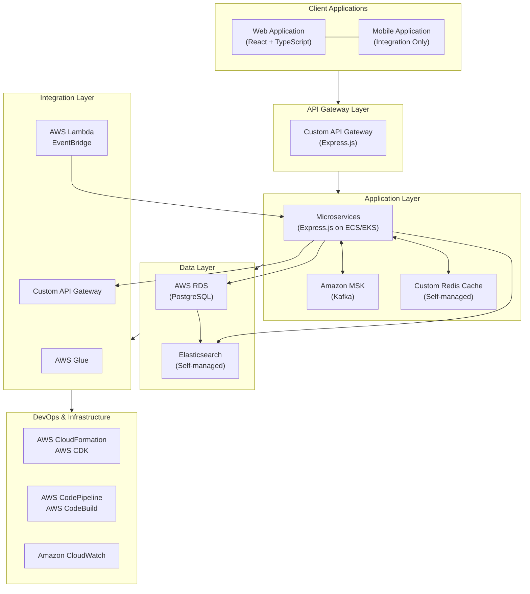

# Technology Stack

This document outlines the recommended technology stack for the Collection CRM replacement project, specifically designed for deployment on AWS Cloud infrastructure with custom services where appropriate.

## Overview

The technology stack is designed to meet the following requirements:

1. **Performance**: Handle ~6 million loans and ~3 million customers with fast search/retrieval
2. **Scalability**: Support ~2000 concurrent collection agents
3. **Security**: Protect sensitive financial data
4. **Reliability**: Ensure high availability for real-time features
5. **Maintainability**: Use modern, well-supported technologies
6. **Integration**: Support seamless integration with external systems
7. **Cost-Efficiency**: Balance AWS managed services with custom implementations for optimal performance and cost-efficiency

## Technology Stack Diagram

## 1. Frontend Technologies

### 1.1 Web Application

**Primary Technology: React with TypeScript**

- **Framework**: React 18+
- **Language**: TypeScript 5.0+
- **State Management**: Redux Toolkit
- **UI Component Library**: Material-UI (MUI)
- **Form Handling**: React Hook Form
- **API Client**: Axios
- **Data Visualization**: D3.js / Chart.js
- **Testing**: Jest, React Testing Library
- **Build Tool**: Vite

**AWS Deployment**:
- **Hosting**: Amazon S3 + CloudFront
- **Authentication**: Amazon Cognito
- **Analytics**: AWS Pinpoint
- **CI/CD**: AWS Amplify

**Justification**:
- React provides a robust ecosystem for building complex web applications
- TypeScript adds strong typing to prevent runtime errors
- S3 + CloudFront provides cost-effective, scalable static site hosting
- Cognito offers secure authentication with minimal setup
- Amplify simplifies the deployment pipeline

### 1.2 Mobile Integration

**Integration with Existing Mobile App**:
- **API Format**: REST with JSON
- **Authentication**: Amazon Cognito
- **Data Synchronization**: AWS AppSync
- **Offline Support**: AWS Amplify DataStore

**AWS Services**:
- **Custom API Gateway**: Secure API endpoints for mobile
- **Cognito**: Authentication and authorization
- **AppSync**: GraphQL API with real-time and offline capabilities
- **Amplify**: SDK for mobile integration

## 2. Backend Technologies

### 2.1 API Layer

**Primary Technology: Custom Express.js API Gateway**

- **Framework**: Express.js
- **Documentation**: OpenAPI / Swagger
- **Authentication**: JWT with Amazon Cognito integration
- **Rate Limiting**: Custom middleware with Redis
- **Circuit Breaking**: Circuit-breaker pattern implementation

**Justification**:
- Express.js provides a lightweight, flexible framework for API creation
- Custom implementation allows for greater control over API design
- Reduced AWS service costs compared to managed API Gateway
- Full integration with Node.js microservices ecosystem
- Scalable with container orchestration platforms

### 2.2 Microservices

**Primary Technology: Express.js with Node.js on AWS ECS/EKS**

- **Framework**: Express.js 4.x
- **Language**: Node.js 18+ (LTS)
- **API Style**: REST
- **Validation**: Joi / express-validator
- **ORM**: Sequelize / TypeORM / Prisma
- **Testing**: Jest, Supertest, Mocha
- **Container Orchestration**: Amazon ECS or EKS

**AWS Services**:
- **Compute**: Amazon ECS (Elastic Container Service) or EKS (Elastic Kubernetes Service)
- **Service Discovery**: AWS Cloud Map
- **Load Balancing**: Application Load Balancer
- **Secrets Management**: AWS Secrets Manager
- **Configuration**: AWS AppConfig

**Justification**:
- Express.js provides a lightweight, high-performance framework for microservices
- Node.js offers excellent IO-bound performance suitable for API services
- ECS/EKS offers managed container orchestration
- The Node.js ecosystem has mature libraries for all required functionality
- Lower resource requirements compared to JVM-based frameworks

### 2.3 Message Broker

**Primary Technology: Amazon MSK (Managed Streaming for Kafka)**

- **Message Broker**: Amazon MSK
- **Schema Registry**: AWS Glue Schema Registry
- **Stream Processing**: Kafka Streams or AWS Lambda

**Justification**:
- MSK provides a fully managed Kafka service
- Eliminates operational overhead of managing Kafka clusters
- Automatic scaling and high availability
- Integration with AWS monitoring and security services
- Pay-for-what-you-use pricing model

### 2.4 Caching

**Primary Technology: Custom Redis Caching Solution**

- **Cache**: Self-managed Redis on EC2 or ECS
- **Client**: Node-Redis / IORedis
- **Patterns**: Cache-Aside, Write-Through
- **Deployment**: Redis Cluster for high availability
- **Monitoring**: Custom metrics with CloudWatch

**Justification**:
- Greater flexibility in Redis configuration and version selection
- Cost savings compared to managed ElastiCache
- Fine-grained control over caching policies and memory allocation
- Ability to implement custom caching strategies specific to application needs
- Seamless integration with Express.js microservices

## 3. Data Technologies

### 3.1 Primary Database

**Primary Technology: Amazon RDS for PostgreSQL**

- **Database**: Amazon RDS for PostgreSQL 15+
- **Connection Pooling**: pg-pool for Node.js
- **Migration**: node-pg-migrate / Sequelize migrations
- **Replication**: RDS Multi-AZ deployment
- **Partitioning**: Table partitioning for large tables
- **Backup**: Automated RDS backups

**Justification**:
- RDS provides a fully managed PostgreSQL service
- Automatic backups and point-in-time recovery
- Multi-AZ deployment for high availability
- Simplified scaling operations
- Reduced operational overhead

**Database Sizing**:
- Estimated data volume: ~10TB
- Growth rate: ~20% annually
- Read/write ratio: 80/20
- Instance type recommendation: db.r6g.4xlarge
- Storage recommendation: io1 with provisioned IOPS

### 3.2 Search Engine

**Primary Technology: Elasticsearch**

- **Search Engine**: Elasticsearch 8.x
- **Deployment**: Self-managed on EC2/ECS
- **Client**: @elastic/elasticsearch for Node.js
- **Analyzers**: Standard, Phonetic, N-gram
- **Replication**: Cross-cluster replication

**Justification**:
- Full control over Elasticsearch version and configuration
- Ability to implement custom plugins and extensions
- Cost-effective for predictable workloads
- Direct access to native Elasticsearch features
- Flexible scaling options with EC2 auto-scaling

### 4.1 ETL Tools

**Primary Technology: AWS Glue**

- **ETL Platform**: AWS Glue
- **Data Catalog**: AWS Glue Data Catalog
- **Workflow**: AWS Glue Workflows
- **Scheduling**: AWS EventBridge

**Justification**:
- AWS Glue provides a fully managed ETL service
- Serverless architecture eliminates infrastructure management
- Pay-per-use pricing model reduces costs
- Integration with other AWS data services
- Support for both batch and streaming ETL

### 4.2 API Management

**Primary Technology: Custom API Gateway (Express.js)**

- **API Management**: Custom Express.js gateway
- **Documentation**: Swagger UI / ReDoc
- **Monitoring**: Prometheus + Grafana / Amazon CloudWatch
- **Security**: helmet.js + custom security middleware

**Justification**:
- Custom API Gateway provides greater control over API management
- Direct integration with Express.js microservices
- Cost savings compared to managed API Gateway
- Flexibility to implement custom security and monitoring solutions
- Enhanced debugging and testing capabilities

### 4.3 Event Processing

**Primary Technology: AWS Lambda and Amazon EventBridge**

- **Functions**: AWS Lambda
- **Event Bus**: Amazon EventBridge
- **State Management**: AWS Step Functions
- **Dead Letter Queue**: Amazon SQS

**Justification**:
- Lambda provides serverless compute for event processing
- EventBridge offers a scalable event bus
- Step Functions enables complex workflow orchestration
- Serverless architecture reduces operational overhead
- Pay-per-use pricing model optimizes costs

## 5. DevOps & Infrastructure

### 5.1 Infrastructure as Code

**Primary Technology: AWS CloudFormation / AWS CDK**

- **IaC Tool**: AWS CloudFormation / AWS CDK
- **Repository**: AWS CodeCommit or GitHub
- **Secret Management**: AWS Secrets Manager
- **Configuration**: AWS Systems Manager Parameter Store

**Justification**:
- CloudFormation/CDK provides native AWS infrastructure as code
- Version-controlled infrastructure changes
- Automated deployment and rollback
- Integration with AWS deployment services
- Comprehensive resource management

### 5.2 CI/CD Pipeline

**Primary Technology: AWS CodePipeline**

- **Pipeline**: AWS CodePipeline
- **Build**: AWS CodeBuild
- **Deploy**: AWS CodeDeploy
- **Artifacts**: Amazon S3

**Justification**:
- CodePipeline provides a fully managed CI/CD service
- Seamless integration with other AWS services
- Automated testing and deployment
- Visual pipeline management
- Event-driven pipeline execution

### 5.3 Monitoring and Logging

**Primary Technology: Amazon CloudWatch**

- **Monitoring**: Amazon CloudWatch
- **Logging**: Amazon CloudWatch Logs
- **Alerting**: Amazon SNS
- **Dashboards**: CloudWatch Dashboards
- **Tracing**: AWS X-Ray

**Justification**:
- CloudWatch provides comprehensive monitoring and logging
- Centralized log management
- Customizable dashboards and alerts
- Distributed tracing with X-Ray
- Integration with AWS auto-scaling

### 5.4 Security

**Primary Technology: AWS Security Services**

- **Identity**: AWS IAM
- **Network**: Security Groups, NACLs
- **Data Protection**: AWS KMS, AWS Shield
- **Compliance**: AWS Config, AWS Security Hub
- **Auditing**: AWS CloudTrail

**Justification**:
- Comprehensive security controls across all layers
- Centralized identity and access management
- Encryption for data at rest and in transit
- Continuous compliance monitoring
- Detailed audit trails

## 6. AWS Architecture Considerations

### 6.1 High Availability

- **Multi-AZ Deployment**: All critical services deployed across multiple Availability Zones
- **Auto-Recovery**: Automatic instance recovery for EC2 instances
- **Load Balancing**: Application Load Balancers for distributing traffic
- **Database Failover**: RDS Multi-AZ with automatic failover
- **Disaster Recovery**: Cross-region replication for critical data

### 6.2 Scalability

- **Auto-Scaling**: EC2 Auto Scaling groups for application tier
- **Database Scaling**: RDS read replicas for read scaling
- **Caching**: Custom Redis caching solution for reducing database load
- **Serverless Components**: Lambda and custom API Gateway for automatically scaling components
- **Content Delivery**: CloudFront for static content delivery

### 6.3 Cost Optimization

- **Reserved Instances**: For predictable workloads
- **Spot Instances**: For non-critical, interruptible workloads
- **Auto-Scaling**: Scale down during low-traffic periods
- **Storage Tiering**: S3 lifecycle policies for data archiving
- **Right-Sizing**: Regular review of resource utilization
- **Custom Services**: Strategic use of custom implementations where AWS managed services are costlier

### 6.4 Security and Compliance

- **VPC Design**: Private subnets for sensitive components
- **Encryption**: KMS for encryption key management
- **Network Security**: Security groups, NACLs, and security middleware
- **Monitoring**: CloudTrail, Config, and Security Hub
- **Compliance**: AWS Artifact for compliance reports

## 7. AWS Service Mapping

| Requirement | Service/Technology | Justification |
|-------------|-------------|---------------|
| Web Hosting | S3 + CloudFront | Scalable, cost-effective static site hosting |
| API Management | Custom Express.js API Gateway | Greater control and cost-effectiveness |
| Authentication | Cognito | User management, authentication, and authorization |
| Application Hosting | ECS/EKS with Express.js | Container orchestration with auto-scaling |
| Messaging | MSK | Managed Kafka service for reliable messaging |
| Caching | Custom Redis Solution | Flexible, cost-effective caching |
| Database | RDS PostgreSQL | Managed relational database with high availability |
| ETL | Glue | Serverless ETL service |
| Event Processing | Lambda + EventBridge | Serverless event processing |
| CI/CD | CodePipeline | Managed CI/CD pipeline |
| Monitoring | CloudWatch | Comprehensive monitoring and logging |
| Security | IAM, KMS, Shield | Identity, encryption, and DDoS protection |

## 8. Migration Considerations

### 8.1 Migration Strategy

- **Assessment**: Evaluate current systems and data
- **Planning**: Define migration phases and success criteria
- **Testing**: Set up test environments in AWS
- **Migration**: Use AWS Database Migration Service for data migration
- **Validation**: Verify data integrity and application functionality
- **Cutover**: Plan for minimal downtime during final cutover

### 8.2 AWS Migration Tools

- **AWS Database Migration Service (DMS)**: For database migration
- **AWS Application Migration Service**: For server migration
- **AWS DataSync**: For large-scale data transfer
- **AWS Snow Family**: For offline data transfer
- **AWS Application Discovery Service**: For application dependency mapping

## 9. AWS Well-Architected Framework Alignment

The proposed architecture aligns with the AWS Well-Architected Framework's five pillars:

1. **Operational Excellence**: Automated deployments, monitoring, and alerting
2. **Security**: Defense-in-depth approach with multiple security controls
3. **Reliability**: Multi-AZ deployments, auto-scaling, and disaster recovery
4. **Performance Efficiency**: Right-sized resources and performance optimization
5. **Cost Optimization**: Reserved instances, auto-scaling, custom implementations, and resource optimization