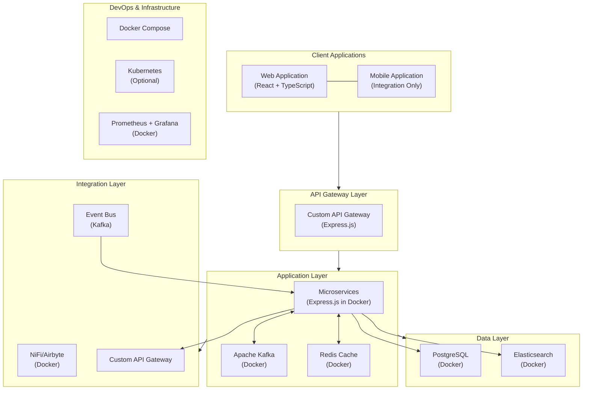

# Containerized Technology Stack

This document outlines the proposed containerized technology stack for the Collection CRM replacement project, designed to simplify development and testing before deciding on a cloud deployment strategy.

## Overview

The containerized technology stack is designed to meet the following requirements:

1. **Performance**: Handle ~6 million loans and ~3 million customers with fast search/retrieval
2. **Scalability**: Support ~2000 concurrent collection agents
3. **Security**: Protect sensitive financial data
4. **Reliability**: Ensure high availability for real-time features
5. **Maintainability**: Use modern, well-supported technologies
6. **Integration**: Support seamless integration with external systems
7. **Portability**: Enable development and testing in containerized environments before cloud deployment

## Technology Stack Diagram

## 1. Frontend Technologies

### 1.1 Web Application

**Primary Technology: React with TypeScript**

- **Framework**: React 18+
- **Language**: TypeScript 5.0+
- **UI Component Library**: Tailwind UI
- **Form Handling**: React Hook Form
- **API Client**: Axios
- **Data Visualization**: D3.js / Chart.js
- **Testing**: Jest, React Testing Library
- **Build Tool**: Vite

**Containerized Development**:
- **Development**: Docker container with Node.js and hot-reloading
- **Testing**: Jest in container with volume mounts for test reports
- **Build**: Multi-stage Docker build for production assets

**Justification**:
- React provides a robust ecosystem for building complex web applications
- TypeScript adds strong typing to prevent runtime errors
- Containerized development ensures consistency across environments
- Hot-reloading in containers improves developer experience

### 1.2 Mobile Integration

**Integration with Existing Mobile App**:
- **API Format**: REST with JSON
- **Authentication**: JWT-based authentication
- **Data Synchronization**: WebSocket or polling
- **Offline Support**: Local storage with sync capabilities

**Containerized Testing**:
- **API Mocking**: Containerized mock servers for mobile testing
- **Integration Testing**: Automated API tests in containers

## 2. Backend Technologies

### 2.1 API Layer

**Primary Technology: Custom Express.js API Gateway in Docker**

- **Framework**: Express.js
- **Documentation**: OpenAPI / Swagger
- **Authentication**: JWT with custom authentication service
- **Rate Limiting**: Custom middleware with Redis
- **Circuit Breaking**: Circuit-breaker pattern implementation

**Justification**:
- Express.js provides a lightweight, flexible framework for API creation
- Custom implementation allows for greater control over API design
- Containerization enables consistent behavior across environments
- Full integration with Node.js microservices ecosystem
- Scalable with container orchestration platforms

### 2.2 Microservices

**Primary Technology: Express.js with Node.js in Docker**

- **Framework**: Express.js 4.x
- **Language**: Node.js 18+ (LTS)
- **API Style**: REST
- **Validation**: Joi / express-validator
- **ORM**: Sequelize / TypeORM / Prisma
- **Testing**: Jest, Supertest, Mocha
- **Container Orchestration**: Docker Compose (dev), Kubernetes (optional for prod)

**Containerization Strategy**:
- **Base Image**: Node.js Alpine for minimal size
- **Development**: Volume mounts for hot-reloading
- **Configuration**: Environment variables and config files
- **Health Checks**: Endpoint for container orchestration
- **Logging**: Console output captured by container runtime

**Justification**:
- Express.js provides a lightweight, high-performance framework for microservices
- Node.js offers excellent IO-bound performance suitable for API services
- Docker Compose simplifies local development and testing
- Kubernetes provides an option for production-grade orchestration
- The Node.js ecosystem has mature libraries for all required functionality

### 2.3 Message Broker

**Primary Technology: Apache Kafka in Docker**

- **Message Broker**: Apache Kafka
- **Schema Registry**: Schema Registry container
- **Stream Processing**: Kafka Streams or custom consumers
- **Management UI**: Kafdrop or Kafka UI container

**Justification**:
- Kafka provides robust message queuing and event streaming
- Containerized Kafka simplifies local development and testing
- Schema Registry ensures message compatibility
- Management UI improves developer experience
- Can be migrated to managed Kafka service in production if needed

### 2.4 Caching

**Primary Technology: Redis in Docker**

- **Cache**: Redis container
- **Client**: Node-Redis / IORedis
- **Patterns**: Cache-Aside, Write-Through
- **Deployment**: Redis Cluster for high availability
- **Monitoring**: Redis metrics exported to Prometheus

**Justification**:
- Redis provides high-performance in-memory caching
- Containerized Redis ensures consistency across environments
- Redis Cluster supports high availability requirements
- Monitoring integration enables performance tracking
- Can be migrated to managed Redis service in production if needed

## 3. Data Technologies

### 3.1 Primary Database

**Primary Technology: PostgreSQL in Docker**

- **Database**: PostgreSQL 15+
- **Connection Pooling**: pg-pool for Node.js
- **Migration**: node-pg-migrate / Sequelize migrations
- **Replication**: PostgreSQL replication (optional)
- **Partitioning**: Table partitioning for large tables
- **Backup**: Automated backups to volume mounts

**Justification**:
- PostgreSQL provides a robust, feature-rich relational database
- Containerized PostgreSQL simplifies local development and testing
- Migration tools ensure database schema consistency
- Partitioning supports large data volumes
- Can be migrated to managed PostgreSQL service in production if needed

**Database Sizing**:
- Estimated data volume: ~10TB
- Growth rate: ~20% annually
- Read/write ratio: 80/20
- Development sizing: Appropriately scaled down for local development
- Production recommendation: Right-sized based on actual usage patterns

### 3.2 Search Engine

**Primary Technology: Elasticsearch in Docker**

- **Search Engine**: Elasticsearch 8.x
- **Deployment**: Elasticsearch container
- **Client**: @elastic/elasticsearch for Node.js
- **Analyzers**: Standard, Phonetic, N-gram
- **Management**: Kibana container for development

**Justification**:
- Elasticsearch provides powerful full-text search capabilities
- Containerized Elasticsearch simplifies local development and testing
- Kibana improves developer experience for index management
- Can be migrated to managed Elasticsearch service in production if needed

## 4. Integration Technologies

### 4.1 ETL Tools

**Primary Technology: Apache NiFi or Airbyte in Docker**

- **ETL Platform**: Apache NiFi or Airbyte container
- **Data Catalog**: Metadata stored in PostgreSQL
- **Workflow**: Visual workflow editor in web UI
- **Scheduling**: Built-in scheduler

**Justification**:
- Open-source ETL tools provide visual workflow design
- Containerized ETL simplifies local development and testing
- Support for a wide range of data sources and transformations
- Can be migrated to managed ETL service in production if needed

### 4.2 API Management

**Primary Technology: Custom API Gateway (Express.js) in Docker**

- **API Management**: Custom Express.js gateway
- **Documentation**: Swagger UI / ReDoc
- **Monitoring**: Prometheus + Grafana
- **Security**: helmet.js + custom security middleware

**Justification**:
- Custom API Gateway provides greater control over API management
- Direct integration with Express.js microservices
- Containerization ensures consistent behavior across environments
- Enhanced debugging and testing capabilities

### 4.3 Event Processing

**Primary Technology: Kafka and Microservices in Docker**

- **Event Bus**: Apache Kafka
- **Consumers**: Microservice containers
- **State Management**: PostgreSQL or Redis
- **Dead Letter Queue**: Dedicated Kafka topics

**Justification**:
- Kafka provides robust event streaming capabilities
- Microservices can process events asynchronously
- Containerization simplifies local development and testing
- Can be migrated to managed event processing services in production if needed

## 5. DevOps & Infrastructure

### 5.1 Container Orchestration

**Primary Technology: Docker Compose / Kubernetes**

- **Development**: Docker Compose
- **Production Option**: Kubernetes
- **Service Discovery**: DNS or Kubernetes service discovery
- **Secret Management**: Docker secrets or Kubernetes secrets
- **Configuration**: Environment variables and config maps

**Justification**:
- Docker Compose provides simple multi-container orchestration for development
- Kubernetes offers production-grade orchestration if needed
- Consistent environment across development, testing, and production
- Flexible deployment options for different environments

### 5.2 CI/CD Pipeline

**Primary Technology: GitHub Actions or Jenkins in Docker**

- **Pipeline**: GitHub Actions or Jenkins
- **Build**: Docker build
- **Test**: Containerized test runners
- **Deploy**: Container deployment scripts
- **Artifacts**: Container registry

**Justification**:
- Platform-agnostic CI/CD solution
- Containerized builds ensure consistency
- Automated testing in containers
- Flexible deployment options for different environments

### 5.3 Monitoring and Logging

**Primary Technology: Prometheus + Grafana in Docker**

- **Monitoring**: Prometheus containers
- **Logging**: Fluentd/Fluent Bit containers
- **Alerting**: Alertmanager container
- **Dashboards**: Grafana container
- **Tracing**: Jaeger container

**Justification**:
- Comprehensive monitoring and logging solution
- Containerized monitoring simplifies local development and testing
- Customizable dashboards and alerts
- Distributed tracing for microservices
- Can be migrated to managed monitoring services in production if needed

### 5.4 Security

**Primary Technology: Container Security Best Practices**

- **Identity**: Custom authentication service
- **Network**: Container network isolation
- **Data Protection**: Encryption at rest and in transit
- **Compliance**: Security scanning in CI/CD
- **Auditing**: Centralized logging

**Justification**:
- Comprehensive security controls across all layers
- Containerization provides additional isolation
- Encryption protects sensitive data
- Automated security scanning
- Detailed audit trails

## 6. Containerization Considerations

### 6.1 Development Environment

- **Local Setup**: Docker Compose for all services
- **IDE Integration**: VS Code or IntelliJ with Docker extensions
- **Hot Reloading**: Volume mounts for source code
- **Debugging**: Remote debugging capabilities
- **Documentation**: README with setup instructions

### 6.2 Testing Environment

- **Unit Testing**: Within service containers
- **Integration Testing**: Across containerized services
- **Performance Testing**: Dedicated performance testing containers
- **Security Testing**: Security scanning containers
- **UI Testing**: Selenium or Cypress in containers

### 6.3 Production Considerations

- **Deployment Options**:
  - Self-hosted Docker Swarm
  - Self-hosted Kubernetes
  - Cloud provider container services (if desired later)
- **Scaling Strategy**: Horizontal scaling of stateless services
- **Stateful Services**: Persistent volumes for databases
- **Backup Strategy**: Regular database dumps to persistent storage
- **Disaster Recovery**: Replication across nodes/zones

### 6.4 Migration Path to Cloud

- **Assessment**: Evaluate cloud provider container services
- **Planning**: Define migration phases and success criteria
- **Testing**: Set up test environments in cloud
- **Migration**: Use container orchestration for seamless migration
- **Validation**: Verify functionality and performance
- **Cutover**: Minimal downtime during final cutover

## 7. Implementation Roadmap

### Phase 1: Containerization Setup (2 weeks)

1. Create Docker Compose configuration
   - Define all required services
   - Configure networking between containers
   - Set up volume mappings for persistence

2. Create Dockerfiles for each microservice
   - Base image selection
   - Dependency installation
   - Configuration management

3. Set up development environment
   - Configure hot-reloading
   - Set up debugging tools
   - Create developer documentation

### Phase 2: Database & Infrastructure (2 weeks)

1. Configure PostgreSQL container
   - Initialize schema
   - Set up users and permissions
   - Configure backup strategy

2. Set up Elasticsearch container
   - Configure indices
   - Set up mappings and analyzers
   - Implement data synchronization

3. Configure Kafka container
   - Define topics
   - Set up Zookeeper
   - Configure retention policies

### Phase 3: Microservices Implementation (8 weeks)

1. Adapt Bank Synchronization Microservice
   - Replace AWS dependencies
   - Implement containerized scheduling
   - Configure data sources

2. Adapt Payment Processing Microservice
   - Replace AWS dependencies
   - Implement event processing
   - Configure real-time updates

3. Adapt Collection Workflow Microservice
   - Replace AWS dependencies
   - Implement business logic
   - Configure workflow engine

4. Adapt Authentication Microservice
   - Replace AWS dependencies
   - Implement token management
   - Configure security settings

### Phase 4: Integration & Testing (4 weeks)

1. Implement inter-service communication
   - Configure Kafka producers/consumers
   - Set up service discovery
   - Implement circuit breakers

2. Set up monitoring and logging
   - Configure Prometheus metrics
   - Set up Grafana dashboards
   - Implement centralized logging

3. Comprehensive testing
   - Unit testing
   - Integration testing
   - Performance testing

### Phase 5: Documentation & Handover (2 weeks)

1. Create comprehensive documentation
   - Architecture overview
   - Development workflow
   - Deployment options

2. Conduct knowledge transfer sessions
   - Developer training
   - Operations training
   - Troubleshooting guides

## 8. Benefits of Containerized Approach

1. **Development Simplicity**
   - One-command setup of the entire environment
   - Consistent behavior across developer machines
   - Faster onboarding of new team members

2. **Testing Confidence**
   - Identical environments for development and testing
   - Ability to test the entire system locally
   - Reproducible test scenarios

3. **Deployment Flexibility**
   - Can be deployed to any cloud provider
   - On-premises deployment option
   - Hybrid deployment possibilities

4. **Cost Optimization**
   - No cloud costs during development
   - Ability to choose the most cost-effective cloud provider
   - Right-sizing of resources based on actual needs

5. **Knowledge Building**
   - Team builds expertise in container technologies
   - Better understanding of system dependencies
   - More control over the infrastructure

## 9. Comparison with AWS-Based Approach

| Component | AWS Approach | Containerized Approach | Migration Path |
|-----------|-------------|------------------------|----------------|
| Frontend Hosting | S3 + CloudFront | Nginx container | Deploy to S3 + CloudFront if desired |
| API Gateway | Custom Express.js | Custom Express.js in Docker | Deploy to ECS/EKS if desired |
| Microservices | ECS/EKS | Docker containers | Deploy to ECS/EKS if desired |
| Message Broker | Amazon MSK | Kafka in Docker | Migrate to MSK if desired |
| Caching | Custom Redis | Redis in Docker | Migrate to ElastiCache if desired |
| Database | RDS PostgreSQL | PostgreSQL in Docker | Migrate to RDS if desired |
| Search | Self-managed Elasticsearch | Elasticsearch in Docker | Migrate to OpenSearch if desired |
| ETL | AWS Glue | NiFi/Airbyte in Docker | Migrate to Glue if desired |
| Event Processing | Lambda/EventBridge | Kafka + Microservices | Migrate to Lambda if desired |
| Monitoring | CloudWatch | Prometheus + Grafana | Migrate to CloudWatch if desired |
| CI/CD | CodePipeline | GitHub Actions/Jenkins | Migrate to CodePipeline if desired |
| Infrastructure | CloudFormation/CDK | Docker Compose/Kubernetes | Migrate to CloudFormation if desired |

This containerized approach provides all the functionality needed for development and testing while maintaining a clear migration path to AWS managed services if desired in the future.