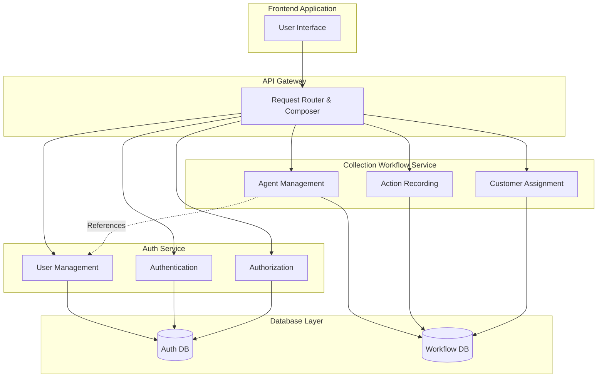
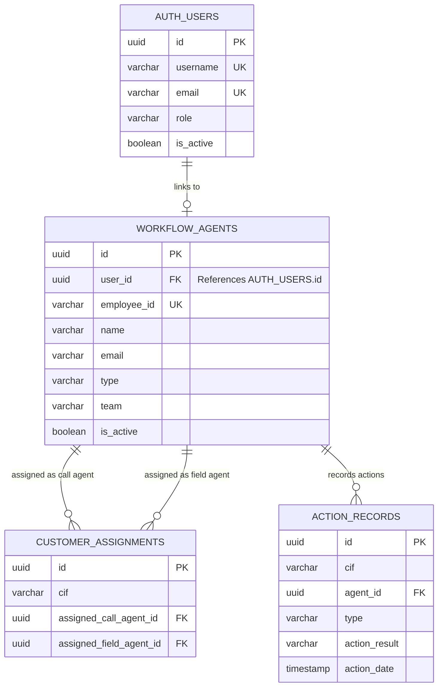
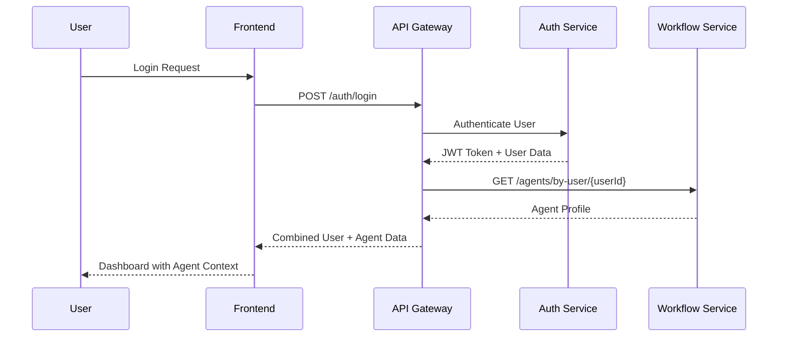
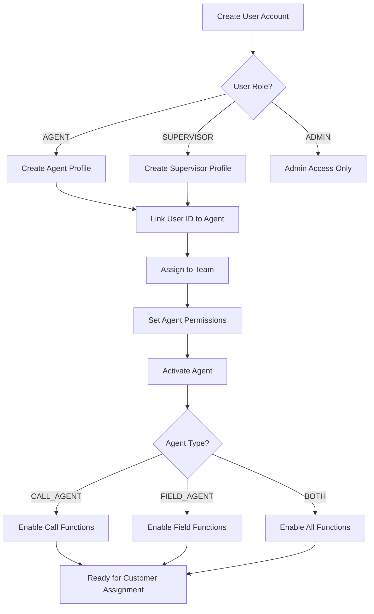
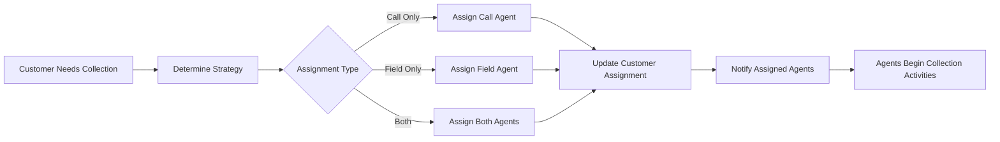
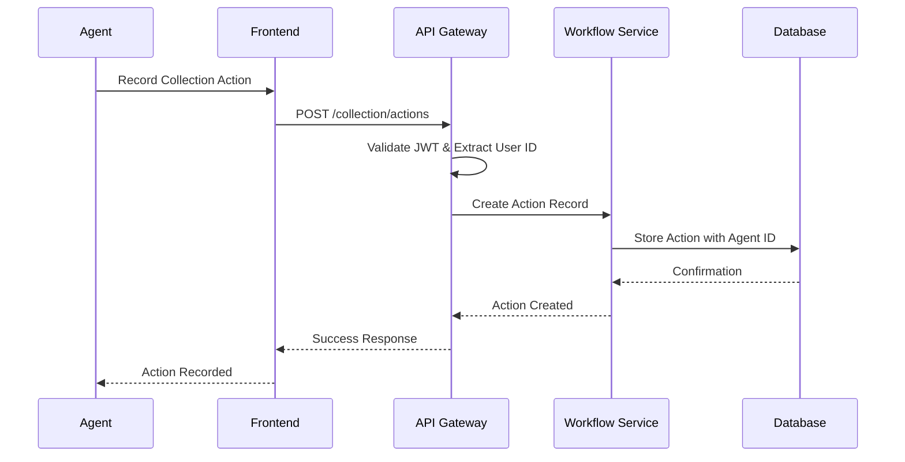

# User-Agent Linking Workflow Design

## Overview

This document outlines the high-level architecture and workflow for linking users (managed in auth-service) to agents (managed in collection-workflow-service) in the Collexis system.

## Architecture Overview

## Data Relationship Model

## Core Workflow Processes

### 1. User Authentication & Agent Profile Loading

### 2. Agent Management Workflow

### 3. Customer Assignment Process

### 4. Action Recording Workflow

## Key Design Principles

### 1. Service Separation
- **Auth Service**: Manages users, authentication, and authorization
- **Workflow Service**: Manages agents, actions, and collection processes
- **API Gateway**: Orchestrates requests and composes responses

### 2. Data Linking Strategy
- **Primary Link**: `workflow_service.agents.user_id` → `auth_service.users.id`
- **Referential Integrity**: Foreign key constraint ensures data consistency
- **Single Source of Truth**: User data in auth-service, agent data in workflow-service

### 3. Communication Patterns
- **Synchronous**: Direct API calls for real-time operations
- **Asynchronous**: Event-driven updates for data consistency
- **Composition**: API Gateway combines data from multiple services

## Operational Workflows

### User Onboarding
1. HR creates user account in auth-service
2. System administrator creates corresponding agent profile
3. Agent profile automatically links to user via user_id
4. Agent receives credentials and can begin work

### Daily Operations
1. Agent logs in through auth-service
2. System loads agent profile from workflow-service
3. Agent sees assigned customers and pending actions
4. All collection activities are recorded with agent context

### Performance Tracking
1. Actions are recorded with agent_id reference
2. Performance metrics calculated from action records
3. Reports show both user and agent information
4. Supervisors can track team performance

## Security & Access Control

### Authentication Flow
- Users authenticate through auth-service
- JWT tokens contain user ID and roles
- Workflow-service validates agent permissions

### Authorization Model
- Role-based access control (RBAC)
- Agent-level permissions for specific functions
- Team-based data access restrictions

## Benefits of This Design

1. **Simplicity**: Direct foreign key relationship
2. **Performance**: Minimal cross-service calls
3. **Consistency**: Single source of truth for each data type
4. **Scalability**: Services can scale independently
5. **Maintainability**: Clear separation of concerns
6. **Flexibility**: Easy to extend with additional agent types

## Implementation Considerations

### Database Changes
- Add `user_id` column to agents table
- Create foreign key constraint
- Index for performance optimization

### API Updates
- New endpoints for user-agent linking
- Enhanced authentication responses
- Agent profile retrieval by user ID

### Service Integration
- Cross-service data validation
- Event-driven consistency updates
- Error handling for service failures

This design provides a robust, scalable foundation for managing the relationship between users and agents while maintaining the benefits of microservices architecture.