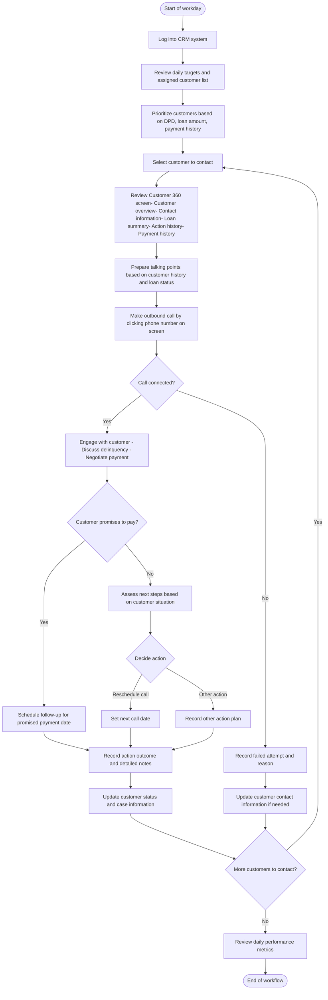
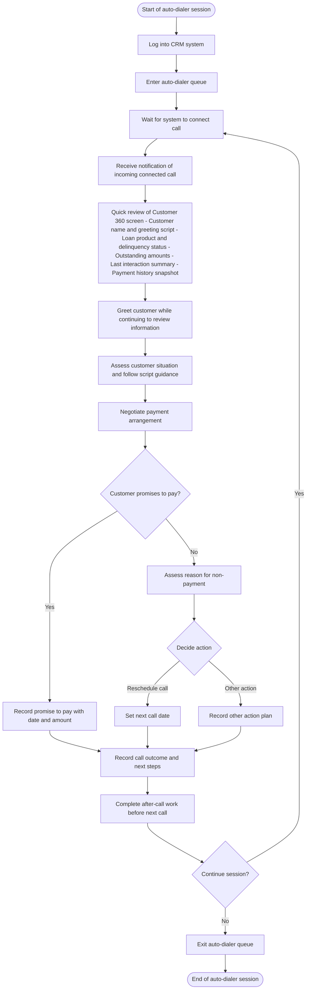
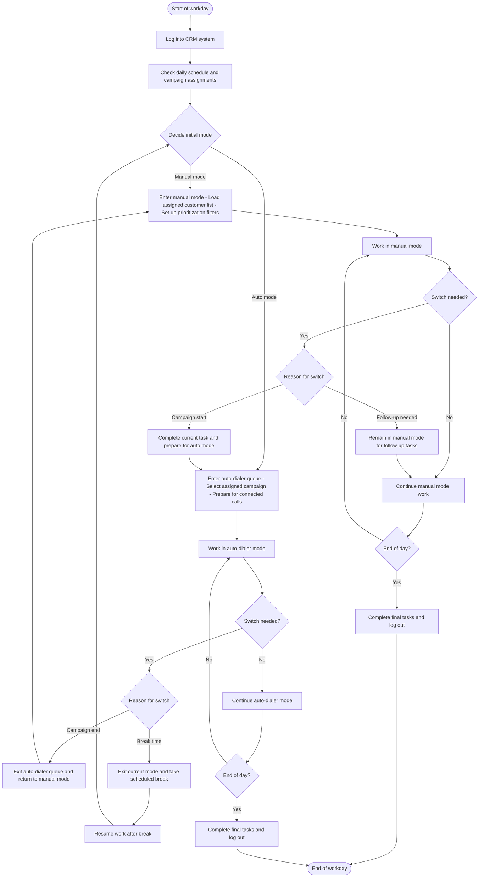
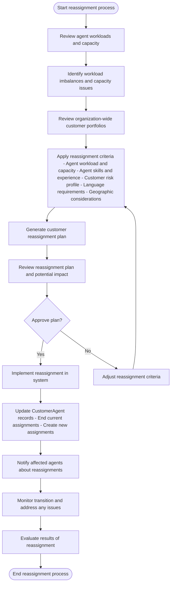
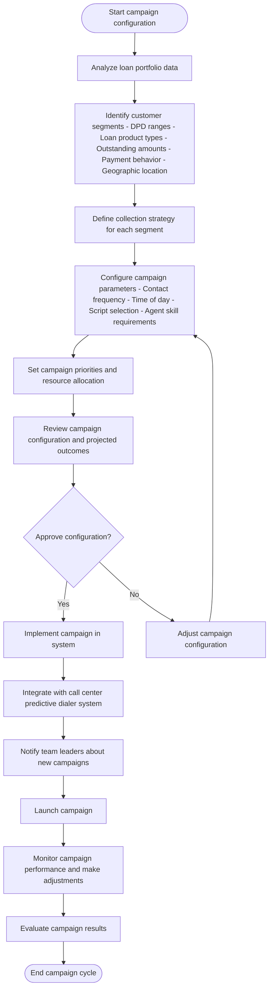
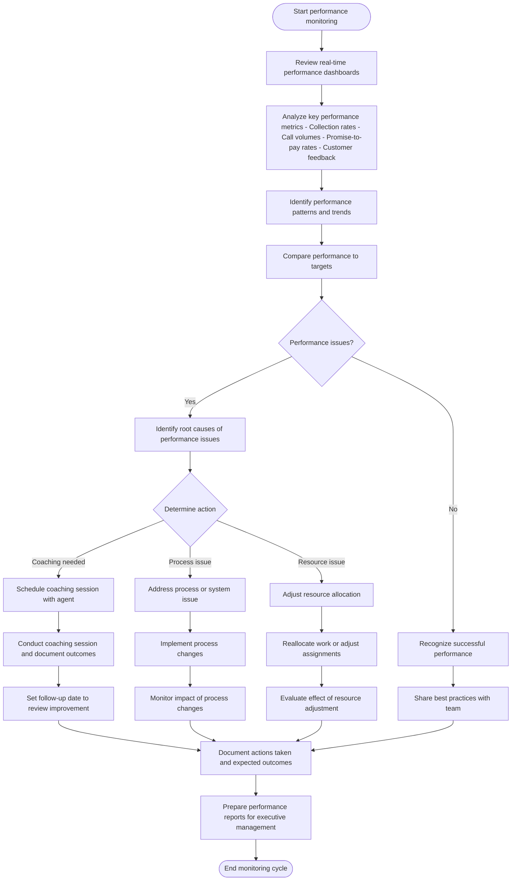

# Collexis User Journey Maps and Workflows

This document outlines detailed user journey maps and workflows for the Collexis system, based on the previously defined user personas. The journeys focus on key workflows for Collection Agents and Supervisors, highlighting the sequence of steps, decision points, information needs, and potential optimization opportunities.

## 1. Collection Agent (Minh Nguyen) Journeys

### 1.1. Manual Mode Workflow

**Starting Point:** Beginning of workday, agent logs into the CRM system
**End Goal:** Successfully contact assigned customers, negotiate payments, and record outcomes

**Key Steps and Information Needed:**

1. **Log into CRM system**
   - Information: Agent credentials
   - System: Authentication Microservice

2. **Review daily targets and assigned customer list**
   - Information: Performance targets, assigned customers
   - System: Collection Workflow Microservice (CustomerAgent entity)

3. **Prioritize customers**
   - Information: Days Past Due (DPD), outstanding amounts, payment history
   - System: Bank Synchronization Microservice (Loan entity)

4. **Review Customer 360 screen**
   - Information: Customer overview, contact information, loan summary, action history, payment history
   - System: Integration of data from multiple microservices

5. **Make outbound call**
   - Information: Contact phone numbers with success rate indicators
   - System: Integration with Call Center Software

6. **Record action outcomes**
   - Information: Call result, payment promises, follow-up dates
   - System: Collection Workflow Microservice (ActionRecord entity)

7. **Update customer status**
   - Information: Current customer situation, cooperation level
   - System: Collection Workflow Microservice (CustomerCase entity)

**Decision Points:**
- Prioritizing which customers to contact first
- Handling connected vs. failed calls
- Determining next steps based on customer response

**Potential Pain Points:**
- Large caseloads making prioritization difficult
- Incomplete or outdated customer information
- System slowdowns during peak hours
- Repetitive data entry across multiple screens

**Optimization Opportunities:**
- Smart prioritization algorithms for customer sorting
- Quick-access buttons for common actions
- Automated scheduling of follow-ups
- Templated notes with customizable fields

### 1.2. Auto Mode (Predictive Dialing) Workflow

**Starting Point:** Agent enters the auto-dialer queue
**End Goal:** Handle high volume of calls efficiently with minimal preparation time

**Key Steps and Information Needed:**

1. **Enter auto-dialer queue**
   - Information: Agent ID, campaign assignment
   - System: Integration with Call Center Software

2. **Quick review of Customer 360 screen**
   - Information: Instant recognition panel with critical customer information
   - System: Integration of data from multiple microservices with optimized display

3. **Assess customer situation**
   - Information: Script guidance, objection handling prompts
   - System: Collection Workflow Microservice

4. **Record call outcome**
   - Information: Quick-select outcome buttons, rapid follow-up scheduling
   - System: Collection Workflow Microservice (ActionRecord entity)

5. **Complete after-call work**
   - Information: Brief window (15-30 seconds) to complete notes
   - System: Collection Workflow Microservice

**Decision Points:**
- Assessing customer situation quickly with minimal preparation
- Determining appropriate script and negotiation approach
- Deciding on next steps based on customer response
- Managing time efficiently between calls

**Potential Pain Points:**
- Lack of context when receiving auto-dialed calls
- Limited time to review customer information
- Stress from handling high call volumes
- System delays impacting after-call work completion

**Optimization Opportunities:**
- Intelligent information prioritization on the Customer 360 screen
- Single-click action recording options
- Dynamic script suggestions based on customer profile
- Automated call metadata capture

### 1.3. Mode Switching Workflow

**Starting Point:** Agent needs to switch between manual and auto modes
**End Goal:** Efficiently transition between modes while maintaining productivity

**Key Steps and Information Needed:**

1. **Check daily schedule and campaign assignments**
   - Information: Campaign schedules, assigned customer lists
   - System: Collection Workflow Microservice

2. **Decide initial mode**
   - Information: Campaign start times, priority follow-ups
   - System: Collection Workflow Microservice

3. **Switch between modes**
   - Information: Campaign status, workload in each mode
   - System: Integration between CRM and Call Center Software

**Decision Points:**
- When to switch between manual and auto modes
- How to prioritize work when returning to manual mode
- When to take breaks between modes

**Potential Pain Points:**
- Loss of context when switching modes
- Incomplete tasks when forced to switch modes
- Mental adjustment required between different work rhythms

**Optimization Opportunities:**
- Seamless transition between interfaces
- Task preservation when switching modes
- Smart scheduling of mode switches based on workload
- Automated prioritization when returning to manual mode

## 2. Supervisor (Linh Tran) Journeys

### 2.1. Customer Reassignment Workflow

**Starting Point:** Need to reassign customers due to workload imbalances or other factors
**End Goal:** Balanced workloads across agents with optimal customer-agent matching

**Key Steps and Information Needed:**

1. **Review agent workloads and capacity**
   - Information: Current assignments, performance metrics, capacity limits
   - System: Collection Workflow Microservice (Agent entity, CustomerAgent entity)

2. **Review customer portfolios**
   - Information: Customer risk profiles, delinquency status, loan amounts
   - System: Bank Synchronization Microservice (Customer entity, Loan entity)

3. **Apply reassignment criteria**
   - Information: Agent skills, customer characteristics, workload targets
   - System: Collection Workflow Microservice

4. **Implement reassignment**
   - Information: CustomerAgent mappings, effective dates
   - System: Collection Workflow Microservice (CustomerAgent entity)

**Decision Points:**
- Determining which customers to reassign
- Matching customers to appropriate agents
- Approving the reassignment plan
- Handling special cases or high-value customers

**Potential Pain Points:**
- Time-consuming process of reassigning customers
- Ensuring balanced workloads while maintaining appropriate customer-agent matches
- Managing the transition period
- Communicating changes effectively to agents

**Optimization Opportunities:**
- Automated workload balancing algorithms
- Bulk reassignment tools
- Performance prediction based on customer-agent matching
- Streamlined notification process

### 2.2. Campaign Configuration Workflow

**Starting Point:** Need to create or update collection campaigns
**End Goal:** Optimized campaigns that maximize collection outcomes

**Key Steps and Information Needed:**

1. **Analyze loan portfolio data**
   - Information: Loan status, delinquency rates, customer segments
   - System: Bank Synchronization Microservice (Loan entity)

2. **Define collection strategy**
   - Information: Historical performance data, resource constraints
   - System: Collection Workflow Microservice

3. **Configure campaign parameters**
   - Information: Contact strategies, script templates, agent skills
   - System: Integration with Call Center Software

4. **Monitor campaign performance**
   - Information: Real-time metrics, contact rates, collection rates
   - System: Collection Workflow Microservice and Call Center Software

**Decision Points:**
- Segmenting customers for different campaigns
- Allocating resources across campaigns
- Setting contact strategies (time, frequency)
- Adjusting campaigns based on performance

**Potential Pain Points:**
- Complex configuration process across multiple systems
- Balancing multiple campaigns with limited resources
- Predicting campaign outcomes accurately
- Making timely adjustments to underperforming campaigns

**Optimization Opportunities:**
- AI-driven segmentation and strategy recommendations
- Automated campaign optimization based on performance
- Integrated campaign management across systems
- Real-time performance dashboards

### 2.3. Agent Performance Monitoring Workflow

**Starting Point:** Regular performance monitoring cycle or specific performance concern
**End Goal:** Optimized agent performance and continuous improvement

**Key Steps and Information Needed:**

1. **Review performance dashboards**
   - Information: Real-time and historical performance metrics
   - System: Collection Workflow Microservice (ActionRecord entity)

2. **Analyze key performance metrics**
   - Information: Collection rates, call volumes, promise-to-pay rates
   - System: Collection Workflow Microservice and Call Center Software

3. **Identify root causes of performance issues**
   - Information: Call recordings, action records, customer feedback
   - System: Collection Workflow Microservice and Call Center Software

4. **Conduct coaching and implement changes**
   - Information: Performance improvement plans, best practices
   - System: Collection Workflow Microservice

**Decision Points:**
- Determining whether performance issues exist
- Identifying the root causes of performance issues
- Selecting appropriate interventions (coaching, process changes, resource adjustments)
- Setting appropriate follow-up timelines

**Potential Pain Points:**
- Limited visibility into real-time performance
- Difficulty isolating causes of performance issues
- Time constraints for coaching and follow-up
- Balancing performance management with other responsibilities

**Optimization Opportunities:**
- Automated performance alerts and anomaly detection
- AI-assisted root cause analysis
- Integrated coaching tools and resources
- Streamlined reporting and documentation

## Summary of User Journeys and Workflows

The user journey maps and workflows created for the Collexis system provide a comprehensive view of how Collection Agents and Supervisors interact with the system to perform their key tasks. These journeys highlight:

1. **For Collection Agents:**
   - The structured approach to handling customer interactions in both manual and auto modes
   - The critical information needed at each step of the collection process
   - The decision points that determine the flow of activities
   - The challenges of switching between different work modes

2. **For Supervisors:**
   - The complex process of optimizing resource allocation through customer reassignment
   - The strategic approach to campaign configuration and management
   - The systematic monitoring and improvement of agent performance

The journeys also identify several common pain points and optimization opportunities that can be addressed in the system design:

- **Information Access:** Ensuring critical information is available at the right time
- **Process Efficiency:** Streamlining workflows to reduce administrative burden
- **Decision Support:** Providing guidance at key decision points
- **System Integration:** Ensuring seamless interaction between different components

These user journey maps provide a foundation for detailed system design and can be used to validate that the Collexis system effectively supports the needs of its primary users.