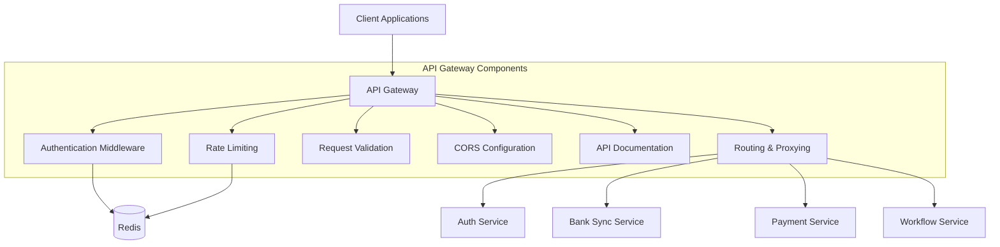

# API Gateway Implementation Technical Plan

## 1. Architecture Overview

Based on my analysis of the current codebase and your requirements, I've created a detailed technical plan for implementing the API Gateway components. Let's start with a high-level architecture diagram showing how these components will interact.



## 2. Component Implementation Details

### 2.1 Express.js API Gateway Container

The API Gateway is already partially implemented using Express.js. We'll enhance it with additional components and middleware.

**Current State:**
- Basic Express.js setup with middleware for CORS, Helmet, Morgan, and JSON parsing
- Simple proxy routing to microservices
- Basic rate limiting with Redis
- Initial Swagger documentation setup

**Implementation Plan:**
1. **Structure Reorganization:**
   - Create a modular folder structure for better organization
   - Separate route definitions from the main application file
   - Implement middleware in dedicated files

```
src/services/api-gateway/
├── src/
│   ├── index.ts                 # Main application entry point
│   ├── config/                  # Configuration files
│   │   ├── app.config.ts        # Application configuration
│   │   ├── cors.config.ts       # CORS configuration
│   │   ├── swagger.config.ts    # Swagger configuration
│   │   └── routes.config.ts     # Route configuration
│   ├── middleware/              # Middleware components
│   │   ├── rate-limiter.ts      # Rate limiting middleware (existing)
│   │   ├── auth.middleware.ts   # Authentication middleware
│   │   ├── validation.middleware.ts # Request validation middleware
│   │   └── error-handler.middleware.ts # Error handling middleware
│   ├── routes/                  # Route definitions
│   │   ├── auth.routes.ts       # Auth service routes
│   │   ├── bank.routes.ts       # Bank service routes
│   │   ├── payment.routes.ts    # Payment service routes
│   │   ├── workflow.routes.ts   # Workflow service routes
│   │   └── index.ts             # Route aggregator
│   └── utils/                   # Utility functions
│       ├── proxy.utils.ts       # Proxy configuration utilities
│       └── logger.utils.ts      # Logging utilities
```

2. **Dependencies:**
   - Express.js (existing)
   - http-proxy-middleware (existing)
   - helmet (existing)
   - morgan (existing)
   - cors (existing)
   - express-validator (new - for request validation)
   - swagger-jsdoc (existing)
   - swagger-ui-express (existing)
   - express-session (new - for session management)
   - connect-redis (new - for Redis session store)

### 2.2 Routing and Proxying

**Current State:**
- Basic proxy routing to microservices using http-proxy-middleware
- Simple path rewriting

**Implementation Plan:**
1. **Enhanced Proxy Configuration:**
   - Create a dedicated proxy configuration module
   - Implement service discovery for dynamic routing
   - Add error handling for proxy failures
   - Implement timeout configurations

2. **Code Structure:**

```typescript
// src/services/api-gateway/src/utils/proxy.utils.ts
import { RequestHandler } from 'express';
import { createProxyMiddleware, Options } from 'http-proxy-middleware';

export interface ProxyConfig {
  path: string;
  target: string;
  pathRewrite?: Record<string, string>;
  timeout?: number;
}

export function createServiceProxy(config: ProxyConfig): RequestHandler {
  const options: Options = {
    target: config.target,
    changeOrigin: true,
    pathRewrite: config.pathRewrite,
    timeout: config.timeout || 30000,
    proxyTimeout: config.timeout || 30000,
    logLevel: process.env.NODE_ENV === 'development' ? 'debug' : 'error',
    onError: (err, req, res) => {
      console.error(`Proxy error: ${err.message}`);
      res.status(502).json({
        error: 'Bad Gateway',
        message: 'The service is temporarily unavailable',
      });
    }
  };

  return createProxyMiddleware(options);
}
```

3. **Route Configuration:**

```typescript
// src/services/api-gateway/src/config/routes.config.ts
import { ProxyConfig } from '../utils/proxy.utils';

export const serviceRoutes: Record<string, ProxyConfig> = {
  auth: {
    path: '/api/auth',
    target: process.env.AUTH_SERVICE_URL || 'http://auth-service:3000',
    pathRewrite: { '^/api/auth': '' },
    timeout: 30000,
  },
  bank: {
    path: '/api/bank',
    target: process.env.BANK_SERVICE_URL || 'http://bank-sync-service:3000',
    pathRewrite: { '^/api/bank': '' },
    timeout: 30000,
  },
  payment: {
    path: '/api/payment',
    target: process.env.PAYMENT_SERVICE_URL || 'http://payment-service:3000',
    pathRewrite: { '^/api/payment': '' },
    timeout: 30000,
  },
  workflow: {
    path: '/api/workflow',
    target: process.env.WORKFLOW_SERVICE_URL || 'http://workflow-service:3000',
    pathRewrite: { '^/api/workflow': '' },
    timeout: 30000,
  },
};
```

### 2.3 Authentication Middleware

**Current State:**
- No authentication middleware implemented in the API Gateway
- Redis SessionStore implementation exists in common/redis/session.ts

**Implementation Plan:**
1. **Session-Based Authentication:**
   - Implement express-session with Redis store
   - Create authentication middleware to validate sessions
   - Implement session verification for protected routes

2. **Code Structure:**

```typescript
// src/services/api-gateway/src/middleware/auth.middleware.ts
import { Request, Response, NextFunction } from 'express';
import { createSessionStore, SessionData } from '../../../../common/redis/session';

// Extend Express Request to include user property
declare global {
  namespace Express {
    interface Request {
      user?: SessionData;
    }
  }
}

// Create session store
const sessionStore = createSessionStore({
  prefix: 'api-gateway:session:',
  clientName: 'api-gateway-auth',
});

// Authentication middleware
export async function authenticate(req: Request, res: Response, next: NextFunction) {
  try {
    // Get session ID from cookie or Authorization header
    const sessionId = req.cookies?.sessionId || 
      (req.headers.authorization?.startsWith('Session ') && 
       req.headers.authorization.split(' ')[1]);
    
    if (!sessionId) {
      return res.status(401).json({ error: 'Unauthorized', message: 'Authentication required' });
    }
    
    // Verify session
    const session = await sessionStore.getSession(sessionId);
    
    if (!session) {
      return res.status(401).json({ error: 'Unauthorized', message: 'Invalid or expired session' });
    }
    
    // Attach user data to request
    req.user = session;
    
    next();
  } catch (error) {
    console.error('Authentication error:', error);
    res.status(500).json({ error: 'Internal Server Error', message: 'Authentication failed' });
  }
}

// Role-based authorization middleware
export function authorize(roles: string[]) {
  return (req: Request, res: Response, next: NextFunction) => {
    if (!req.user) {
      return res.status(401).json({ error: 'Unauthorized', message: 'Authentication required' });
    }
    
    const hasRole = req.user.roles.some(role => roles.includes(role));
    
    if (!hasRole) {
      return res.status(403).json({ error: 'Forbidden', message: 'Insufficient permissions' });
    }
    
    next();
  };
}
```

### 2.4 Rate Limiting with Redis

**Current State:**
- Basic rate limiting implemented with Redis
- RateLimiter class in common/redis/rate-limit.ts
- redisRateLimiter middleware in middleware/rate-limiter.ts

**Implementation Plan:**
1. **Enhanced Rate Limiting:**
   - Implement service-specific rate limits
   - Add dynamic rate limiting based on user roles
   - Implement IP-based and user-based rate limiting
   - Add configurable rate limit tiers

2. **Code Structure:**

```typescript
// src/services/api-gateway/src/middleware/enhanced-rate-limiter.ts
import { Request, Response, NextFunction } from 'express';
import { createRateLimiter, RateLimitOptions } from '../../../../common/redis/rate-limit';

// Rate limit tiers
export enum RateLimitTier {
  PUBLIC = 'public',
  AUTHENTICATED = 'authenticated',
  PREMIUM = 'premium',
  ADMIN = 'admin',
}

// Rate limit configurations by tier
const rateLimitConfigs: Record<RateLimitTier, RateLimitOptions> = {
  [RateLimitTier.PUBLIC]: {
    max: 60,
    windowSizeInSeconds: 60,
    prefix: 'api-gateway:rate-limit:public:',
    includeUserId: false,
    includeRoute: true,
    clientName: 'api-gateway-rate-limit-public',
  },
  [RateLimitTier.AUTHENTICATED]: {
    max: 300,
    windowSizeInSeconds: 60,
    prefix: 'api-gateway:rate-limit:auth:',
    includeUserId: true,
    includeRoute: true,
    clientName: 'api-gateway-rate-limit-auth',
  },
  [RateLimitTier.PREMIUM]: {
    max: 600,
    windowSizeInSeconds: 60,
    prefix: 'api-gateway:rate-limit:premium:',
    includeUserId: true,
    includeRoute: true,
    clientName: 'api-gateway-rate-limit-premium',
  },
  [RateLimitTier.ADMIN]: {
    max: 1200,
    windowSizeInSeconds: 60,
    prefix: 'api-gateway:rate-limit:admin:',
    includeUserId: true,
    includeRoute: true,
    clientName: 'api-gateway-rate-limit-admin',
  },
};

// Create rate limiters for each tier
const rateLimiters = Object.entries(rateLimitConfigs).reduce(
  (acc, [tier, config]) => {
    acc[tier as RateLimitTier] = createRateLimiter(config);
    return acc;
  },
  {} as Record<RateLimitTier, ReturnType<typeof createRateLimiter>>
);

// Enhanced rate limiter middleware
export function enhancedRateLimiter() {
  return async (req: Request, res: Response, next: NextFunction) => {
    try {
      // Determine rate limit tier based on user role
      let tier = RateLimitTier.PUBLIC;
      
      if (req.user) {
        if (req.user.roles.includes('admin')) {
          tier = RateLimitTier.ADMIN;
        } else if (req.user.roles.includes('premium')) {
          tier = RateLimitTier.PREMIUM;
        } else {
          tier = RateLimitTier.AUTHENTICATED;
        }
      }
      
      // Get rate limiter for the tier
      const rateLimiter = rateLimiters[tier];
      
      // Get identifier (IP address or user ID if authenticated)
      const identifier = req.user?.userId || req.ip || 
        req.headers['x-forwarded-for'] as string || 'unknown';
      
      // Get route identifier
      const route = req.path.split('/').filter(Boolean)[1] || 'unknown';
      
      // Check rate limit
      const result = await rateLimiter.check(identifier, route);
      
      // Set rate limit headers
      res.setHeader('X-RateLimit-Limit', result.limit.toString());
      res.setHeader('X-RateLimit-Remaining', result.remaining.toString());
      res.setHeader('X-RateLimit-Reset', result.resetIn.toString());
      
      if (result.allowed) {
        next();
      } else {
        res.status(429).json({
          error: 'Too Many Requests',
          message: 'Rate limit exceeded. Please try again later.',
          retryAfter: result.resetIn,
        });
      }
    } catch (error) {
      console.error('Rate limiter error:', error);
      next(); // Fail open
    }
  };
}
```

### 2.5 Request Validation

**Current State:**
- No request validation implemented

**Implementation Plan:**
1. **Express-Validator Implementation:**
   - Create validation schemas for each endpoint
   - Implement validation middleware
   - Add error handling for validation failures

2. **Code Structure:**

```typescript
// src/services/api-gateway/src/middleware/validation.middleware.ts
import { Request, Response, NextFunction } from 'express';
import { validationResult, ValidationChain } from 'express-validator';

// Validation middleware
export function validate(validations: ValidationChain[]) {
  return async (req: Request, res: Response, next: NextFunction) => {
    // Run all validations
    await Promise.all(validations.map(validation => validation.run(req)));
    
    // Check for validation errors
    const errors = validationResult(req);
    
    if (errors.isEmpty()) {
      return next();
    }
    
    // Return validation errors
    return res.status(400).json({
      error: 'Bad Request',
      message: 'Validation failed',
      details: errors.array(),
    });
  };
}
```

3. **Example Validation Schema:**

```typescript
// src/services/api-gateway/src/routes/auth.routes.ts
import { Router } from 'express';
import { body } from 'express-validator';
import { validate } from '../middleware/validation.middleware';
import { createServiceProxy } from '../utils/proxy.utils';
import { serviceRoutes } from '../config/routes.config';

const router = Router();

// Login validation schema
const loginValidation = [
  body('username').isString().notEmpty().withMessage('Username is required'),
  body('password').isString().notEmpty().withMessage('Password is required'),
];

// Apply validation middleware before proxying to auth service
router.post('/login', validate(loginValidation), createServiceProxy(serviceRoutes.auth));

export default router;
```

### 2.6 CORS Configuration

**Current State:**
- Simple CORS configuration with default settings

**Implementation Plan:**
1. **Environment-Based CORS Configuration:**
   - Create separate CORS configurations for development and production
   - Allow all origins in development
   - Restrict to specific origins in production

2. **Code Structure:**

```typescript
// src/services/api-gateway/src/config/cors.config.ts
import cors from 'cors';

// CORS options based on environment
export function getCorsOptions() {
  const isDevelopment = process.env.NODE_ENV === 'development';
  
  if (isDevelopment) {
    // Development: Allow all origins
    return cors({
      origin: '*',
      methods: ['GET', 'POST', 'PUT', 'DELETE', 'PATCH', 'OPTIONS'],
      allowedHeaders: ['Content-Type', 'Authorization'],
      credentials: true,
    });
  } else {
    // Production: Restrict to specific origins
    const allowedOrigins = (process.env.ALLOWED_ORIGINS || '').split(',');
    
    return cors({
      origin: (origin, callback) => {
        // Allow requests with no origin (like mobile apps or curl requests)
        if (!origin || allowedOrigins.includes(origin)) {
          callback(null, true);
        } else {
          callback(new Error('Not allowed by CORS'));
        }
      },
      methods: ['GET', 'POST', 'PUT', 'DELETE', 'PATCH', 'OPTIONS'],
      allowedHeaders: ['Content-Type', 'Authorization'],
      credentials: true,
      maxAge: 86400, // 24 hours
    });
  }
}
```

### 2.7 API Documentation with Swagger/OpenAPI

**Current State:**
- Basic Swagger setup with minimal configuration

**Implementation Plan:**
1. **Combination Approach:**
   - Create core OpenAPI specification files
   - Use JSDoc comments for endpoint details
   - Implement enhanced Swagger UI configuration

2. **Code Structure:**

```typescript
// src/services/api-gateway/src/config/swagger.config.ts
import swaggerJSDoc from 'swagger-jsdoc';
import swaggerUi from 'swagger-ui-express';
import { Express } from 'express';
import path from 'path';

// OpenAPI specification
const openApiSpec = {
  openapi: '3.0.0',
  info: {
    title: 'Collexis API',
    version: '1.0.0',
    description: 'Collexis API Documentation',
    contact: {
      name: 'API Support',
      email: 'support@collectioncrm.com',
    },
  },
  servers: [
    {
      url: process.env.API_BASE_URL || 'http://localhost:3000',
      description: process.env.NODE_ENV === 'production' ? 'Production server' : 'Development server',
    },
  ],
  components: {
    securitySchemes: {
      sessionAuth: {
        type: 'apiKey',
        in: 'header',
        name: 'Authorization',
        description: 'Session-based authentication. Format: "Session {sessionId}"',
      },
    },
    schemas: {
      Error: {
        type: 'object',
        properties: {
          error: { type: 'string' },
          message: { type: 'string' },
          details: { type: 'array', items: { type: 'object' } },
        },
      },
    },
  },
  security: [{ sessionAuth: [] }],
};

// Swagger configuration
const swaggerOptions = {
  definition: openApiSpec,
  apis: [
    path.resolve(__dirname, '../routes/*.ts'),
    path.resolve(__dirname, '../routes/*.js'),
    path.resolve(__dirname, '../openapi/*.yaml'),
    path.resolve(__dirname, '../openapi/*.json'),
  ],
};

// Configure Swagger
export function configureSwagger(app: Express) {
  const swaggerSpec = swaggerJSDoc(swaggerOptions);
  
  app.use('/api-docs', swaggerUi.serve, swaggerUi.setup(swaggerSpec, {
    explorer: true,
    customCss: '.swagger-ui .topbar { display: none }',
    swaggerOptions: {
      persistAuthorization: true,
    },
  }));
  
  // Serve OpenAPI spec as JSON
  app.get('/api-docs.json', (req, res) => {
    res.setHeader('Content-Type', 'application/json');
    res.send(swaggerSpec);
  });
}
```

## 3. Integration Points

### 3.1 Integration with Auth Service

The API Gateway will integrate with the Auth Service for:
- Session validation
- User authentication
- Permission checking

**Implementation Details:**
- Proxy authentication requests to the Auth Service
- Use Redis SessionStore for session management
- Implement middleware to validate sessions

### 3.2 Integration with Redis

The API Gateway will use Redis for:
- Rate limiting
- Session storage
- Caching (optional)

**Implementation Details:**
- Use the existing Redis connection manager
- Configure Redis clients for different purposes
- Implement proper error handling for Redis operations

### 3.3 Integration with Microservices

The API Gateway will route requests to:
- Auth Service
- Bank Sync Service
- Payment Service
- Workflow Service

**Implementation Details:**
- Use http-proxy-middleware for routing
- Implement service discovery (optional)
- Add health checks for services

## 4. Configuration Changes

### 4.1 Docker Compose Changes

The current docker-compose.yml configuration for the API Gateway is sufficient, but we should add environment variables for:
- CORS configuration
- Rate limiting settings
- Session configuration

```yaml
# docker/compose/docker-compose.yml (changes)
api-gateway:
  build:
    context: ../../src/services/api-gateway
    dockerfile: ../../../docker/base-images/node.Dockerfile
  ports:
    - "3000:3000"
  environment:
    - NODE_ENV=development
    - REDIS_HOST=redis
    - REDIS_PORT=6379
    - RATE_LIMIT_MAX_REQUESTS=100
    - RATE_LIMIT_WINDOW_MS=900000
    - SESSION_SECRET=your_session_secret_here
    - SESSION_TTL=86400
    - ALLOWED_ORIGINS=http://localhost:8080
  depends_on:
    - auth-service
    - bank-sync-service
    - payment-service
    - workflow-service
    - redis
```

### 4.2 Environment Variables

Create a comprehensive .env.example file:

```
# API Gateway Configuration
PORT=3000
NODE_ENV=development

# Redis Configuration
REDIS_HOST=redis
REDIS_PORT=6379
REDIS_PASSWORD=

# Rate Limiting
RATE_LIMIT_MAX_REQUESTS=100
RATE_LIMIT_WINDOW_MS=900000

# Session Configuration
SESSION_SECRET=your_session_secret_here
SESSION_TTL=86400

# CORS Configuration
ALLOWED_ORIGINS=http://localhost:8080

# Service URLs
AUTH_SERVICE_URL=http://auth-service:3000
BANK_SERVICE_URL=http://bank-sync-service:3000
PAYMENT_SERVICE_URL=http://payment-service:3000
WORKFLOW_SERVICE_URL=http://workflow-service:3000

# API Documentation
API_BASE_URL=http://localhost:3000
```

## 5. Implementation Roadmap

### 5.1 Phase 1: Core Structure and Configuration (Week 1)

1. Reorganize the API Gateway structure
2. Create configuration files
3. Set up enhanced CORS configuration
4. Update Docker and environment configurations

### 5.2 Phase 2: Authentication and Rate Limiting (Week 1)

1. Implement session-based authentication middleware
2. Enhance rate limiting with tiered approach
3. Integrate with Redis SessionStore
4. Add authentication routes

### 5.3 Phase 3: Request Validation and Routing (Week 2)

1. Implement request validation middleware
2. Create validation schemas for core endpoints
3. Enhance proxy routing with error handling
4. Implement service-specific routes

### 5.4 Phase 4: API Documentation (Week 2)

1. Create core OpenAPI specification files
2. Add JSDoc comments to routes
3. Configure enhanced Swagger UI
4. Create documentation for all endpoints

### 5.5 Phase 5: Testing and Integration (Week 2)

1. Write unit tests for middleware
2. Perform integration testing with services
3. Test rate limiting and authentication
4. Validate API documentation