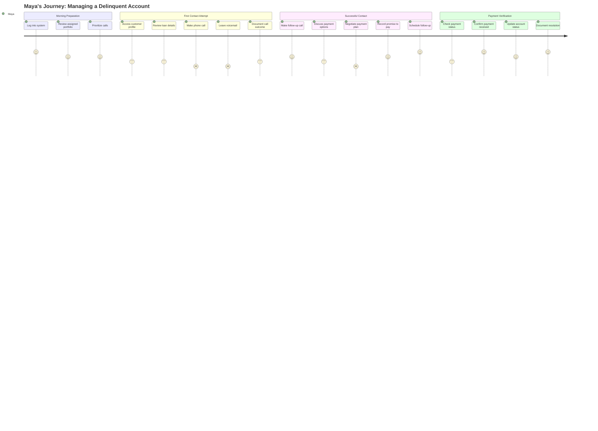
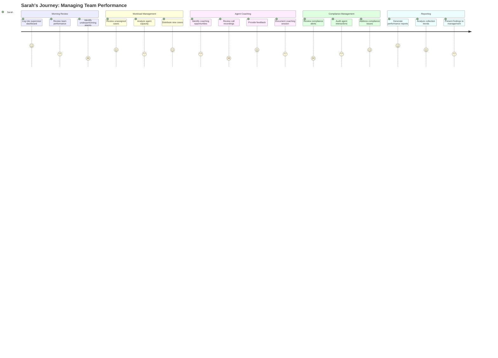
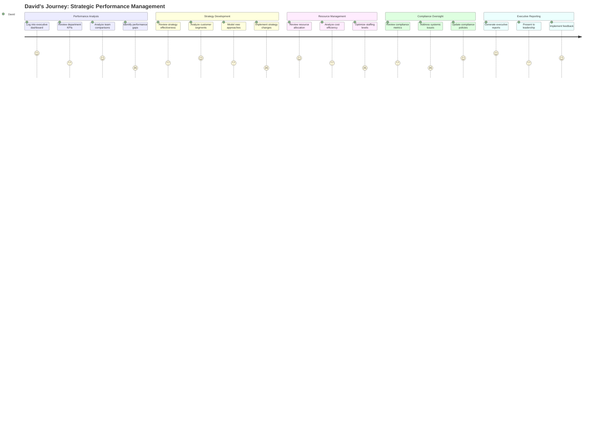

# CollectionCRM User Journey Maps

This document outlines detailed user journey maps for the CollectionCRM system, representing the key workflows and interactions for each user persona.

## 1. Call Center Agent Journey: Managing a Delinquent Account

### Persona: Maya Chen (Call Center Agent)

### Detailed Journey Map

#### Phase 1: Morning Preparation
| Step | Actions | System Touchpoints | Pain Points | Opportunities | Emotions |
|------|---------|-------------------|-------------|---------------|----------|
| 1. Log into CollectionCRM | - Enter credentials - Access dashboard | - Login screen - Dashboard | - System sometimes slow to load - Password resets are cumbersome | - Single sign-on integration - Biometric login option | Neutral → Slightly frustrated if system is slow |
| 2. Review assigned portfolio | - View today's call list - Check performance metrics - Review high-priority accounts | - Portfolio dashboard - Performance metrics panel - Priority queue | - Too many columns and data points - Difficult to quickly identify priorities | - Customizable dashboard - AI-powered prioritization - Visual indicators for priorities | Focused → Overwhelmed if too many high-priority cases |
| 3. Prioritize calls | - Sort by delinquency days - Filter by promise dates - Identify high-value accounts | - Filtering tools - Sorting functions - Customer segmentation view | - Manual prioritization is time-consuming - Limited filtering options | - Smart recommendations - Automated call sequencing - Predictive contact scoring | Determined → Confident with clear priorities |
#### Phase 2: First Contact Attempt
| Step | Actions | System Touchpoints | Pain Points | Opportunities | Emotions |
|------|---------|-------------------|-------------|---------------|----------|
| 4. Access customer profile | - Search by account number - Open customer record - Review customer overview | - Search function - Customer profile page - 360° customer view | - Information spread across multiple tabs - Slow to load complete history | - Unified customer view - Preloaded high-priority accounts - Quick access shortcuts | Curious → Frustrated if information is incomplete |
| 5. Review loan details | - Check loan status - Review payment history - Verify delinquency information | - Loan details panel - Payment history timeline - Delinquency status indicators | - Payment history not always up to date - Difficult to see payment patterns | - Visual payment timeline - Delinquency trend indicators - Integrated payment projections | Analytical → Concerned about outdated information |
| 6. Make phone call | - Initiate call from system - Follow call script - Attempt to reach customer | - Click-to-call function - Script guidance panel - Call timer | - Manual dialing if integration fails - Script not adaptive to conversation | - Seamless telephony integration - Dynamic scripting - Real-time guidance | Focused → Disappointed if no answer |
| 7. Leave voicemail | - Select voicemail template - Customize message - Record voicemail attempt | - Voicemail template selector - Message customization tool - Call outcome recorder | - Limited template options - No way to know if voicemail was heard | - Voicemail delivery confirmation - A/B tested templates - Automated follow-up scheduling | Professional → Uncertain about effectiveness |
| 8. Document call outcome | - Select call result code - Add notes about attempt - Schedule next action | - Call result dropdown - Notes field - Action scheduler | - Too many result codes - Free-text notes lack structure - Manual follow-up scheduling | - Simplified outcome categories - Structured note templates - Automated follow-up suggestions | Efficient → Rushed if behind on calls |

#### Phase 3: Successful Contact
| Step | Actions | System Touchpoints | Pain Points | Opportunities | Emotions |
|------|---------|-------------------|-------------|---------------|----------|
| 9. Make follow-up call | - Review previous attempt notes - Initiate call - Establish contact with customer | - Previous interaction history - Click-to-call function - Contact verification | - Difficult to quickly review history - No context about customer mood | - Interaction summary view - Sentiment analysis from previous calls - Recommended talking points | Hopeful → Relieved when contact made |
| 10. Discuss payment options | - Explain current status - Present payment options - Answer customer questions | - Account status display - Payment options calculator - FAQ knowledge base | - Calculator requires manual inputs - Limited payment options to offer - Slow to access policy information | - Automated payment scenarios - Expanded payment options - Integrated policy guidance | Patient → Challenged during difficult conversations |
| 11. Negotiate payment plan | - Propose payment schedule - Adjust based on customer feedback - Reach agreement | - Payment plan creator - Approval workflow - Terms and conditions display | - Limited authority to negotiate - Approval workflows slow down process - Difficult to explain terms to customer | - Pre-approved negotiation parameters - Real-time supervisor chat support - Visual payment plan for customer sharing | Persuasive → Satisfied when agreement reached |
| 12. Record promise to pay | - Document agreed amount - Set payment date(s) - Capture customer commitment | - Promise to pay form - Calendar integration - Commitment confirmation | - Multiple screens to record promise - No easy way to send confirmation to customer - Manual reminder setting | - One-click promise recording - Automated confirmation to customer - Intelligent reminder system | Relieved → Accomplished |
| 13. Schedule follow-up | - Set follow-up date - Select follow-up reason - Add to calendar | - Follow-up scheduler - Reason code selector - Calendar integration | - Follow-up often forgotten - Manual calendar entry - No automated reminders | - Smart follow-up suggestions - Automated calendar integration - Proactive reminder system | Organized → Confident about next steps |
#### Phase 4: Payment Verification
| Step | Actions | System Touchpoints | Pain Points | Opportunities | Emotions |
|------|---------|-------------------|-------------|---------------|----------|
| 14. Check payment status | - Search for customer - Review payment records - Verify against promise | - Customer search - Payment records view - Promise to pay tracker | - Delayed payment updates - Manual reconciliation needed - Difficult to match payments to promises | - Real-time payment notifications - Automated promise matching - Payment status dashboard | Curious → Anxious if payment not showing |
| 15. Confirm payment received | - Verify payment details - Match to correct account - Validate payment amount | - Payment details view - Account matching tool - Amount verification | - Payment sometimes misapplied - Limited payment detail visibility - Manual verification required | - Automated payment verification - Payment source tracking - Exception flagging system | Thorough → Relieved when confirmed |
| 16. Update account status | - Change delinquency status - Update collection stage - Adjust risk category | - Status update form - Collection stage selector - Risk category matrix | - Multiple status updates required - Inconsistent status definitions - Manual updates to multiple systems | - One-click status updates - Automated status propagation - Consistent status definitions | Methodical → Satisfied |
| 17. Document resolution | - Record resolution details - Close or update case - Add final notes | - Resolution form - Case status updater - Notes field | - Extensive documentation required - No templates for common resolutions - Time-consuming process | - Resolution templates - Quick-close options - Automated success reporting | Thorough → Accomplished |

---

## 2. Field Agent Journey: Conducting Field Collections

### Persona: Carlos Rodriguez (Field Agent)

### Detailed Journey Map

#### Phase 1: Morning Planning
| Step | Actions | System Touchpoints | Pain Points | Opportunities | Emotions |
|------|---------|-------------------|-------------|---------------|----------|
| 1. Log into GPS Mobile app | - Enter credentials - Access field agent dashboard | - GPS Mobile login screen - Field agent dashboard | - Connectivity issues - Session timeouts - Slow mobile performance | - Offline authentication - Biometric login - Optimized mobile performance | Routine → Frustrated with connectivity issues |
| 2. Sync with CollectionCRM | - Initiate data sync - Download latest customer data - Verify sync completion | - Sync button - Sync progress indicator - Sync status notification | - Incomplete data synchronization - Sync failures - Long sync times | - Background synchronization - Intelligent data prioritization - Conflict resolution | Patient → Relieved when sync completes |
| 3. Review assigned visits | - View today's visit list - Check customer locations - Review account details | - Visit queue - Map integration - Customer summary cards | - Too many visits assigned - Incomplete customer information - Difficult to assess visit priority | - AI-powered visit prioritization - Complete offline customer profiles - Visual priority indicators | Focused → Overwhelmed if overbooked |
| 4. Plan optimal route | - View customers on map - Arrange visits by location - Consider traffic conditions | - Interactive map - Route optimization tool - Traffic integration | - Manual route planning - No integration with traffic data - Unable to easily reorder visits | - Automated route optimization - Real-time traffic updates - Drag-and-drop visit reordering | Strategic → Frustrated with inefficient routing |
#### Phase 2: Customer Visit
| Step | Actions | System Touchpoints | Pain Points | Opportunities | Emotions |
|------|---------|-------------------|-------------|---------------|----------|
| 5. Navigate to location | - Follow GPS Mobile map directions - Update status to "en route" - Notify customer of arrival | - Turn-by-turn navigation - Status updater - Customer notification tool | - Inaccurate GPS locations - Manual status updates - No easy way to notify customers | - Enhanced location accuracy - Automatic status updates - Automated arrival notifications | Focused → Frustrated with navigation issues |
| 6. Verify customer identity | - Check customer details from CollectionCRM - Verify identification - Confirm account ownership | - Customer profile - ID verification checklist - Account confirmation tool | - Limited verification options - Manual identity checking - No digital ID verification | - Photo ID scanner - Biometric verification - Digital signature capture | Cautious → Confident after verification |
| 7. Discuss delinquent account | - Present account status from CollectionCRM - Explain delinquency - Address customer questions | - Account status display - Delinquency explanation tools - FAQ knowledge base | - Complex information to explain - Difficult conversations - Limited visual aids | - Visual payment timelines - Interactive account explanations - Simplified financial education tools | Professional → Tense during difficult conversations |
| 8. Negotiate payment | - Present payment options - Negotiate terms - Reach agreement | - Payment options calculator - Negotiation guidelines - Agreement templates | - Limited authority to negotiate - Difficult to explain options - No real-time approval process | - Pre-approved negotiation parameters - Visual payment scenarios - Real-time supervisor chat | Persuasive → Relieved when agreement reached |

#### Phase 3: Payment Collection
| Step | Actions | System Touchpoints | Pain Points | Opportunities | Emotions |
|------|---------|-------------------|-------------|---------------|----------|
| 9. Process physical payment | - Accept cash/check - Count/verify amount - Secure payment | - GPS Mobile payment entry form - Amount verification - Security protocols | - Risk of handling cash - Manual counting errors - Security concerns | - Mobile payment options - Digital payment verification - Enhanced security features | Careful → Relieved when payment secured |
| 10. Generate receipt | - Enter payment details - Generate digital receipt - Provide to customer | - Receipt generator - Digital signature capture - Delivery options | - Printer connectivity issues - Manual receipt creation - No digital delivery options | - Instant digital receipts - Multiple delivery channels - Receipt templates | Efficient → Proud of professional process |
| 11. Update payment status | - Record payment details - Update account status - Queue for sync with CollectionCRM | - Payment record form - Status updater - Sync queue manager | - Offline status updates - Sync conflicts - Delayed confirmation | - Offline-first architecture - Conflict resolution - Background syncing | Thorough → Concerned about sync issues |

#### Phase 4: Visit Documentation
| Step | Actions | System Touchpoints | Pain Points | Opportunities | Emotions |
|------|---------|-------------------|-------------|---------------|----------|
| 12. Record visit outcome | - Select outcome type - Add detailed notes - Capture supporting evidence | - Outcome selector - Notes field - Photo/document capture | - Time-consuming documentation - Limited outcome categories - Manual photo management | - Voice-to-text notes - Smart outcome suggestions - Automated photo categorization | Diligent → Rushed if behind schedule |
| 13. Sync data with CollectionCRM | - Connect to network - Initiate data sync - Verify successful upload | - Network connector - Sync initiator - Verification notification | - Unreliable connectivity - Failed syncs - No progress indicator | - Automatic background syncing - Incremental uploads - Clear sync status indicators | Hopeful → Relieved when sync completes |
| 14. Plan next day visits | - Review upcoming visits - Prepare route plan - Research customer histories | - Visit calendar - Route planner - Customer research tool | - Limited planning tools - After-hours planning required - Insufficient research time | - AI-suggested visit planning - Automated route optimization - Quick customer insights | Proactive → Prepared for tomorrow |

---

## 3. Team Supervisor Journey: Managing Team Performance

### Persona: Sarah Johnson (Team Supervisor)

### Detailed Journey Map

#### Phase 1: Morning Review
| Step | Actions | System Touchpoints | Pain Points | Opportunities | Emotions |
|------|---------|-------------------|-------------|---------------|----------|
| 1. Log into supervisor dashboard | - Enter credentials - Access supervisor view - Check system alerts | - Login screen - Supervisor dashboard - Alerts panel | - Multiple systems to check - Information overload - Critical alerts not prioritized | - Unified dashboard - Customizable views - Intelligent alert prioritization | Focused → Overwhelmed by information |
| 2. Review team performance | - Check key metrics - Compare to targets - Identify trends | - Performance dashboard - Target comparison tool - Trend analyzer | - Manual data compilation - Inconsistent metrics - Limited historical context | - Automated performance tracking - Standardized KPIs - Historical trend visualization | Analytical → Concerned about negative trends |
| 3. Identify underperforming agents | - Review individual metrics - Compare to team averages - Flag concerning patterns | - Agent performance cards - Comparative analysis tool - Pattern recognition alerts | - Subjective performance assessment - Limited context for numbers - Difficult to identify root causes | - Objective performance indicators - Contextual performance data - Root cause analysis tools | Fair-minded → Worried about team morale |

#### Phase 2: Workload Management
| Step | Actions | System Touchpoints | Pain Points | Opportunities | Emotions |
|------|---------|-------------------|-------------|---------------|----------|
| 4. Review unassigned cases | - Check new case queue - Review case characteristics - Assess priority levels | - Case queue - Case detail viewer - Priority assessment tool | - High volume of new cases - Manual priority assessment - Limited case information | - Automated case prioritization - AI-powered risk assessment - Enhanced case previews | Methodical → Overwhelmed by volume |
| 5. Analyze agent capacity | - Review current workloads - Check agent availability - Assess skill matching | - Workload dashboard - Availability tracker - Skill matrix | - Inaccurate workload data - Manual skill assessment - No predictive capacity planning | - Real-time workload tracking - Skill-based routing - Predictive capacity modeling | Thoughtful → Frustrated by imbalances |
| 6. Distribute new cases | - Assign cases to agents - Balance workloads - Set priorities | - Case assignment tool - Workload balancer - Priority setter | - Manual assignment process - Time-consuming - Difficult to optimize | - Automated assignment suggestions - One-click distribution - Optimized workload balancing | Fair → Satisfied with balanced distribution |

#### Phase 3: Agent Coaching
| Step | Actions | System Touchpoints | Pain Points | Opportunities | Emotions |
|------|---------|-------------------|-------------|---------------|----------|
| 7. Identify coaching opportunities | - Review performance gaps - Analyze quality scores - Identify skill deficiencies | - Performance gap analyzer - Quality scoring system - Skill assessment tool | - Subjective quality assessment - Limited coaching resources - Reactive rather than proactive | - AI-powered coaching suggestions - Objective quality metrics - Proactive skill development | Supportive → Concerned about resource constraints |
| 8. Review call recordings | - Select calls to review - Listen to agent-customer interactions - Assess against quality standards | - Call recording selector - Playback interface - Quality assessment checklist | - Time-consuming process - Manual scoring - Limited search capabilities | - AI-powered call analysis - Automated quality scoring - Smart call selection | Attentive → Frustrated by inefficient process |
| 9. Provide feedback | - Meet with agent - Share observations - Provide constructive feedback | - Feedback session scheduler - Observation notes - Coaching template | - Scheduling conflicts - Inconsistent feedback delivery - Limited coaching tools | - Integrated coaching platform - Real-time feedback tools - Video coaching capabilities | Constructive → Hopeful about improvement |
| 10. Document coaching session | - Record coaching topics - Document action items - Set follow-up timeline | - Coaching log - Action item tracker - Follow-up scheduler | - Time-consuming documentation - No templates for common issues - Manual follow-up tracking | - Coaching templates - Automated action tracking - Intelligent follow-up reminders | Thorough → Satisfied with documentation |
#### Phase 4: Compliance Management
| Step | Actions | System Touchpoints | Pain Points | Opportunities | Emotions |
|------|---------|-------------------|-------------|---------------|----------|
| 11. Review compliance alerts | - Check compliance dashboard - Review flagged interactions - Assess risk levels | - Compliance dashboard - Interaction flag viewer - Risk assessment matrix | - Too many false positives - Manual review required - Limited context provided | - AI-powered compliance monitoring - Contextual flag information - Risk prioritization | Vigilant → Anxious about serious issues |
| 12. Audit agent interactions | - Select interactions to audit - Review against compliance standards - Document findings | - Audit sample selector - Compliance checklist - Findings documenter | - Time-consuming process - Inconsistent standards - Manual documentation | - Automated compliance checking - Standardized audit protocols - One-click documentation | Meticulous → Relieved when no issues found |
| 13. Address compliance issues | - Meet with agents - Explain compliance concerns - Implement corrective actions | - Issue tracker - Compliance training tools - Corrective action templates | - Difficult conversations - Limited training resources - Time-consuming remediation | - Just-in-time training modules - Guided corrective actions - Automated follow-up | Firm → Confident after resolution |

#### Phase 5: Reporting
| Step | Actions | System Touchpoints | Pain Points | Opportunities | Emotions |
|------|---------|-------------------|-------------|---------------|----------|
| 14. Generate performance reports | - Select report templates - Input parameters - Generate reports | - Report template library - Parameter selector - Report generator | - Manual report creation - Inconsistent formats - Time-consuming process | - Automated report generation - Standardized templates - Scheduled reporting | Efficient → Frustrated by manual work |
| 15. Analyze collection trends | - Review historical data - Identify patterns - Draw conclusions | - Trend analysis tool - Pattern recognition - Insight generator | - Limited analytical tools - Data silos - Time-consuming analysis | - Advanced analytics - Predictive modeling - Automated insights | Analytical → Insightful with clear patterns |
| 16. Present findings to management | - Prepare presentation - Highlight key insights - Make recommendations | - Presentation builder - Key metrics highlighter - Recommendation engine | - Manual presentation creation - Difficult to tell compelling story - Limited visualization options | - Automated presentation generation - Data storytelling tools - Interactive visualizations | Prepared → Confident with solid data |

---

## 4. Collection Manager Journey: Strategic Performance Management

### Persona: David Okonkwo (Collection Manager)

### Detailed Journey Map

#### Phase 1: Performance Analysis
| Step | Actions | System Touchpoints | Pain Points | Opportunities | Emotions |
|------|---------|-------------------|-------------|---------------|----------|
| 1. Log into executive dashboard | - Enter credentials - Access executive view - Check critical alerts | - Login screen - Executive dashboard - Critical alerts panel | - Multiple systems to check - Information overload - Lack of prioritized insights | - Single sign-on - Customizable executive views - AI-powered insight prioritization | Focused → Overwhelmed by data volume |
| 2. Review department KPIs | - Check recovery rates - Review cost metrics - Analyze compliance status | - KPI dashboard - Metric trend viewer - Compliance status board | - Manual data aggregation - Inconsistent metrics - Limited drill-down capability | - Automated KPI tracking - Standardized metrics - Interactive drill-down | Analytical → Concerned about underperformance |
| 3. Analyze team comparisons | - Compare team performance - Identify top/bottom performers - Assess strategy differences | - Team comparison tool - Performance ranking - Strategy effectiveness analyzer | - Difficult to normalize data - Limited context for differences - Manual analysis required | - Normalized comparison views - Contextual performance data - Automated variance analysis | Objective → Curious about performance drivers |
| 4. Identify performance gaps | - Pinpoint underperforming areas - Quantify performance gaps - Prioritize improvement areas | - Gap analysis tool - Performance quantifier - Priority matrix | - Subjective gap assessment - Limited root cause analysis - Difficult to prioritize | - Objective gap measurement - AI-powered root cause analysis - Data-driven prioritization | Strategic → Determined to address gaps |
#### Phase 2: Strategy Development
| Step | Actions | System Touchpoints | Pain Points | Opportunities | Emotions |
|------|---------|-------------------|-------------|---------------|----------|
| 5. Review strategy effectiveness | - Analyze strategy outcomes - Compare to benchmarks - Assess ROI of approaches | - Strategy outcome analyzer - Benchmark comparator - ROI calculator | - Limited strategy tracking - Inconsistent implementation - Difficult to isolate variables | - Strategy tracking framework - Implementation consistency metrics - Controlled testing capabilities | Evaluative → Frustrated by inconsistent data |
| 6. Analyze customer segments | - Review segment performance - Identify responsive segments - Detect changing patterns | - Segment analyzer - Response rate tracker - Pattern detection tool | - Manual segmentation - Static segment definitions - Limited behavioral insights | - Dynamic segmentation - Behavioral analysis - Predictive response modeling | Insightful → Excited about opportunities |
| 7. Model new approaches | - Design strategy variations - Forecast expected outcomes - Assess implementation requirements | - Strategy designer - Outcome forecaster - Implementation planner | - Limited modeling capabilities - Unreliable forecasts - Manual implementation planning | - Advanced strategy modeling - AI-powered forecasting - Automated implementation roadmaps | Creative → Uncertain about outcomes |
| 8. Implement strategy changes | - Document strategy updates - Communicate to supervisors - Monitor initial results | - Strategy documentation tool - Communication platform - Results monitoring dashboard | - Inconsistent implementation - Communication gaps - Delayed feedback loops | - Implementation checklists - Integrated communication - Real-time feedback mechanisms | Decisive → Anxious about execution |

#### Phase 3: Resource Management
| Step | Actions | System Touchpoints | Pain Points | Opportunities | Emotions |
|------|---------|-------------------|-------------|---------------|----------|
| 9. Review resource allocation | - Analyze team distribution - Review case allocation - Assess technology utilization | - Resource allocation dashboard - Case distribution analyzer - Technology utilization tracker | - Fragmented resource data - Manual allocation tracking - Limited optimization tools | - Unified resource view - Automated allocation tracking - AI-powered optimization | Methodical → Frustrated by inefficiencies |
| 10. Analyze cost efficiency | - Review cost per recovery - Compare channel efficiency - Identify cost drivers | - Cost analysis tool - Channel comparison - Cost driver identifier | - Incomplete cost data - Manual efficiency calculations - Limited cost attribution | - Comprehensive cost tracking - Automated efficiency metrics - Advanced cost attribution | Analytical → Determined to improve efficiency |
| 11. Optimize staffing levels | - Review workload data - Analyze productivity metrics - Adjust staffing models | - Workload analyzer - Productivity dashboard - Staffing model tool | - Unreliable workload data - Subjective productivity measures - Static staffing models | - Real-time workload tracking - Objective productivity metrics - Dynamic staffing optimization | Pragmatic → Confident with data-backed decisions |

#### Phase 4: Compliance Oversight
| Step | Actions | System Touchpoints | Pain Points | Opportunities | Emotions |
|------|---------|-------------------|-------------|---------------|----------|
| 12. Review compliance metrics | - Check compliance dashboard - Review audit results - Assess risk indicators | - Compliance dashboard - Audit results viewer - Risk indicator panel | - Fragmented compliance data - Delayed audit results - Reactive risk indicators | - Unified compliance view - Real-time audit reporting - Predictive risk indicators | Vigilant → Concerned about compliance risks |
| 13. Address systemic issues | - Identify pattern violations - Investigate root causes - Develop remediation plans | - Pattern violation detector - Root cause analyzer - Remediation planner | - Manual pattern detection - Limited investigation tools - Ad-hoc remediation planning | - AI-powered pattern detection - Advanced investigation tools - Structured remediation framework | Resolute → Determined to fix systemic issues |
| 14. Update compliance policies | - Review policy effectiveness - Draft policy updates - Implement and communicate changes | - Policy effectiveness analyzer - Policy editor - Communication platform | - Manual policy review - Disconnected editing tools - Inconsistent communication | - Automated effectiveness tracking - Integrated policy management - Streamlined communication | Thorough → Confident in improved compliance |

#### Phase 5: Executive Reporting
| Step | Actions | System Touchpoints | Pain Points | Opportunities | Emotions |
|------|---------|-------------------|-------------|---------------|----------|
| 15. Generate executive reports | - Compile performance data - Create visualizations - Develop key insights | - Data compilation tool - Visualization creator - Insight generator | - Manual data gathering - Time-consuming visualization - Difficult to identify insights | - Automated data aggregation - AI-powered visualizations - Insight recommendation engine | Meticulous → Proud of comprehensive reporting |
| 16. Present to leadership | - Prepare presentation - Deliver key findings - Answer questions | - Presentation builder - Interactive dashboard - Data explorer | - Static presentations - Limited ability to drill down - Difficult to answer unexpected questions | - Interactive presentations - Live data exploration - AI-assisted Q&A support | Prepared → Confident with data mastery |
| 17. Implement feedback | - Document leadership feedback - Adjust strategies - Communicate changes | - Feedback tracker - Strategy adjustment tool - Communication platform | - Inconsistent feedback capture - Slow strategy adjustment - Fragmented communication | - Structured feedback management - Agile strategy adaptation - Integrated change communication | Responsive → Determined to drive improvement |

## Summary of Key Insights from User Journey Maps

### Integration Approach with Existing Systems
The CollectionCRM system will integrate with several existing systems rather than replacing them. Key integration points include:

1. **GPS Mobile Application**: Field agents already use a separate GPS Mobile app for field visits. CollectionCRM will integrate with this app by:
   - Synchronizing customer and loan information to the GPS Mobile app
   - Receiving visit outcomes, payment records, and action documentation from the GPS Mobile app
   - Ensuring bidirectional data flow while maintaining data integrity
   - Supporting offline operations with reliable synchronization when connectivity is restored

2. **Other Potential Integrations**: Similar integration approaches may be needed for:
   - Call center software for phone agents
   - Payment processing systems
   - Core banking systems for customer and loan data

This integration-focused approach leverages existing investments in specialized tools while providing a unified data view across the collection process.
### Common Pain Points Across Personas
1. **Information Access**: All personas struggle with fragmented information across multiple systems
2. **Manual Processes**: Excessive manual work reduces efficiency across all roles
3. **Limited Visibility**: Lack of real-time updates and comprehensive views hinders decision-making
4. **Connectivity Issues**: Field agents particularly affected by offline/online synchronization challenges
5. **Compliance Complexity**: Ensuring regulatory compliance adds significant overhead to workflows
6. **System Integration Gaps**: Disconnects between specialized systems create data silos and redundant work

### Key Opportunities for Improvement
1. **Unified Information Access**: Create consolidated views tailored to each persona's needs
2. **Intelligent Automation**: Implement AI-powered recommendations and automated workflows
3. **Seamless System Integration**: Develop robust APIs and synchronization mechanisms with existing systems
4. **Real-time Collaboration**: Enable seamless communication between team members
5. **Predictive Analytics**: Leverage data to forecast outcomes and optimize strategies

### Emotional Journey Patterns
1. **Morning Preparation**: Generally positive but can be overwhelming with information overload
2. **Core Work Activities**: Often stressful due to system limitations and customer interactions
3. **Documentation & Follow-up**: Frequently frustrating due to manual processes
4. **Analysis & Reporting**: Satisfying when insights are discovered but tedious to produce

These journey maps provide a foundation for designing user-centered interfaces and workflows that address the specific needs, pain points, and opportunities for each persona interacting with the CollectionCRM system.

## From Journey Maps to Wireframes: Next Steps

These user personas and journey maps provide a solid foundation for the wireframing and mockup creation process. Here's how they will inform the next phase of the UI/UX design:

### Informing the Wireframing Process

1. **Screen Prioritization**: The journey maps highlight the most critical screens and interactions for each persona, helping prioritize which screens to wireframe first:
   - For Call Center Agents: Customer profile view, payment history timeline, and promise-to-pay recording interfaces
   - For Field Agents: Integration touchpoints with GPS Mobile app, including data synchronization interfaces
   - For Team Supervisors: Performance dashboards and workload distribution tools
   - For Collection Managers: Strategic analysis and reporting interfaces

2. **Feature Requirements**: The pain points and opportunities identified in the journey maps translate directly into feature requirements:
   - Information consolidation needs will guide dashboard and profile screen designs
   - Integration pain points will inform API and synchronization interface designs
   - Compliance concerns will shape documentation and reporting interfaces

3. **Interaction Patterns**: The emotional journey of each persona helps identify where simplified interactions are most needed:
   - High-stress touchpoints require clearer, simpler interfaces
   - Frequently used features need streamlined workflows with fewer clicks
   - Complex decision points need supportive information architecture

4. **Content Prioritization**: The journey maps reveal what information is most critical at each step:
   - Morning preparation screens need clear prioritization of tasks
   - Customer interaction screens need comprehensive but well-organized information
   - Documentation screens need efficient data entry with minimal friction

### Wireframing Approach

The wireframing process will follow these steps:

1. Create low-fidelity wireframes for key screens identified in the journey maps
2. Map user flows between screens based on the sequential steps in the journey maps
3. Validate wireframes against the personas' goals, pain points, and needs
4. Refine wireframes based on feedback and journey map alignment
5. Develop high-fidelity mockups for the most critical user journeys

By maintaining a direct connection between the personas, journey maps, and wireframes, we'll ensure the final design addresses the actual needs of the CollectionCRM users and supports their daily workflows effectively.