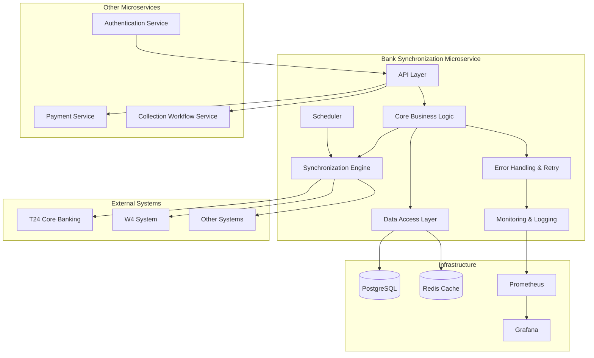
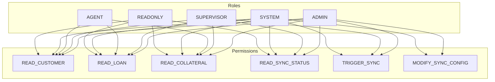

# Bank Synchronization Microservice Architecture

## 1. Service Container Structure



## 2. Key Components

### 2.1 API Layer

The API Layer serves as the entry point for all requests to the Bank Synchronization Microservice, implementing the API contract defined in the documentation.

**Components:**
- **Express.js Router**: Handles HTTP requests and routes them to appropriate controllers
- **Request Validation**: Validates incoming requests against defined schemas
- **Authentication Middleware**: Verifies JWT tokens and user permissions
- **Response Formatter**: Formats responses according to the common response format
- **API Documentation**: Swagger/OpenAPI documentation

**Key Endpoints:**
- Synchronization Operations (`/sync/*`)
- Customer Operations (`/customers/*`)
- Loan Operations (`/loans/*`)
- Collateral Operations (`/collaterals/*`)
- Reference Customer Operations (`/customers/:cif/references`)

### 2.2 Core Business Logic

The Core Business Logic layer contains the service classes that implement the business logic for the microservice.

**Components:**
- **CustomerService**: Handles customer-related operations
- **LoanService**: Handles loan-related operations
- **CollateralService**: Handles collateral-related operations
- **ReferenceCustomerService**: Handles reference customer operations
- **SyncService**: Orchestrates the synchronization process

**Key Interfaces:**
```typescript
interface CustomerService {
  getCustomerByNaturalKey(cif: string): Promise<Customer>;
  searchCustomers(criteria: CustomerSearchCriteria): Promise<PaginatedResult<Customer>>;
  getCustomerLoans(cif: string, criteria?: LoanSearchCriteria): Promise<PaginatedResult<Loan>>;
  getCustomerCollaterals(cif: string, criteria?: CollateralSearchCriteria): Promise<PaginatedResult<Collateral>>;
  getCustomerReferences(cif: string, criteria?: ReferenceSearchCriteria): Promise<PaginatedResult<ReferenceCustomer>>;
}

interface LoanService {
  getLoanByNaturalKey(accountNumber: string): Promise<Loan>;
  getLoanWithDetails(accountNumber: string): Promise<LoanWithDetails>;
}

interface CollateralService {
  getCollateralByNaturalKey(collateralNumber: string): Promise<Collateral>;
  getCollateralWithDetails(collateralNumber: string): Promise<CollateralWithDetails>;
}

interface SyncService {
  getSyncStatus(criteria?: SyncStatusCriteria): Promise<PaginatedResult<SyncStatus>>;
  triggerSync(options: SyncOptions): Promise<SyncJob>;
  getSyncJobStatus(syncJobId: string): Promise<SyncJob>;
}
```

### 2.3 Data Access Layer

The Data Access Layer handles all interactions with the database, implementing the repository pattern for data access.

**Components:**
- **Entity Models**: TypeORM entity classes mapping to database tables
- **Repositories**: TypeORM repositories for CRUD operations
- **Query Builders**: Complex query construction
- **Transaction Manager**: Manages database transactions
- **Cache Manager**: Handles Redis caching for frequently accessed data

**Key Entity Models:**
```typescript
@Entity('customers')
export class Customer {
  @PrimaryGeneratedColumn('uuid')
  id: string;
  
  @Column({ unique: true })
  cif: string;
  
  @Column({ type: 'enum', enum: CustomerType })
  type: CustomerType;
  
  @Column({ nullable: true })
  name: string;
  
  // Other fields...
  
  @OneToMany(() => Phone, phone => phone.customer)
  phones: Phone[];
  
  @OneToMany(() => Address, address => address.customer)
  addresses: Address[];
  
  @OneToMany(() => Email, email => email.customer)
  emails: Email[];
  
  @OneToMany(() => Loan, loan => loan.customer)
  loans: Loan[];
  
  @OneToMany(() => Collateral, collateral => collateral.customer)
  collaterals: Collateral[];
  
  @OneToMany(() => ReferenceCustomer, ref => ref.primaryCustomer)
  referenceCustomers: ReferenceCustomer[];
}
```

**Key Repositories:**
```typescript
interface SyncEntityRepository<T extends SynchronizedEntity> {
  findByNaturalKey(naturalKey: string): Promise<T | undefined>;
  upsertByNaturalKey(entity: T): Promise<T>;
  findBySourceSystem(source: SourceSystemType): Promise<T[]>;
  findStaleRecords(olderThan: Date): Promise<T[]>;
}

class CustomerRepository extends Repository<Customer> implements SyncEntityRepository<Customer> {
  // Implementation of SyncEntityRepository methods
}
```

### 2.4 Synchronization Engine

The Synchronization Engine is responsible for extracting data from external systems, transforming it to the internal model, and loading it into the database.

**Components:**
- **Source Connectors**: Adapters for connecting to external systems (T24, W4, etc.)
- **Data Extractors**: Extract data from external systems
- **Data Transformers**: Transform external data to internal model
- **Data Loaders**: Load transformed data into the database
- **Sync Orchestrator**: Coordinates the ETL process

**Key Interfaces:**
```typescript
interface SourceConnector {
  connect(): Promise<void>;
  disconnect(): Promise<void>;
  isConnected(): boolean;
  extractData(entityType: string, options?: ExtractOptions): Promise<RawData[]>;
}

interface DataTransformer<T extends SynchronizedEntity> {
  transform(rawData: RawData): T;
  validate(entity: T): ValidationResult;
}

interface DataLoader<T extends SynchronizedEntity> {
  load(entities: T[]): Promise<LoadResult>;
}

interface SyncOrchestrator {
  synchronize(options: SyncOptions): Promise<SyncResult>;
}
```

### 2.5 Error Handling & Retry Logic

The Error Handling & Retry Logic component manages errors during the synchronization process, implementing retry policies for transient errors.

**Components:**
- **Error Classifier**: Classifies errors as transient or permanent
- **Retry Policy Manager**: Configures retry policies based on error types
- **Circuit Breaker**: Prevents repeated failures by temporarily disabling operations
- **Error Repository**: Stores error information for analysis
- **Notification Service**: Sends notifications for critical errors

**Key Interfaces:**
```typescript
interface ErrorClassifier {
  classify(error: Error): ErrorType;
}

interface RetryPolicyManager {
  getPolicy(operationType: OperationType): RetryPolicy;
}

interface CircuitBreaker {
  execute<T>(operation: () => Promise<T>): Promise<T>;
  getState(): CircuitBreakerState;
}

interface ErrorRepository {
  logError(error: SyncError): Promise<void>;
  getErrors(criteria: ErrorSearchCriteria): Promise<PaginatedResult<SyncError>>;
}
```

### 2.6 Scheduler

The Scheduler component manages the scheduling of synchronization jobs, supporting both scheduled and manual triggers.

**Components:**
- **Job Scheduler**: Schedules synchronization jobs
- **Job Queue**: Manages the queue of pending jobs
- **Job Executor**: Executes jobs from the queue
- **Job Monitor**: Monitors job execution and status

**Key Interfaces:**
```typescript
interface JobScheduler {
  scheduleJob(jobDefinition: JobDefinition): Promise<Job>;
  cancelJob(jobId: string): Promise<boolean>;
  getScheduledJobs(): Promise<Job[]>;
}

interface JobQueue {
  enqueue(job: Job): Promise<void>;
  dequeue(): Promise<Job | undefined>;
  peek(): Promise<Job | undefined>;
  getLength(): Promise<number>;
}

interface JobExecutor {
  execute(job: Job): Promise<JobResult>;
}
```

### 2.7 Monitoring & Logging

The Monitoring & Logging component provides comprehensive monitoring and logging capabilities for the microservice.

**Components:**
- **Logger**: Structured logging with different severity levels
- **Metrics Collector**: Collects performance and operational metrics
- **Health Check**: Provides health status of the microservice
- **Trace Manager**: Manages distributed tracing
- **Dashboard Provider**: Provides data for monitoring dashboards

**Key Interfaces:**
```typescript
interface Logger {
  debug(message: string, context?: any): void;
  info(message: string, context?: any): void;
  warn(message: string, context?: any): void;
  error(message: string, error?: Error, context?: any): void;
}

interface MetricsCollector {
  recordCounter(name: string, value: number, tags?: Record<string, string>): void;
  recordGauge(name: string, value: number, tags?: Record<string, string>): void;
  recordHistogram(name: string, value: number, tags?: Record<string, string>): void;
  recordTimer(name: string, durationMs: number, tags?: Record<string, string>): void;
}

interface HealthCheck {
  check(): Promise<HealthStatus>;
}
```

## 3. Technology Stack Recommendations

Based on the project requirements and the existing technology stack, I recommend the following technologies for the Bank Synchronization Microservice:

### 3.1 Core Technologies

- **Runtime Environment**: Node.js 18+ (LTS)
- **Framework**: Express.js 4.x
- **Language**: TypeScript 5.0+
- **Database**: PostgreSQL 15+
- **ORM**: TypeORM (recommended for its native TypeScript support, complex relationship handling, and PostgreSQL compatibility)
- **API Documentation**: Swagger/OpenAPI
- **Testing**: Jest, Supertest

### 3.2 Additional Technologies

- **Caching**: Redis for caching frequently accessed data
- **Scheduler**: node-cron for job scheduling
- **Monitoring**: Prometheus for metrics collection
- **Visualization**: Grafana for dashboards
- **Logging**: Winston for structured logging
- **Tracing**: OpenTelemetry for distributed tracing
- **Circuit Breaker**: Opossum for implementing circuit breaker pattern
- **Validation**: Joi for request validation

### 3.3 Container Configuration

- **Base Image**: Node.js Alpine for minimal size
- **Multi-stage Build**: Separate build and runtime stages
- **Configuration**: Environment variables and config files
- **Health Checks**: Endpoint for container orchestration
- **Resource Limits**: CPU and memory limits
- **Volumes**: For persistent data and logs

## 4. Integration Points with Other Services

The Bank Synchronization Microservice integrates with several other components of the system:

### 4.1 Authentication Service

- **Integration Type**: REST API
- **Purpose**: Validate JWT tokens and user permissions
- **Endpoints Used**:
  - `POST /api/auth/validate-token`: Validate JWT token
  - `GET /api/auth/permissions`: Get user permissions

### 4.2 Payment Service

- **Integration Type**: REST API
- **Purpose**: Provide loan data for payment processing
- **Endpoints Exposed**:
  - `GET /api/loans/:accountNumber`: Get loan data for payment processing

### 4.3 Collection Workflow Service

- **Integration Type**: REST API
- **Purpose**: Provide customer and loan data for collection workflows
- **Endpoints Exposed**:
  - `GET /api/customers/:cif`: Get customer data
  - `GET /api/loans/:accountNumber`: Get loan data

### 4.4 External Systems

- **T24 Core Banking System**:
  - **Integration Type**: Batch ETL
  - **Data Extracted**: Customer, loan, and collateral data
  - **Frequency**: Daily scheduled sync

- **W4 System**:
  - **Integration Type**: Batch ETL
  - **Data Extracted**: Case tracking data
  - **Frequency**: Daily scheduled sync

- **Other Systems**:
  - **Integration Type**: Batch ETL
  - **Data Extracted**: Varies by system
  - **Frequency**: Daily scheduled sync

## 5. Role-Based Access Control Approach

The Bank Synchronization Microservice implements a comprehensive role-based access control (RBAC) system to ensure data security and proper access control.

### 5.1 Role Definitions

- **ADMIN**: Full access to all operations
- **SUPERVISOR**: Read access to all data, limited write access
- **AGENT**: Read access to assigned customers and related data
- **SYSTEM**: Used for system-to-system communication
- **READONLY**: Read-only access to all data

### 5.2 Permission Matrix



### 5.3 Implementation Approach

1. **JWT-Based Authentication**:
   - JWT tokens issued by the Authentication Service
   - Tokens contain user ID, roles, and permissions
   - Tokens are validated on each request

2. **Middleware-Based Authorization**:
   - Express middleware checks permissions for each endpoint
   - Permissions are defined at the route level
   - Custom middleware for data-level access control

3. **Data-Level Access Control**:
   - Agents can only access assigned customers
   - Supervisors can access all customers but with limited write permissions
   - Admins have full access to all data

4. **Audit Logging**:
   - All access attempts are logged
   - Failed authorization attempts trigger alerts
   - Audit logs are stored for compliance purposes

## 6. Error Handling and Retry Logic

Based on the requirement for comprehensive error handling with automatic retries, detailed logging, and monitoring dashboards, the following approach is implemented:

### 6.1 Error Classification

Errors are classified into the following categories:
- **Transient Errors**: Temporary issues that may resolve on retry (network timeouts, temporary service unavailability)
- **Permanent Errors**: Issues that won't resolve with retries (invalid data format, authentication failures)
- **Critical Errors**: Severe issues requiring immediate attention (database connection failures, data corruption)

### 6.2 Retry Policies

Different retry policies are applied based on error classification:
- **Transient Errors**: Exponential backoff with jitter (initial delay: 1s, max attempts: 5)
- **Permanent Errors**: No retry, log and report
- **Critical Errors**: Limited retry (max attempts: 2), alert, and manual intervention

### 6.3 Circuit Breaker Pattern

Circuit breaker pattern is implemented to prevent cascading failures:
- **Closed State**: Normal operation, requests pass through
- **Open State**: After threshold of failures, requests are rejected
- **Half-Open State**: After timeout, allows limited requests to test recovery

### 6.4 Logging Strategy

Comprehensive logging strategy with the following levels:
- **DEBUG**: Detailed information for debugging
- **INFO**: General operational information
- **WARN**: Potential issues that don't affect operation
- **ERROR**: Errors that affect operation but don't stop the service
- **FATAL**: Critical errors that stop the service

### 6.5 Monitoring Dashboards

Grafana dashboards are provided for monitoring:
- **Sync Status Dashboard**: Shows status of synchronization jobs
- **Error Dashboard**: Shows error rates, types, and trends
- **Performance Dashboard**: Shows performance metrics for sync operations
- **Data Volume Dashboard**: Shows volume of data processed