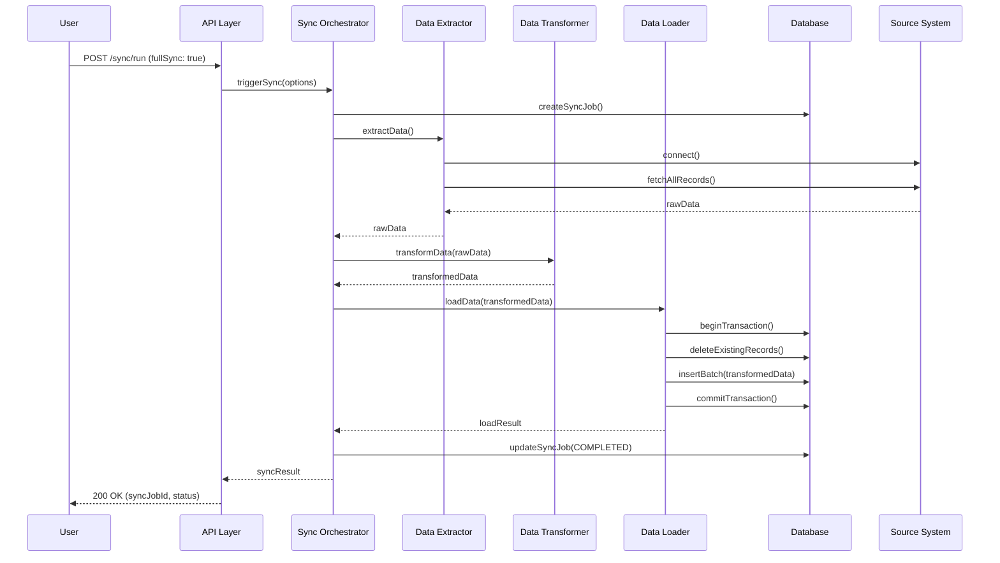
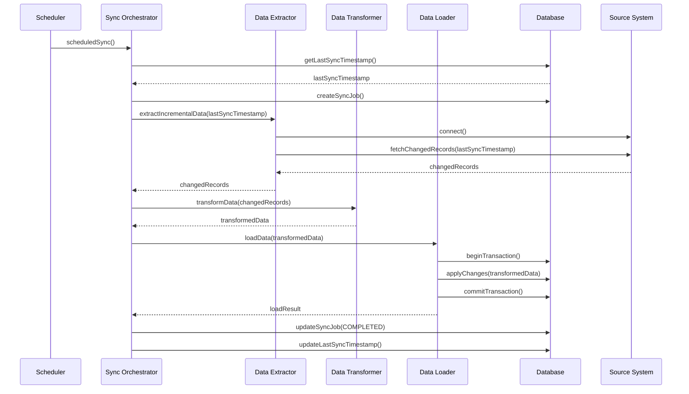

# Bank Synchronization Service Workflows

This document describes the key workflows and data flows within the Bank Synchronization Microservice.

## Table of Contents

1. [Overview](#overview)
2. [Data Synchronization Workflows](#data-synchronization-workflows)
   - [Full Synchronization](#full-synchronization)
   - [Incremental Synchronization](#incremental-synchronization)
   - [On-Demand Synchronization](#on-demand-synchronization)
3. [ETL Process](#etl-process)
   - [Extraction](#extraction)
   - [Transformation](#transformation)
   - [Loading](#loading)
4. [Error Handling and Retry Mechanisms](#error-handling-and-retry-mechanisms)
   - [Error Classification](#error-classification)
   - [Retry Policies](#retry-policies)
   - [Circuit Breaker Pattern](#circuit-breaker-pattern)
5. [Data Flow Diagrams](#data-flow-diagrams)

## Overview

The Bank Synchronization Microservice is responsible for synchronizing data from external banking systems (T24, W4, and others) and providing access to customer, loan, and collateral data. The service implements various workflows to ensure data consistency, reliability, and availability.

## Data Synchronization Workflows

### Full Synchronization

Full synchronization involves extracting all data from the source system and replacing the existing data in the target system. This is typically performed during initial setup or when there's a need to completely refresh the data.

**Workflow Steps:**

1. **Initialization**
   - Create a new sync job record with status `INITIATED`
   - Log the start of the synchronization process
   - Allocate necessary resources

2. **Data Extraction**
   - Connect to the source system
   - Extract all records of the specified entity type
   - Store the extracted data in a temporary storage

3. **Data Transformation**
   - Transform the extracted data to match the target schema
   - Validate the transformed data
   - Generate unique identifiers for new records

4. **Data Loading**
   - Begin a database transaction
   - Delete existing records (if configured)
   - Insert or update transformed records
   - Commit the transaction

5. **Finalization**
   - Update the sync job record with status `COMPLETED`
   - Log the completion of the synchronization process
   - Release allocated resources

**Configuration Options:**

```json
{
  "sourceSystem": "T24",
  "entityType": "Customer",
  "fullSync": true,
  "syncOptions": {
    "batchSize": 1000,
    "priority": "HIGH",
    "deleteExisting": true
  }
}
```

### Incremental Synchronization

Incremental synchronization involves extracting only the data that has changed since the last synchronization. This is the default synchronization method for regular updates.

**Workflow Steps:**

1. **Initialization**
   - Create a new sync job record with status `INITIATED`
   - Retrieve the timestamp of the last successful synchronization
   - Log the start of the synchronization process

2. **Data Extraction**
   - Connect to the source system
   - Extract records modified after the last synchronization timestamp
   - Store the extracted data in a temporary storage

3. **Data Transformation**
   - Transform the extracted data to match the target schema
   - Validate the transformed data
   - Identify records for insertion, update, or deletion

4. **Data Loading**
   - Begin a database transaction
   - Apply changes (insert, update, delete) to the target system
   - Commit the transaction

5. **Finalization**
   - Update the sync job record with status `COMPLETED`
   - Update the last synchronization timestamp
   - Log the completion of the synchronization process

**Configuration Options:**

```json
{
  "sourceSystem": "T24",
  "entityType": "Customer",
  "fullSync": false,
  "syncOptions": {
    "batchSize": 1000,
    "priority": "MEDIUM",
    "includeDeleted": true
  }
}
```

### On-Demand Synchronization

On-demand synchronization allows users to trigger synchronization for specific entities or records. This is useful for resolving data discrepancies or updating specific records.

**Workflow Steps:**

1. **Initialization**
   - Create a new sync job record with status `INITIATED`
   - Log the start of the synchronization process

2. **Data Extraction**
   - Connect to the source system
   - Extract the specified records
   - Store the extracted data in a temporary storage

3. **Data Transformation**
   - Transform the extracted data to match the target schema
   - Validate the transformed data

4. **Data Loading**
   - Begin a database transaction
   - Update or insert the transformed records
   - Commit the transaction

5. **Finalization**
   - Update the sync job record with status `COMPLETED`
   - Log the completion of the synchronization process

**Configuration Options:**

```json
{
  "sourceSystem": "T24",
  "entityType": "Customer",
  "fullSync": false,
  "syncOptions": {
    "priority": "HIGH",
    "identifiers": ["C123456789", "C987654321"]
  }
}
```

## ETL Process

The ETL (Extract, Transform, Load) process is the core of the synchronization workflow. Each step is designed to handle specific aspects of the data synchronization process.

### Extraction

The extraction phase involves retrieving data from the source systems. The service supports multiple source systems and adapts to their specific APIs and data formats.

**Key Components:**

- **Source Connectors**: Adapters for connecting to external systems (T24, W4, etc.)
- **Data Extractors**: Extract data from external systems
- **Extraction Strategies**: Full extraction, incremental extraction, or targeted extraction

**Source System Specifics:**

1. **T24 Core Banking System**
   - Connection: SOAP API
   - Authentication: OAuth 2.0
   - Extraction Method: Batch API calls with pagination
   - Data Format: XML

2. **W4 System**
   - Connection: REST API
   - Authentication: API Key
   - Extraction Method: Date-range based API calls
   - Data Format: JSON

3. **Other Systems**
   - Connection: Various (API, SFTP, Database)
   - Authentication: System-specific
   - Extraction Method: System-specific
   - Data Format: Various

### Transformation

The transformation phase converts the extracted data into the format required by the target system. This includes data mapping, validation, and enrichment.

**Key Components:**

- **Data Mappers**: Map source fields to target fields
- **Data Validators**: Validate data against business rules
- **Data Enrichers**: Enrich data with additional information

**Transformation Rules:**

1. **Customer Data**
   - Map customer identifiers
   - Normalize name formats
   - Validate contact information
   - Enrich with segmentation data

2. **Loan Data**
   - Calculate derived fields (e.g., days past due)
   - Convert currency amounts
   - Validate loan terms
   - Link to customer records

3. **Collateral Data**
   - Standardize collateral types
   - Validate valuation data
   - Link to loan and customer records

### Loading

The loading phase inserts or updates the transformed data into the target database. This phase ensures data integrity and consistency.

**Key Components:**

- **Data Loaders**: Load data into the database
- **Transaction Managers**: Manage database transactions
- **Conflict Resolvers**: Resolve conflicts during data loading

**Loading Strategies:**

1. **Bulk Insert/Update**
   - Used for large datasets
   - Optimized for performance
   - Uses database-specific bulk operations

2. **Individual Insert/Update**
   - Used for small datasets or on-demand synchronization
   - Provides detailed error reporting
   - Allows for fine-grained control

3. **Upsert Operations**
   - Combines insert and update operations
   - Uses natural keys for record identification
   - Handles both new and existing records

## Error Handling and Retry Mechanisms

The service implements comprehensive error handling and retry mechanisms to ensure reliability and resilience.

### Error Classification

Errors are classified into different categories for appropriate handling:

1. **Transient Errors**
   - Temporary issues that may resolve on retry
   - Examples: network timeouts, temporary service unavailability
   - Handling: Automatic retry with exponential backoff

2. **Permanent Errors**
   - Issues that won't resolve with retries
   - Examples: invalid data format, authentication failures
   - Handling: Log, report, and skip

3. **Critical Errors**
   - Severe issues requiring immediate attention
   - Examples: database connection failures, data corruption
   - Handling: Limited retry, alert, and manual intervention

### Retry Policies

Different retry policies are applied based on error classification and operation type:

1. **Database Operations**
   - Max Attempts: 5
   - Initial Delay: 500ms
   - Max Delay: 10s
   - Backoff Factor: 2

2. **API Calls**
   - Max Attempts: 3
   - Initial Delay: 1s
   - Max Delay: 15s
   - Backoff Factor: 2

3. **Synchronization Operations**
   - Max Attempts: 5
   - Initial Delay: 2s
   - Max Delay: 60s
   - Backoff Factor: 2

### Circuit Breaker Pattern

The circuit breaker pattern is implemented to prevent cascading failures:

1. **Closed State**
   - Normal operation, requests pass through
   - Failure counter tracks consecutive failures

2. **Open State**
   - After threshold of failures (default: 5), circuit opens
   - Requests are rejected immediately
   - Timeout period (default: 30s) before trying half-open state

3. **Half-Open State**
   - Limited requests allowed to test recovery
   - Success threshold (default: 2) to close circuit
   - Any failure returns to open state

**Implementation Details:**

```typescript
// Circuit breaker configuration
const circuitBreakerOptions = {
  failureThreshold: 5,
  resetTimeout: 30000, // 30 seconds
  successThreshold: 2
};

// Usage example
const result = await withCircuitBreaker(
  't24-api',
  () => t24Connector.extractCustomerData(),
  circuitBreakerOptions
);
```

## Data Flow Diagrams

### Full Synchronization Flow



### Incremental Synchronization Flow



### Error Handling and Retry Flow

```mermaid
sequenceDiagram
    participant Sync as Sync Orchestrator
    participant Operation as Operation
    participant ErrorHandler as Error Handler
    participant RetryPolicy as Retry Policy
    participant CircuitBreaker as Circuit Breaker
    participant Monitoring as Monitoring

    Sync->>CircuitBreaker: execute(operation)
    CircuitBreaker->>Operation: execute()
    alt Success
        Operation-->>CircuitBreaker: result
        CircuitBreaker-->>Sync: result
    else Error
        Operation-->>CircuitBreaker: error
        CircuitBreaker->>ErrorHandler: handleError(error)
        ErrorHandler->>ErrorHandler: classifyError(error)
        alt Transient Error
            ErrorHandler->>RetryPolicy: getRetryPolicy(error)
            RetryPolicy-->>ErrorHandler: retryPolicy
            ErrorHandler->>Monitoring: logRetryAttempt(error)
            ErrorHandler->>Operation: retry(retryPolicy)
            alt Retry Success
                Operation-->>CircuitBreaker: result
                CircuitBreaker-->>Sync: result
            else Max Retries Exceeded
                ErrorHandler->>CircuitBreaker: recordFailure()
                CircuitBreaker->>Monitoring: logFailure(error)
                CircuitBreaker-->>Sync: error
            end
        else Permanent Error
            ErrorHandler->>Monitoring: logError(error)
            ErrorHandler-->>CircuitBreaker: error
            CircuitBreaker-->>Sync: error
        end
    end